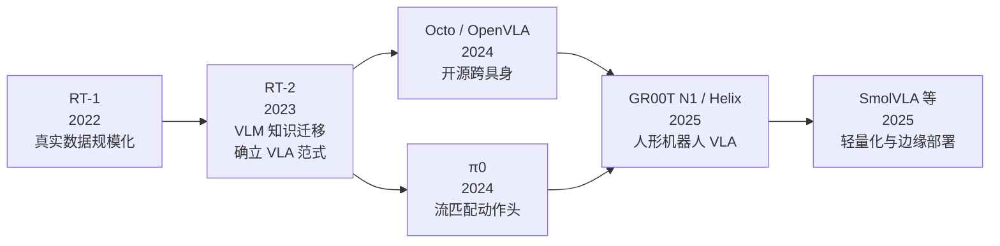
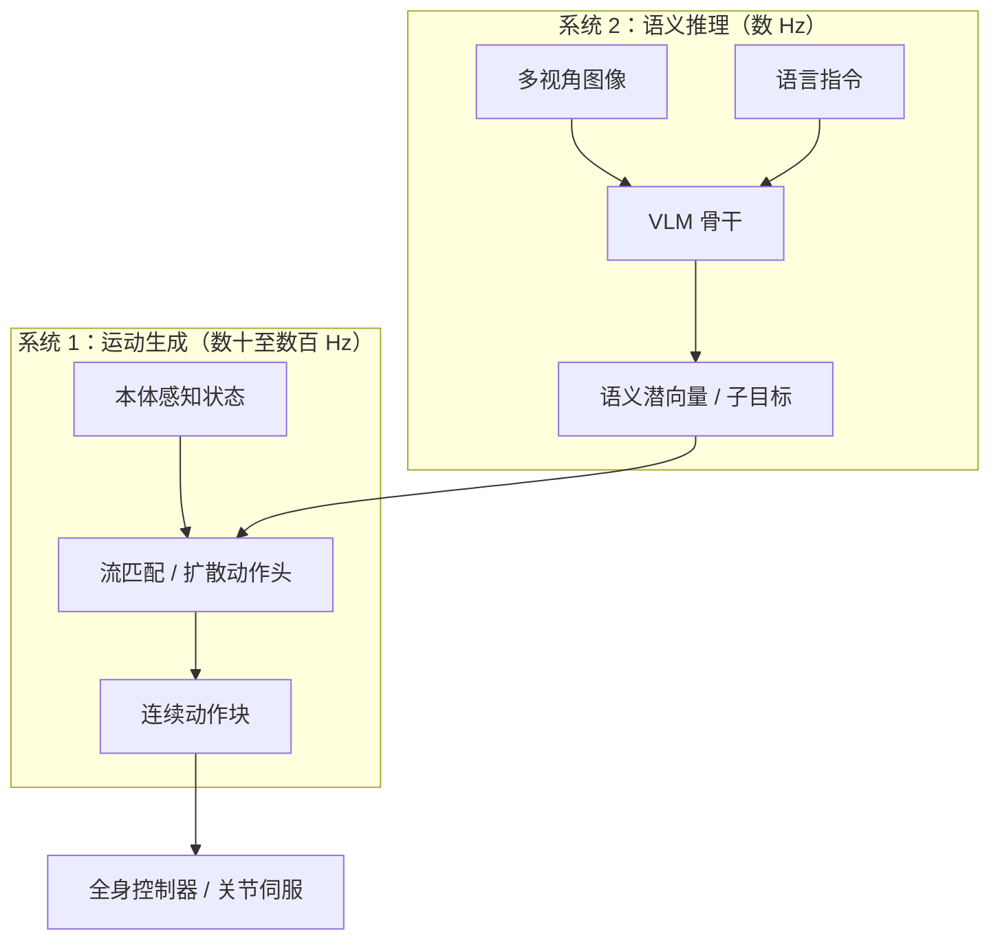
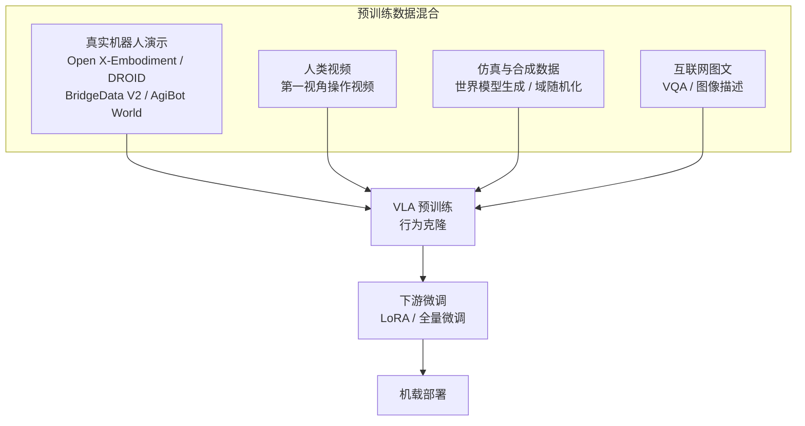

# 第 19 章 视觉-语言-动作模型（VLA）

## 摘要

视觉-语言-动作模型（Vision-Language-Action Model, VLA）是近年具身智能领域最具影响力的技术路线：它将大规模视觉-语言模型（VLM）的语义理解能力与机器人动作生成统一在同一个端到端网络中，使机器人能够依据自然语言指令和视觉观测直接输出可执行动作。本章从 VLA 的定义与数学表述出发，系统梳理其架构范式——包括离散动作 token 自回归、扩散策略与流匹配连续动作头、以及"慢思考-快执行"双系统架构；随后深入剖析 RT-1/RT-2、OpenVLA、Octo、π0、GR00T N1、Helix、SmolVLA 等代表性系统的设计取舍；进而讨论跨具身预训练的数据工程（Open X-Embodiment、DROID、BridgeData V2、AgiBot World Colosseo 等）、面向人形机器人全身控制的适配方法、推理延迟与边缘部署约束，以及评测基准与典型失效模式。本章与第 18 章（模仿学习与策略学习）、第 20 章（世界模型与长期推理）、第 21 章（数据基础设施）共同构成本书的智能层技术主线。

**关键词**：视觉-语言-动作模型；VLA；RT-2；OpenVLA；π0；GR00T N1；Helix；流匹配；扩散策略；动作分块；跨具身预训练；双系统架构；边缘部署

---

## 19.1 VLA 概述：从端到端控制到具身基础模型

### 19.1.1 定义与定位

**视觉-语言-动作模型（Vision-Language-Action Model, VLA）** 是指以视觉观测与自然语言指令为输入、直接输出机器人动作（或动作序列）的大模型策略。其核心思想是把"感知—理解—决策—控制"这条传统上分层实现的流水线压缩进一个可端到端训练的神经网络，并借助视觉-语言模型在互联网规模数据上预训练获得的语义先验，实现对开放世界中物体、任务与指令的泛化。

!!! note "术语解释：视觉-语言-动作模型、视觉-语言模型、具身基础模型、端到端策略"
    - **视觉-语言-动作模型（Vision-Language-Action Model, VLA）**：输入图像（或视频帧）与语言指令、输出机器人动作的多模态大模型。名称由 Google DeepMind 的 RT-2 工作（2023）正式确立。
    - **视觉-语言模型（Vision-Language Model, VLM）**：在互联网图文数据上预训练、具备视觉问答与图像描述能力的模型，如 PaLI-X、SigLIP+Llama 系组合等，是 VLA 的语义骨干。
    - **具身基础模型（embodied foundation model）**：面向物理世界任务、可适配多种机器人本体（embodiment）的通用模型，VLA 是当前最主要的实现形态。
    - **端到端策略（end-to-end policy）**：从原始传感器输入到执行器输出之间不经过人工设计的中间模块（如显式的位姿估计、抓取规划器）的策略网络。

与第 18 章讨论的经典模仿学习相比，VLA 的差异不在于训练范式（多数 VLA 仍以行为克隆为主干），而在于**规模与先验**：参数规模从百万级跃升到十亿级，训练数据从单一任务演示扩展到跨本体、跨场景的百万级片段，且模型携带来自互联网图文预训练的开放词汇语义。这使 VLA 具备了经典方法难以企及的指令跟随与新物体泛化能力。

对全书而言，本章处于"智能层"叙事的中枢位置：第 14–17 章回答"机器人如何被控制与示教"，第 18 章回答"策略如何从数据中学习"，本章则回答"如何让大模型的常识真正驱动物理身体"。这一问题的答案正重塑整个人形机器人产业的分工——模型公司、数据公司与整机厂之间的边界，很大程度上沿 VLA 的技术栈重新划定（第 28 章将讨论其产业后果）。

从硬件视角回看，VLA 也解释了为什么本书前半部分反复强调某些设计选择：腕部相机与本体感知接口（第 5 章）是 VLA 的"感官"，机载算力与热设计（第 6 章）决定能跑多大的骨干，力控带宽与关节精度（第 4 章）决定动作头的输出能否被忠实执行。大模型并没有让硬件变得不重要——恰恰相反，它把硬件质量的差异放大成了数据质量与部署密度的差异。

### 19.1.2 发展脉络：从 RT-1 到开源生态

VLA 的谱系可以追溯到 Google 的 **RT-1（Robotics Transformer，2022）**：它在约 13 万条真实机器人演示片段上训练 Transformer 策略，覆盖 700 余项任务，首次展示了大规模真实数据驱动的语言条件操作策略的可行性。其后 **RT-2（2023）** 迈出了关键一步：将动作表示为文本 token，直接对互联网规模预训练的视觉-语言模型（PaLI-X、PaLM-E）做协同微调（co-fine-tuning），使网络规模的语义知识（如"把快要灭绝的动物挑出来"这类需要常识推理的指令）迁移到机器人控制。RT-2 由此确立了 VLA 这一术语与基本范式。

此后生态迅速扩张：开源侧出现了 **Octo**（在异构跨具身数据上训练的通才策略）与 **OpenVLA**（在 Open X-Embodiment 约 97 万条片段上训练的 70 亿参数开源模型）；初创公司 **Physical Intelligence** 推出基于流匹配的 **π0**，展示了折衣服、装盒等灵巧长时程任务；NVIDIA 发布面向通用人形机器人的开放基础模型 **GR00T N1**；Figure 发布驱动其 Figure 02 人形机器人的 **Helix**；Hugging Face 社区则推出面向低成本硬件的 **SmolVLA**。自动驾驶领域的 VLA 工作（如 DriveVLA、Impromptu VLA）与机器人领域相互借鉴，进一步丰富了这一谱系。

这条脉络中有三个值得记住的转折点。第一，RT-2 证明了**知识迁移**的价值：机器人不再需要从零学习"什么是恐龙""什么是锤子"，这些概念可以继承自互联网预训练。第二，OpenVLA 证明了**开放生态**的力量：一个学术团队用数百 GPU 天的预算即可复现并超越工业界的闭源基线，使 VLA 研究迅速民主化。第三，π0 与 GR00T N1 证明了**生成式动作头**的必要性：当任务从"抓取放置"升级为"折叠衣物"这类高维、多峰、时序强耦合的灵巧操作时，离散 token 路线的精度与带宽开始捉襟见肘。

### 19.1.3 VLA 与相关概念的边界

为避免概念混淆，有必要划定 VLA 与相邻术语的边界。VLA 不是 VLM 的简单同义词：VLM 只负责理解，VLA 必须输出可执行动作；一个图像描述得再准确的 VLM，若没有动作头，就不是 VLA。VLA 也不是策略学习的新范式：它绝大多数情况下仍是行为克隆（第 18 章），只是策略网络换成了预训练大模型。VLA 与**遥操作（teleoperation，第 17 章）**的关系则是数据上的共生——当前绝大多数 VLA 训练数据来自人类遥操作演示，而 VLA 又反过来被用于遥操作的意图辅助与自动纠错。最后，VLA 与**世界模型（第 20 章）**的分工是"反应"与"预见"：VLA 给定观测直接产生动作，世界模型给定动作预测观测；二者的耦合正是当前最活跃的研究前沿。

| 概念 | 输入 | 输出 | 是否含动作 | 典型代表 |
|---|---|---|---|---|
| VLM | 图像+文本 | 文本 | 否 | PaLI-X、Gemini |
| 经典模仿学习策略 | 观测 | 动作 | 是 | ACT、扩散策略 |
| VLA | 图像+指令(+状态) | 动作 | 是 | RT-2、OpenVLA、π0 |
| 世界模型 | 观测+动作 | 未来观测/状态 | 反向 | Cosmos、Dreamer |
| LLM 规划器 | 文本(任务) | 子目标序列 | 间接 | SayCan、CoT 规划 |

### 19.1.4 VLA 的数学表述

形式上，VLA 是一个条件策略模型。给定时刻 \(t\) 的多模态观测 \(o_t\)（通常包含一至多个相机视角的图像、本体感知状态 \(q_t\)，可选深度、触觉等）与自然语言指令 \(\ell\)，VLA 学习如下条件分布：

$$
\pi_\theta\big(a_{t:t+H} \mid o_t, \ell\big)
$$

其中 \(a_{t:t+H} = (a_t, a_{t+1}, \dots, a_{t+H-1})\) 是未来 \(H\) 步的**动作块（action chunk）**，\(\theta\) 为模型参数。输出动作块而非单步动作的设计继承自**动作分块变压器（Action Chunking with Transformers, ACT）**，能够显著缓解长时程任务中的误差累积，并降低对推理频率的要求。

训练目标通常为演示数据集 \(\mathcal{D} = \{(o_t, \ell, a_{t:t+H})\}\) 上的负对数似然（行为克隆损失）：

$$
\mathcal{L}_{\mathrm{BC}}(\theta) = -\mathbb{E}_{(o,\ell,a)\sim\mathcal{D}} \log \pi_\theta\big(a \mid o, \ell\big)
$$

不同架构的分野，本质上在于**如何参数化这个条件分布**：离散 token 自回归（RT-2、OpenVLA）、去噪扩散（RDT-1B、DexVLA）、流匹配（π0、GR00T N1），或三者的混合。这一选择直接决定了模型的精度上限、推理延迟与可部署性，是 19.2 节的主线。

!!! note "术语解释：动作块、条件策略、行为克隆损失、复合误差"
    - **动作块（action chunk）**：一次性预测的未来 \(H\) 步动作序列，执行时可开环展开若干步再重新推理。
    - **条件策略（conditional policy）**：以观测与指令为条件的动作分布，VLA 是其在多模态大模型下的实例。
    - **行为克隆损失（behavior cloning loss）**：对演示动作的负对数似然，是绝大多数 VLA 的基础训练目标。
    - **复合误差（compounding error）**：策略微小偏差逐帧累积、把系统推出训练分布的现象，动作块与时间集成是常用缓解手段。

## 19.2 架构范式

### 19.2.1 视觉-语言骨干：VLA 的语义底座

几乎所有 VLA 都建立在一个预训练 VLM 骨干之上，其职责是把图像与指令编码成富含语义的 token 序列。典型做法包括：

- **视觉编码器**：采用 SigLIP、DINOv2 或两者的拼接（如 OpenVLA 同时使用 DINOv2 的低层空间特征与 SigLIP 的语义特征），将图像切成 patch token；
- **语言模型主干**：采用 Llama、PaLI-X、Gemma、Eagle-2 等解码器 Transformer，将视觉 token 与指令 token 拼接后做统一的多模态自回归或双向注意力编码；
- **本体感知注入**：将关节位置、夹爪状态等低维状态经 MLP 映射为额外 token 或加到动作头输入中。

!!! note "术语解释：骨干网络、视觉编码器、多模态投影、协同微调"
    - **骨干网络（backbone）**：承担主要表征计算的预训练大模型部分，VLA 中通常指 VLM。
    - **视觉编码器（vision encoder）**：把图像映射为特征向量序列的网络，常用对比学习（CLIP/SigLIP）或自监督（DINOv2）预训练。
    - **多模态投影（projector）**：将视觉特征空间对齐到语言模型词嵌入空间的轻量适配层。
    - **协同微调（co-fine-tuning）**：在机器人数据与原始图文数据混合上联合微调，防止 VLM 在机器人数据上遗忘其语义知识——RT-2 表明这对保留泛化能力至关重要。

骨干的选择决定了 VLA 的"常识储备"。工程上的核心权衡是：更大的骨干带来更强的指令理解，但也带来更高的显存占用与推理延迟，这对人形机器人的机载部署构成硬约束（见 19.5.3）。

### 19.2.2 动作表示 I：离散 token 自回归

RT-2 与 OpenVLA 采用的路线是**动作 token 预测（action token prediction）**：把每个自由度的连续动作量化为离散 bin（RT-2 使用 256 个均匀分箱），再将这些 bin 映射到语言模型词表中（常用词表尾部最少使用的 token），于是动作生成变成与文本生成完全一致的"下一个 token 预测"问题。

$$
\hat{a}_{t} = \mathrm{decode}\big(\mathrm{tokenizer}^{-1}(y_1, y_2, \dots, y_D)\big), \quad y_i \sim p_\theta(y_i \mid o_t, \ell, y_{<i})
$$

这一方案的最大优点是**复用**：无需修改 VLM 的任何结构，训练基础设施、正则技巧乃至强化学习后训练（RLHF 类方法）都可以直接借用语言模型生态。其代价同样明显：

1. **量化误差**：256 bin 对高精度装配类任务可能不足，提高分辨率又会拉长序列；
2. **序列长度**：\(D\) 个自由度 × \(H\) 步动作块的 token 数随维度线性增长，自回归逐 token 解码使推理延迟居高不下，典型模型只能以数 Hz 的频率输出动作块；
3. **高频抖动**：离散化破坏了动作的时序平滑性，需要额外的后处理或时间集成。

针对效率问题，**FAST（Efficient Action Tokenization）** 提出用离散余弦变换（DCT）对动作块做频域压缩再 token 化，以远少于逐维量化的 token 数表示高频动作序列，显著降低自回归解码步数，是离散路线向高频动作方向的重要改进。

### 19.2.3 动作表示 II：扩散与流匹配连续动作头

另一条路线保留动作的连续性：VLM 骨干输出的语义表征作为条件，交由一个**动作专家（action expert）** 生成连续动作块。主流的两种生成模型是扩散模型与流匹配。

**扩散策略（Diffusion Policy）** 把动作块生成建模为去噪扩散的逆过程：从纯噪声 \(a^{K}\) 出发，经 \(K\) 步迭代去噪得到动作 \(a^{0}\)。训练目标为噪声预测损失：

$$
\mathcal{L}_{\mathrm{diff}}(\theta) = \mathbb{E}_{k, a^0, \epsilon} \big\| \epsilon - \epsilon_\theta(a^k, k \mid o_t, \ell) \big\|^2
$$

**流匹配（Flow Matching）** 则学习一个连接噪声分布与动作分布的确定性速度场。取线性插值路径 \(a^\tau = \tau a^1 + (1-\tau) a^0\)（\(a^0\) 为高斯噪声，\(a^1\) 为真实动作），条件流匹配损失为：

$$
\mathcal{L}_{\mathrm{FM}}(\theta) = \mathbb{E}_{\tau, a^0, a^1} \big\| v_\theta(a^\tau, \tau \mid o_t, \ell) - (a^1 - a^0) \big\|^2
$$

推理时从 \(a^0 \sim \mathcal{N}(0, I)\) 出发对常微分方程 \(\dot{a}^\tau = v_\theta(a^\tau, \tau)\) 做数值积分即可得到动作块。π0 与 GR00T N1 均采用流匹配动作头；RDT-1B（面向双臂操作的扩散基础模型）与 DexVLA（插件式扩散专家）采用扩散路线。相比离散 token，连续动作头在高维、高频动作（如双臂 50 Hz 控制、灵巧手多指协调）上具有天然优势，且扩散/流匹配天然支持**多峰动作分布**——面对"从左侧或右侧绕过障碍均可"的演示数据时不会学成折中的"撞墙"动作，这是单模态回归损失做不到的。

| 维度 | 离散 token 自回归 | 扩散/流匹配动作头 |
|---|---|---|
| 代表系统 | RT-2、OpenVLA、Octo | π0、GR00T N1、RDT-1B、DexVLA |
| 动作连续性 | 量化 bin，存在量化误差 | 原生连续 |
| 多峰分布建模 | 自回归可表达但样本效率低 | 天然支持 |
| 推理延迟 | 逐 token 解码，延迟随维度增长 | 固定步数迭代（典型数步到数十步） |
| 高频动作（>20 Hz） | 需 FAST 等压缩技巧 | 适合 |
| 基础设施复用 | 完全复用 LLM 生态 | 需额外动作专家与采样器 |

!!! note "术语解释：动作专家、去噪扩散、流匹配、速度场、多峰分布"
    - **动作专家（action expert）**：VLA 中专职生成连续动作的子网络，通常与 VLM 骨干共享或交叉注意语义表征，但拥有独立的参数与输出生头。
    - **去噪扩散（denoising diffusion）**：通过逐步向数据加噪再学习逆转加噪过程的生成模型，推理时需多次前向迭代。
    - **流匹配（flow matching）**：学习噪声分布到数据分布之间确定性传输速度场的生成框架，可视为扩散模型的"直线化"变体，通常用更少步数完成采样。
    - **速度场（velocity field）**：流匹配中被学习的向量场 \(v_\theta(a,\tau)\)，指示样本在传输路径上每一点的移动方向。
    - **多峰分布（multimodal distribution）**：存在多个高概率区域的动作分布，如"从左侧或右侧绕行均可"；生成模型能如实表达多峰性，而均方回归会学成两峰之间的折中点。

### 19.2.4 双系统架构：慢思考与快执行

受认知科学"系统 1/系统 2"启发，2025 年以来人形机器人 VLA 普遍收敛到**双系统（dual-system）架构**：一个低频运行的大模型负责语义理解与高层决策，一个高频运行的小模型负责实时动作生成。

- **Figure 的 Helix**：系统 2（S2）为约 70 亿参数的 VLM，以个位数 Hz 频率理解场景与指令并产出语义潜向量；系统 1（S1）为约 8000 万参数的视觉运动 Transformer，以约 200 Hz 频率将语义潜向量翻译成上半身（含手臂、手腕、手指）的连续控制量。两系统端到端联合训练但异步运行。
- **NVIDIA GR00T N1**：以 Eagle-2 视觉-语言模块做推理，以流匹配扩散 Transformer（DiT）动作头做实时运动生成，在真实机器人轨迹、人类视频与合成数据的异构混合上端到端训练。
- **Fast-in-Slow** 等学术工作进一步探讨快慢系统共享表征、慢系统输出如何作为快系统的条件提示等设计。

双系统架构本质上是在**语义泛化能力**与**控制带宽**之间做工程折中：大模型不可能以 200 Hz 运行，而反射式的低层控制也不需要每次都"深思熟虑"。它与经典的分层控制（第 14 章）在思想上同构，区别仅在于高层从符号规划器换成了学习到的 VLM。

### 19.2.5 条件注入与接口设计

无论选择哪种动作表示，都需回答同一个问题：**语义表征如何注入动作生成过程**。主流的接口设计有四种：

1. **拼接式（concatenation）**：视觉-语言 token 与动作 token 在同一序列中自回归，结构最简单，是 RT-2、OpenVLA 的做法；
2. **交叉注意力（cross-attention）**：动作专家的每一层通过交叉注意力读取骨干的多模态表征，π0、GR00T N1 的 DiT 动作头采用此方式，语义条件作用更深；
3. **自适应归一化（AdaLN）**：把条件向量注入归一化层的缩放-偏移参数，计算开销小，是 DiT 系模型的经典条件化手段；
4. **潜向量桥接（latent bridge）**：慢系统输出压缩的语义潜向量，快系统以其为条件高频运行，Helix 的 S1/S2 接口即属此类。

接口设计的选择影响的不只是性能：拼接式训练数据效率最高但推理最贵；交叉注意力在语义细节保留上更好；潜向量桥接则天然支持异步部署。对系统工程师而言，接口往往是比骨干选型更早需要冻结的决策，因为它直接决定数据格式、训练流水线与部署拓扑。

## 19.3 代表性 VLA 系统剖析

### 19.3.1 RT 系列：范式的确立者

**RT-1（Robotics Transformer）** 的贡献在于数据规模化：约 13 万条真实世界演示、700 余项语言标注任务，证明了"真实机器人数据 + Transformer + 行为克隆"这一配方的可行性，但其视觉与语义模块是轻量的，开放世界泛化有限。

**RT-2** 的关键创新是把动作当文本：直接对 PaLI-X（约 550 亿参数）与 PaLM-E（约 120 亿参数）实例做机器人数据与原始图文数据的协同微调。由此获得三类涌现能力——**语义泛化**（理解训练集中从未出现但互联网语料中存在的概念）、**符号理解**（数字、图标）与**基础推理**（以思维链提示完成"选择能当锤子用的物体"之类的多步推理）。RT-2 的教训同样重要：超大骨干带来严重部署负担（需要云端或大型加速卡推理），且离散化限制了精细操作能力。

### 19.3.2 OpenVLA 与 Octo：开源生态的奠基者

**OpenVLA** 是目前引用最广的开源 VLA：约 70 亿参数，采用 DINOv2+SigLIP 双视觉编码器与 Llama 系语言骨干，在 **Open X-Embodiment** 数据集约 97 万条真实机器人片段上预训练，并在 LIBERO 等基准上超越此前的开源基线。其价值不在于某个单项指标，而在于**全开放**：权重、训练代码与数据配方全部公开，且支持 LoRA 等参数高效微调，使学术界与中小团队能够在单台多卡工作站上完成下游适配。

**Octo** 则探索了另一条开源路线：以较小的 Transformer 骨干在 80 万条跨本体片段上训练通才策略，采用扩散式动作头与任务/目标条件化接口，强调"拿来即可在新本体上微调"的适配性。二者共同确立了开源 VLA 的事实标准：跨具身预训练 + 参数高效微调 + 标准化评测。

开源 VLA 的兴起还带来一个方法论红利：**可复现的消融研究**。借助 OpenVLA 这类全开放模型，社区得以系统回答"预训练 VLM 到底贡献了什么"这一关键问题——实验普遍表明，互联网预训练主要贡献语义与指令泛化，而对纯运动技能（如精确插入）的贡献有限；视觉编码器的低层特征保留程度、动作 token 化粒度与微调策略，往往比骨干大小更能决定下游成功率。这类结论对工程选型的指导价值，不亚于模型本身。

### 19.3.3 π0：流匹配通用策略

**π0** 由 Physical Intelligence 提出，其核心设计是"VLM 骨干 + 流匹配动作专家"：骨干复用互联网预训练 VLM 的语义能力，动作专家以流匹配生成高至 50 Hz 的连续动作块，从而覆盖叠衣服、收拾桌面、装盒打包等**长时程、双手机械臂灵巧操作**任务。π0 同时展示了跨本体预训练（单臂、双臂、移动操作平台混合数据）+ 高质量任务数据微调的"预训练-后训练"配方，其开源版本（openpi）进一步推动了流匹配动作头的普及。其后继工作 π0.5 则引入"高层语义推理 + 低层动作生成"的分层推理结构，向开放环境泛化迈进。

π0 的演示之所以引起轰动，在于它攻破了此前被认为"学习法不可行"的一类任务：**可变形体操作**。衣物、床单没有固定几何模型，基于模型规划的方法几乎无从下手，而纯数据驱动的流匹配策略却能从数千次遥操作折叠中归纳出"拉平—对折—抚平"的技能结构。这一案例常被引用来论证：当任务难以建模但易于演示时，大容量生成式策略是当前最有效的技术路线。

### 19.3.4 GR00T N1 与 Helix：人形机器人专用 VLA

人形机器人给 VLA 带来两个独特挑战：动作空间维数高（全身 30–50+ 自由度）且存在双足平衡这一强动力学约束。两个代表性系统给出了不同答卷：

- **GR00T N1（NVIDIA）**：定位"面向通用人形机器人的开放基础模型"，双系统设计——Eagle-2 VLM 负责视觉-语言推理，流匹配 DiT 动作头负责实时运动生成。其数据策略尤为值得关注：真实机器人轨迹、人类视频（经动作标注/潜动作学习）与仿真合成数据（结合 NVIDIA Cosmos 世界模型与 Isaac 仿真生成）的异构混合，以缓解人形机器人真机数据稀缺问题。
- **Helix（Figure）**：S2（约 70 亿参数 VLM）+ S1（约 8000 万参数视觉运动策略）异步架构，单一权重集驱动 Figure 02 上半身全部 35 个自由度的连续控制，无需为每个任务单独训练或手工设计动作原语，并展示了双机协作与"拿起任意未见过的家用物品"的零样本抓取。

| 系统 | 发布方 | 骨干规模 | 动作生成 | 目标本体 | 开放程度 |
|---|---|---|---|---|---|
| RT-1 | Google | 轻量 Transformer | 离散 token | 单臂移动操作 | 论文开放 |
| RT-2 | Google DeepMind | 约 120 亿–550 亿 | 离散 token | 单臂移动操作 | 闭源 |
| Octo | UC Berkeley 等 | 约 1 亿 | 扩散头 | 多本体机械臂 | 开源权重 |
| OpenVLA | Stanford 等 | 约 70 亿 | 离散 token | 多本体机械臂 | 全开源 |
| π0 | Physical Intelligence | 约 30 亿级 | 流匹配 | 双臂/移动操作 | 开源（openpi） |
| RDT-1B | 清华大学等 | 约 12 亿 | 扩散 | 双臂 | 开源 |
| GR00T N1 | NVIDIA | VLM+DiT 双系统 | 流匹配 | 人形机器人 | 开放权重 |
| Helix | Figure | S2 约 70 亿 + S1 约 8000 万 | 连续回归 | 人形机器人（Figure 02） | 闭源 |
| SmolVLA | Hugging Face | 约 4.5 亿 | 流匹配 | 低成本机械臂 | 全开源 |
| Gemini Robotics | Google DeepMind | Gemini 2.0 系 | 连续动作 | 双臂至人形 | 受限开放 |

### 19.3.5 轻量化与边缘部署：SmolVLA、TinyVLA 与效率优化

大模型与机载算力之间的矛盾催生了轻量化方向。**SmolVLA**（Hugging Face）将参数压缩到约 4.5 亿，采用异步推理栈（策略推理与动作执行重叠），可在消费级 GPU 乃至 CPU 上驱动 LeRobot 生态的低成本机械臂，验证了"社区数据 + 小模型"路线的性价比。**TinyVLA** 系统性地研究了免预训练的数据高效小型 VLA 的可行性。效率优化手段还包括：视觉 token 剪枝与合并、KV-cache、量化（INT8/INT4）、动作块预测降低推理频率、以及快慢异步推理。对人形机器人整机而言，这些优化直接决定了 VLA 能否塞进机载计算预算（典型地，整机为智能计算预留的持续功耗仅数十瓦量级，见第 6 章）。

### 19.3.6 其他值得关注的方向

在主线系统之外，若干分支方向正在快速演化，值得读者跟踪：

- **推理增强 VLA**：将显式推理引入 VLA，如 Gemini Robotics-ER 的具身推理（先做指认、可供性判断与多步推理，再输出动作）与各类"先规划后执行"的层次化变体，目标是改善长时程任务与失败恢复；
- **空间与几何增强 VLA**：SpatialVLA、TraceVLA 等通过 3D 位置编码、视觉轨迹提示等手段补齐 VLM 在空间推理上的短板（详见 19.5.2）；
- **自动驾驶 VLA**：DriveVLA、CoVLA、Impromptu VLA 等把 VLA 范式迁移到驾驶场景，其处理长尾场景与语义指令的经验（如 Impromptu VLA 开放权重与数据的做法）正反向输入机器人领域；
- **垂直领域 VLA**：医疗（Open-H-Embodiment 及其 GR00T-H）、物流、餐饮等场景开始出现专用数据与专用微调模型，行业 know-how 被直接编码进数据配方。

这些分支共享同一个判断：通用 VLA 提供了"地基"，但进入具体行业仍需领域数据与领域约束的"上层建筑"。

## 19.4 数据与训练

### 19.4.1 跨具身预训练数据

VLA 的泛化能力主要来自**跨具身（cross-embodiment）预训练**：在多种机器人、多种场景的数据混合上训练，迫使模型学习与具体本体解耦的"操作物理直觉"。关键数据集包括：

- **Open X-Embodiment**：由 20 余家机构聚合的开放数据集，覆盖 20 余种机器人本体、百万级片段，是 OpenVLA、Octo、RT 系列后续工作的公共底座；
- **DROID**：跨多个实验室与真实家庭环境分布式收集的操作数据集，以场景与视角多样性著称；
- **BridgeData V2**：带语言指令标注的桌面操作数据集，是模仿学习研究的常用基准数据；
- **AgiBot World Colosseo**：智元机器人发布的大规模人形/双臂操作平台数据集，为全尺寸人形机器人提供稀缺的高质量真机数据。

### 19.4.2 数据配方与协同训练

经验上，VLA 训练有三个关键配方问题。其一是**混合比例**：机器人数据、图文数据与人类视频的比例直接影响语义保持与动作精度之间的平衡，RT-2 的协同微调与 GR00T N1 的异构混合都表明完全丢弃图文数据会导致语义泛化能力退化。其二是**动作空间对齐**：不同本体的关节空间、控制频率、夹爪接口各不相同，常见做法是统一到末端位姿空间、按本体分组输出头，或以潜动作（latent action）对齐人类视频。其三是**质量过滤**：遥操作演示中的停顿、回退、失败片段若不过滤，会显著拖累策略质量——这也是各团队竞相建设遥操作数据管线（第 17、21 章）的原因。

!!! note "术语解释：跨具身、动作空间对齐、潜动作、数据混合比例"
    - **跨具身（cross-embodiment）**：在多种形态机器人（单臂、双臂、人形、移动底盘）数据上联合训练，追求与本体解耦的通用策略。
    - **动作空间对齐（action space alignment）**：把不同本体的动作表示统一（如统一到末端六维位姿+夹爪开合），使混合数据可共同训练。
    - **潜动作（latent action）**：从视频帧间变化中无监督学习到的动作代理变量，用于从无动作标注的人类视频中提取监督信号。
    - **数据混合比例（data mixture ratio）**：各数据源在训练批次中的占比，是 VLA 训练中与模型规模同等重要的超参数。

### 19.4.3 微调、后训练与量化部署

下游适配的主流做法包括：**LoRA/适配器微调**（冻结骨干，仅训练低秩增量，显存需求降低一个数量级以上）、**全量微调**（性能上限更高但需多卡）、以及**后训练强化学习**（在真实或仿真环境中用 PPO 类算法微调 VLA，或用世界模型做策略优化，见第 20 章 WMPO 等）。部署侧的典型流水线为：FP16 训练 → INT8/INT4 量化 → TensorRT 编译 → 机载 Orin 级 SoC 推理。量化对动作精度的影响需要在任务级指标上实测，而非仅看困惑度等代理指标。

### 19.4.4 人类视频与合成数据：缓解真机数据稀缺

人形机器人真机数据的采集成本远高于机械臂（整机昂贵、遥操作全身难度高、机时有限），这迫使社区寻找替代数据源：

- **人类视频**：第一视角操作视频（如 Ego4D 一类的大规模自我中心视频）体量巨大但缺少动作标签。解决思路包括用手部位姿估计算法反推动作、学习"潜动作"（latent action）表征把视频帧间变化编码为伪动作，或仅把视频用作视觉-语义预训练而非动作监督；
- **仿真合成数据**：在 Isaac Sim 等引擎中程序化生成任务变体（MimicGen、DexMimicGen 一类"从少量演示扩展出大规模数据"的方法），经域随机化后与真机数据混合；
- **世界模型生成数据**：用动作条件视频生成模型从少量真实片段扩增反事实轨迹（第 20 章），GR00T N1 的数据配方中即包含此类合成数据。

三类数据的有效性排序因任务而异，但一条经验法则已被广泛验证：**合成数据负责多样性，真机数据负责精确性**——二者缺一，模型要么"见多识广但手笨"，要么"手巧但认生"。数据工程的系统性讨论见第 21 章。

## 19.5 面向人形机器人的适配

### 19.5.1 全身动作空间与分层控制

直接把 VLA 输出映射到全身 40+ 个关节的位置指令，会同时面临维数灾难与动力学可行性两个问题：学习到的策略并不天然保证双足平衡。工程上的主流解法是**分层**：

1. VLA 输出上半身目标（末端位姿、手腕/手指指令、或腰部以上关节轨迹）；
2. 由全身控制（Whole-Body Control, WBC）或基于强化学习的运动控制器（第 14、15 章）实时解算满足平衡约束的全身关节指令；
3. 踝关节、髋关节等平衡关键关节由低层控制器闭环，不对 VLA 开放。

Helix 的 S1 输出上半身连续控制量、GR00T N1 将运动技能与操作技能统一在动作头中，都是这一思想的体现。严格地说，当前人形 VLA 解决的是"操作智能"，"行走智能"仍主要依赖第 15 章的运动控制栈，两者的深度融合（行走中操作、全身协同搬运）是前沿方向。

!!! note "术语解释：全身控制、动作原语、分层策略、技能路由"
    - **全身控制（Whole-Body Control, WBC）**：在关节层统一求解满足平衡、接触与任务约束的全身力矩/位置指令的控制框架（第 14 章），是 VLA 输出落地的常见执行层。
    - **动作原语（motion primitive）**：预定义或预学习的参数化动作模板（如"抓取""放置"），VLA 可选择其一并给出参数，降低输出维度。
    - **分层策略（hierarchical policy）**：高层输出子目标、低层输出动作的策略结构；双系统 VLA 是其大模型时代的实例。
    - **技能路由（skill routing）**：根据任务阶段在导航、操作、行走等技能模块间切换调度的机制。

### 19.5.2 空间表征与 3D 感知

纯 2D 图像特征在空间推理（"把杯子放到盘子左边""够到货架第二层"）上表现有限，这推动了 VLA 的 3D 化：

- **SpatialVLA** 在跨本体数据上注入以机器人坐标系表达的 3D 位置编码（Ego3D 位置编码与自适应动作网格），提升空间泛化与数据效率；
- **TraceVLA** 用视觉轨迹提示（visual trace prompting）增强通才策略的时空感知；
- 点云/体素表征、占用栅格与隐式神经场也被引入 VLA 输入侧，以牺牲部分推理速度换取几何精度。

对人形机器人而言，头部多视角相机与腕部相机的组合提供了天然的立体观测，但随身体运动的相机标定、遮挡与视野抖动，比固定机械臂场景苛刻得多（参见第 5 章的传感标定讨论）。

### 19.5.3 推理延迟、频率与机载部署约束

VLA 部署的工程约束可以归结为三个数字：**语义回路延迟**（VLM 前向一次通常数百毫秒级）、**动作回路频率**（关节伺服需要 100 Hz 以上的平滑指令流）、**算力预算**（机载 SoC 级算力，且与运动控制、感知共享）。弥合三者差距的标准手段是：

- **异步推理**：VLM 低频运行，动作头或插值器高频展开最近一次动作块（SmolVLA 的异步栈、Helix 的 S1/S2 分工）；
- **动作块+时间集成**：每次推理输出 \(H\) 步动作并按重叠窗口加权平滑，源自 ACT 的传统在 VLA 时代依然有效；
- **量化与编译**：INT8/INT4 量化、TensorRT/ONNX 编译、KV-cache 复用；
- **分层卸载**：慢系统置于基站或云端、快系统机载运行——代价是引入网络延迟与可用性风险，安全相关回路必须机载闭环。

!!! note "术语解释：异步推理、时间集成、量化、KV-cache"
    - **异步推理（asynchronous inference）**：策略网络推理与动作执行并行进行，执行侧使用最近一次推理结果，避免机器人"思考时僵住"。
    - **时间集成（temporal ensemble）**：对重叠动作块按时间权重平均，平滑逐块推理带来的抖动。
    - **量化（quantization）**：将权重/激活从 FP16 降到 INT8/INT4，以降低显存与延迟，需评估对任务成功率的影响。
    - **KV-cache**：自回归解码中缓存历史 key/value 以避免重复计算，是 LLM 推理加速的基础手段。

### 19.5.4 移动操作与导航的接口

人形机器人的任务很少局限于桌面：取物需要先走到货架，送餐需要穿过走廊。移动操作（mobile manipulation）给 VLA 提出了"操作-导航一体化"的要求。当前的工程做法是**技能路由**：一个高层调度器（可以是 LLM 规划器，也可以是状态机）根据任务阶段在导航栈（SLAM+局部规划，传统方案成熟度更高）与操作 VLA 之间切换，VLA 只在到达作业位姿后接管。Mobility VLA 等工作则尝试把导航指令（"去厨房"）与操作指令统一进同一多模态策略。导航与操作的真正融合——行走中调整上身姿态、边走边整理货架——要求 VLA 输出同时驱动底盘/双腿与手臂，这又回到了 19.5.1 的全身动作空间问题，是通向"全屋服务"场景必须跨越的一道门槛。

## 19.6 评测与失效模式

### 19.6.1 基准与评测维度

VLA 评测的困难在于真实机器人实验不可规模化，因此社区形成了"仿真基准 + 受控真机套件"的双轨制。**LIBERO** 提供了空间关系、物体、目标与长时程四类程序化变化的桌面操作基准，广泛用于衡量 VLA 的泛化维度；**LIBERO-Plus** 进一步提高了扰动强度与组合复杂度。真机侧则常用标准化的"未见物体/未见指令/未见背景/未见光照"梯度测试，以及跨本体迁移测试（在 A 本体训练、B 本体微调）。评测报告应同时给出成功率、完成时间、干预次数与失败归因，而非单一成功率（系统性的评测方法学见第 25 章）。

| 评测维度 | 典型变化因素 | 考察能力 | 常用载体 |
|---|---|---|---|
| 物体泛化 | 未见过的物体类别、颜色、材质 | 视觉-语义迁移 | LIBERO-OBJECT、真机梯度测试 |
| 空间泛化 | 位置/朝向/布局变化 | 空间推理与坐标变换 | LIBERO-SPATIAL |
| 指令泛化 | 同义改写、组合指令、反事实指令 | 语言理解 | LIBERO-GOAL |
| 长时程 | 多阶段任务、中途扰动 | 目标保持与恢复 | LIBERO-LONG |
| 视觉鲁棒性 | 背景、光照、相机位姿变化 | 表征不变性 | LIBERO-Plus 扰动套件 |
| 跨本体 | 新臂型、新夹爪、新人形平台 | 动作空间迁移 | 跨本体微调实验 |

需要强调一个方法论陷阱：**仿真成功率与真机成功率之间的相关性并不总是成立**，尤其在接触富集任务上。严谨的评估流程应当以仿真做大规模筛选、以真机做最终确认，并在论文或交付文档中明确标注两者的差异。

### 19.6.2 典型失效模式

VLA 在现场部署中的失效呈现出与经典控制器截然不同的形态：

| 失效模式 | 现象 | 根源 | 缓解手段 |
|---|---|---|---|
| 语义幻觉 | 抓取与指令无关的物体 | VLM 先验压制了视觉证据 | 数据均衡、指令增广、视觉 grounding 监督 |
| 分布外漂移 | 背景/光照/桌面变化后成功率骤降 | 演示数据多样性不足 | 数据增广、跨场景采集、域随机化 |
| 动作抖动/停顿 | 动作块边界处抖动或犹豫 | 离散化、多峰分布折中 | 时间集成、流匹配头、增大块长 |
| 长时程迷失 | 多步任务中遗忘子目标 | 缺乏显式任务状态 | 分层规划、思维链、进度监督 |
| 恢复能力缺失 | 一次抓取失败后无法重试 | 演示中缺乏失败-恢复数据 | 收集纠正性演示、DAgger 式回灌 |
| 安全越界 | 撞击、超速、接近人 | 策略无硬约束概念 | 机载安全层、速度/工作空间限幅 |

### 19.6.3 安全约束：学习策略之上的硬防线

无论 VLA 成功率多高，其输出都必须经过**不可学习的安全层**：关节位置/速度/力矩限幅、工作空间虚拟围栏、与人协作场景的功率与力限制（参见第 12 章的标准体系，如 ISO/TS 15066 对协作功率的限制思路），以及独立于学习策略的急停回路。学习系统负责"做对的事"，硬安全层负责"绝不做错的事"，这一分层是 VLA 走向工厂与家庭的工程前提。

具体落地时，安全层设计可以遵循三条原则：

1. **确定性优先**：安全逻辑用可形式化验证的规则实现，不依赖任何学习组件的输出；
2. **独立供电与独立传感**：急停与碰撞检测回路拥有独立的电源与传感器，主计算机死机时仍能触发；
3. **最小权限**：VLA 只能输出"建议性"目标，最终执行量必须经过限幅器与监控器，从架构上杜绝策略直接驱动执行器。

### 19.6.4 开源生态与工具链

VLA 能快速普及，很大程度上得益于一套成熟的开源工具链，读者可按以下路径动手复现本章内容：

- **模型与权重**：OpenVLA、Octo、π0（openpi）、SmolVLA、RDT-1B 与 GR00T N1 均提供公开权重，覆盖从 4 亿到 70 亿参数的完整梯度；
- **训练框架**：Hugging Face 的 **LeRobot** 统一了数据集格式、策略实现与低成本硬件接口，是入门 VLA 训练的首选；openpi 提供了流匹配动作头的参考实现与微调脚本；
- **评测环境**：LIBERO/LIBERO-Plus、以及各模型自带的真机复现指南，构成从仿真到真机的验证阶梯。

对工程团队而言，务实的技术选型路径通常是：先用 LeRobot + SmolVLA 在低成本臂上跑通数据闭环，再以 OpenVLA 或 π0 类模型作为性能基线，最后在目标人形平台上做双系统化改造与机载部署优化。

## 19.7 小结与展望

VLA 把机器人操作从"为每个任务编程"推进到"用语言与演示定义任务"，其本质是互联网规模语义先验与机器人动作数据的结合。本章勾勒的技术版图可以概括为：架构上，离散 token 与扩散/流匹配连续动作头两条路线并存，人形机器人场景正收敛于"慢思考-快执行"双系统；数据上，跨具身预训练 + 高质量微调成为标准配方，真机数据稀缺推动人类视频与合成数据的利用；部署上，量化、异步推理与分层卸载共同弥合大模型与机载算力的鸿沟。

展望未来三到五年，几个方向值得特别关注：

1. **VLA 与世界模型的合流**：动作预测未来、未来反哺动作（UWM、WorldVLA 已露端倪），策略与模型的边界正在消融，详见第 20 章；
2. **后训练与在线学习**：从"一次性行为克隆"走向"部署中持续改进"，强化学习后训练、失败数据自动回灌将成为标配；
3. **全身化**：VLA 从上半身操作扩展到行走-操作一体化全身控制，真正发挥人形形态的价值；
4. **标准化与合规**：随着 VLA 进入工厂与家庭，针对学习系统的功能安全评估方法（第 12、25 章）将从空白走向规范。

VLA 当前的短板——长时程任务中的目标保持、失败恢复、对物理后果的预判——恰好指向第 20 章的主题：世界模型与长期推理。
