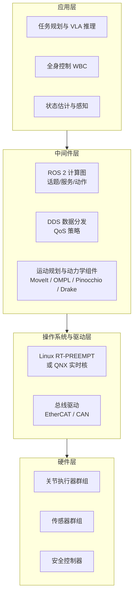
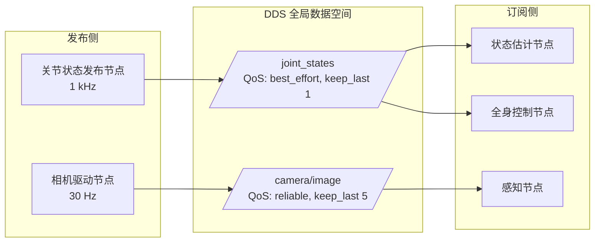
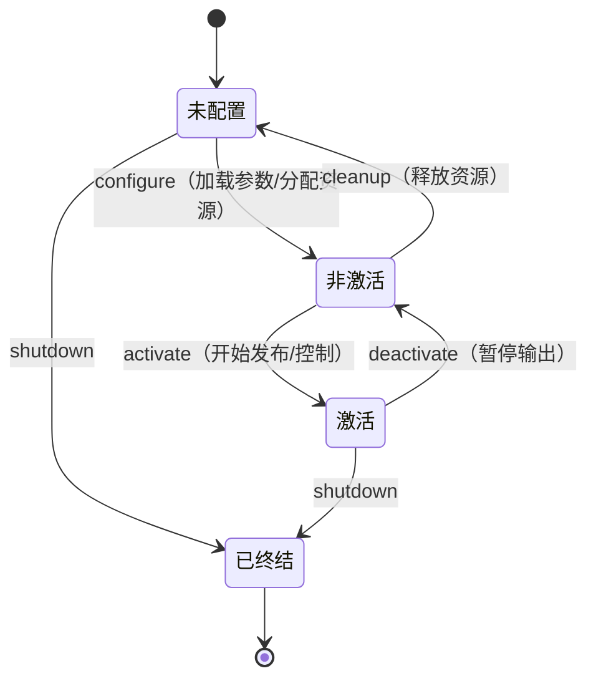
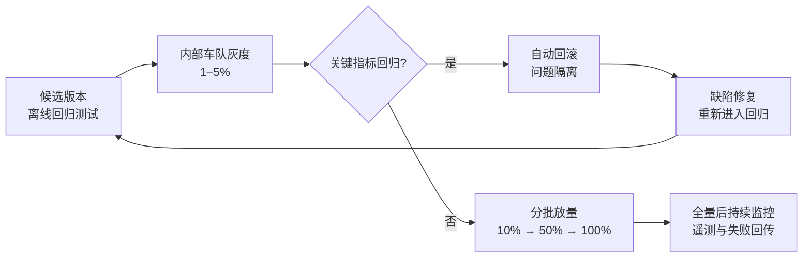
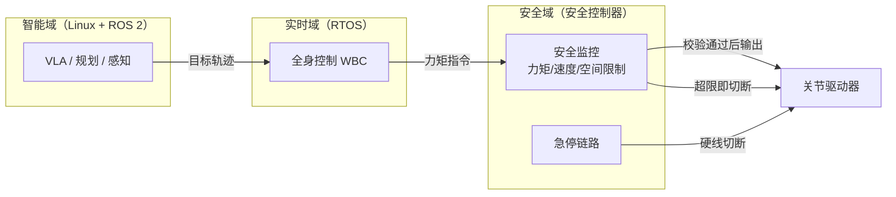

# 第 22 章 软件中间件

## 摘要

人形机器人是当今机器人领域中软件复杂度最高的系统之一：全身上下数十个执行器以毫秒级周期闭环，多路相机、激光雷达与力觉传感器以各异速率涌入数据，VLA 大模型、全身控制器、运动规划器与安全监控需要在异构计算单元上协同运行。把这些部件组织成一个确定性整体的，正是软件中间件——位于操作系统之上、应用算法之下的一层基础软件。本章系统阐述人形机器人软件中间件的技术体系：机器人中间件框架（ROS 与 ROS 2、DDS 数据分发服务及其 QoS 机制）、实时通信与现场总线（EtherCAT、CAN/CAN FD）、运动规划与动力学计算组件（MoveIt、OMPL、Pinocchio、Drake、URDF/MJCF 描述格式）、实时操作系统（QNX、Linux RT-PREEMPT）以及面向部署的 OTA 软件更新与机群管理平台，并讨论功能安全标准（IEC 61508、ISO 13849、ISO 13482、ISO/TS 15066）对软件架构的约束。本章以一个实时任务可调度性分析与端到端延迟预算的 Python 算例收尾，给出从需求到架构选型的工程方法。

**关键词**：软件中间件；ROS 2；DDS；QoS；实时通信；EtherCAT；CAN；MoveIt；OMPL；Pinocchio；Drake；URDF；MJCF；RT-PREEMPT；QNX；OTA；机群管理；功能安全

---

## 22.1 软件中间件概述

### 22.1.1 什么是机器人中间件

**机器人中间件（robot middleware）**是介于操作系统与机器人应用之间的一层软件基础设施，其核心职责有四：

- **进程间通信（IPC）**：为分布在多个进程、多台计算单元上的软件模块提供统一的消息传递机制（发布/订阅、请求/响应），屏蔽底层传输细节；
- **抽象与复用**：把传感器驱动、执行器接口、坐标变换、机器人描述等通用能力封装为标准组件，使算法开发者不必重复造轮子；
- **并发与实时调度支持**：提供执行器（executor）、回调组与优先级机制，使多速率控制回路能够在共享算力下满足时序约束；
- **工具链**：可视化、录制回放（rosbag 类）、参数管理、启动编排与诊断，构成开发-调试-部署的完整工作流。

没有中间件的人形机器人项目，每一个新算法都要从头解决"数据从哪里来、以什么时序到达、失效时如何降级"的问题，研发成本将随模块数量呈平方级增长。中间件把这些横切关注点收敛为一层统一设施，是百人级团队协作开发的前提。

!!! note "术语解释：中间件、进程间通信、横切关注点"
    - **中间件（middleware）**：位于操作系统与应用软件之间的基础软件层，为分布式应用提供通信、抽象与公共服务；机器人中间件额外覆盖传感器/执行器接口与坐标变换等机器人特有需求。
    - **进程间通信（Inter-Process Communication, IPC）**：同一机器或跨机器进程之间交换数据的机制，包括共享内存、消息队列与网络传输；中间件把这些机制封装为统一的编程抽象。
    - **横切关注点（cross-cutting concern）**：日志、时间同步、参数配置、诊断等"每个模块都需要、但不属于任何单一模块业务逻辑"的功能；中间件的核心价值正是集中实现这些关注点。

### 22.1.2 人形机器人对中间件的特殊要求

与固定机械臂或轮式底盘相比，人形机器人给中间件提出了更苛刻的要求：

| 挑战 | 具体表现 | 对中间件的要求 |
|------|---------|---------------|
| 高维全身控制 | 30–60 个关节、1 kHz 级力控回路 | 微秒级抖动的实时通道，零拷贝数据传输 |
| 异构计算 | 实时控制核 + 高性能 AI 核 + 安全 MCU 并存 | 跨进程、跨芯片、跨网络的统一通信抽象 |
| 多模态高带宽 | 多路 RGB-D、激光雷达、触觉阵列 | 大消息吞吐与有损/无损 QoS 分级 |
| 动态任务切换 | 行走、操作、交互模式实时切换 | 生命周期管理与确定性状态机 |
| 安全关键 | 整机跌倒或失控可能伤人 | 通信失效检测、看门狗与降级策略 |
| 云端协同 | OTA 更新、车队数据回流 | 车-云通道与机内总线的安全隔离 |

这些要求解释了为什么人形机器人的软件架构几乎无一例外是"**实时层 + 非实时层**"的双层结构：力控与安全逻辑运行在实时层（实时操作系统 + 现场总线），感知、规划与大模型推理运行在非实时层（通用 Linux + 中间件），两层之间通过严格定义的接口交换状态与目标。

### 22.1.3 分层参考架构

一个典型的人形机器人软件分层参考架构如下：



本章余下部分自中间件层向两侧展开：22.2 节讨论机器人中间件框架本身，22.3 节向下深入实时通信与总线，22.4 节向上介绍构建在框架之上的规划与动力学组件，22.5 节讨论实时操作系统与部署运维设施，22.6 节给出架构综合与算例。

## 22.2 机器人中间件框架：从 ROS 到 ROS 2

机器人中间件框架是整个软件栈的"骨架"：它决定了模块如何拆分、数据如何流动、系统如何启动与降级。本节沿"ROS 1 的局限 → ROS 2/DDS 的架构回答 → QoS 的工程用法 → 计算图的组织方式"这条线索展开，这也是当前人形机器人产品软件栈最主流的演进路径。

### 22.2.1 ROS 1 的遗产与局限

机器人操作系统（Robot Operating System, ROS）尽管名字中有"操作系统"，本质是一套机器人中间件：它定义了节点（node）、话题（topic）、服务（service）与参数服务器等抽象，并提供了庞大的开源包生态。ROS 1 自 2007 年起主导了机器人研究界，但其架构存在三个难以修补的局限：

- **单点主节点（roscore）**：所有节点的发现与注册依赖中心化主节点，主节点失效即全系统瘫痪，不满足产品级可靠性；
- **无实时性与 QoS 概念**：基于 TCP/UDP 的通信无法表达"这条状态流允许丢帧但不容忍延迟"之类的传输策略；
- **安全性缺失**：无认证与加密机制，无法直接部署到联网的商业产品。

这些局限在实验室单机器人场景中可以忍受，但在人形机器人这种多计算单元、安全关键、需要车队运维的产品形态下是致命的。

### 22.2.2 ROS 2 与 DDS：以数据为中心的发布订阅

**ROS 2 中间件**针对上述局限进行了彻底重构，其最关键的设计决策是把通信层建立在国际标准 **DDS（Data Distribution Service，数据分发服务）** 之上。DDS 是以数据为中心的发布/订阅（Data-Centric Publish-Subscribe, DCPS）中间件标准：

- **去中心化发现**：节点通过多播自动发现彼此，不存在单点故障；
- **全局数据空间**：话题被建模为带键值的数据对象，订阅者声明兴趣后由 DDS 负责分发，支持一对多、多对多通信；
- **丰富的 QoS 策略**：可靠性、持久性、历史深度、截止时间、活跃性等均可按话题独立配置；
- **可替换实现**：ROS 2 通过 RMW（ROS Middleware）抽象层支持多种 DDS 实现，厂商可针对实时性、资源占用或认证需求选型。

对实时控制场景，ROS 2 还提供了 `ros2_control` 框架（控制器与硬件接口的标准化）与实时友好的执行器设计：在正确配置（实时内核、内存预分配、静态优先级调度、零拷贝进程内通信）下，ROS 2 节点可以支撑 1 kHz 级的软实时控制回路；更严苛的硬实时回路则下沉到 22.3 节讨论的现场总线层完成。

DDS 的**自动发现（discovery）**机制值得单独说明：节点启动时通过多播向网络宣告自己发布/订阅的话题与 QoS，对端匹配成功后即建立直接的数据通道，此后数据传输不再经过任何中心节点。发现协议本身还承担 QoS 兼容性检查——例如订阅方要求 reliable 而发布方只提供 best_effort 时，匹配将失败并给出诊断，这类"接口契约的编译期检查"在大型系统中能拦截大量集成事故。不同 DDS 实现（如 eProsima Fast DDS、Eclipse Cyclone DDS 等）在发现开销、共享内存传输与实时行为上各有侧重，RMW 抽象层使应用代码与具体实现解耦，便于按部署场景替换。



### 22.2.3 QoS 策略：为每路数据流定制传输契约

DDS 的 QoS（Quality of Service）机制允许按话题声明传输契约，这是 ROS 2 区别于 ROS 1 最实用的特性。人形机器人中的典型 QoS 配置如下：

| 数据流 | 可靠性 | 历史 | 理由 |
|--------|--------|------|------|
| 关节状态 /joint_states | best_effort | keep_last(1) | 高频周期数据，旧帧即刻过时，丢一帧优于延迟一帧 |
| 相机图像 | best_effort 或 reliable | keep_last(1–5) | 带宽大；视觉算法通常容忍偶发丢帧 |
| 控制指令 | reliable | keep_last(1) | 指令不可丢失，但只需最新值 |
| 地图 /map | reliable + transient_local | keep_last(1) | 后加入的节点也必须能收到最后一份地图 |
| 安全事件 /estop | reliable | keep_all | 任何一条安全事件都不允许丢失 |

对于相机图像与点云这类大消息，QoS 之外还有两个性能杠杆：一是**进程内零拷贝通信**——把发布与订阅节点编排进同一进程，消息只传指针不传数据，可把单帧 1080p 图像的传递开销从毫秒级压到微秒级；二是**共享内存传输**——部分 DDS 实现在跨进程场景下以共享内存加句柄传递替代 socket 拷贝。人形机器人头部多路 RGB-D 的数据吞吐可达每秒数百 MB，是否启用这两类机制，直接决定感知链路能否在通用计算单元上闭合。

!!! note "术语解释：发布/订阅、DCPS、QoS、零拷贝"
    - **发布/订阅（publish/subscribe）**：通信双方不直接寻址，发布者向话题写数据、订阅者声明兴趣，由中间件完成匹配与分发，从而实现模块解耦。
    - **DCPS（Data-Centric Publish-Subscribe）**：DDS 的核心模型，把通信视为对"全局数据空间"中数据对象的读写，而非点对点消息传递。
    - **QoS（Quality of Service）**：描述数据流传输策略的参数集合，如可靠性（reliable/best_effort）、持久性（transient_local）、历史深度（keep_last/keep_all）与截止时间（deadline）。
    - **零拷贝（zero-copy）**：同一进程或共享内存域内传递大消息时不复制数据、只传递引用的机制，是图像、点云等大带宽数据流达到实时性能的关键。

### 22.2.4 计算图组织：节点、生命周期与动作

ROS 2 应用被组织为一张**计算图（computation graph）**：节点是执行单元，话题、服务（同步请求/响应）与动作（action，带反馈与可取消的异步任务）是边。人形机器人系统中的典型划分是：每个传感器与执行器群组一个驱动节点，状态估计、感知、规划、控制各为一组节点，任务级行为用动作服务器建模（如"走到 A 点""抓取物体 B"），便于上层任务规划器取消与监控。

ROS 2 引入的**生命周期节点（lifecycle node）**对产品化尤为重要：节点从"未配置—非激活—激活—析构"经历受控状态机，系统启动时可以按依赖顺序确定性地拉起全部模块，故障时可按序降级。对一台需要"按一下电源键就可靠启动"的商用机器人而言，这一机制把启动编排从脚本技巧变成了架构保证。



### 22.2.5 与数据基础设施的衔接

中间件同时是第 21 章数据基础设施的机内载体。三个衔接点值得架构师在选型时显式设计：

- **录制与回放**：基于中间件话题的录制工具（rosbag/MCAP 类）是数据采集管线的机内入口，录制格式直接决定后续入湖转换的成本；
- **时间同步**：多计算单元间需要统一时钟（以太网 PTP 或基于 EtherCAT 分布式时钟的层级同步），否则跨相机的多模态轨迹无法对齐——这与第 21 章的毫秒级同步要求互为因果；
- **车-云通道**：车队回流数据与 OTA 下行包共用一条受限的上行/下行链路，必须在中间件层做流量整形与优先级隔离，避免日志回传挤占控制相关流量。

## 22.3 实时通信与现场总线

中间件解决"模块之间如何对话"，现场总线解决"控制指令如何在确定时限内抵达执行器"。人形机器人的关节闭环频率高、节点数量多、同步要求严，使总线选型直接决定了整机控制性能的物理上限。本节先建立实时性的定量语言，再逐一分析 EtherCAT 与 CAN 这两条主力路线。

### 22.3.1 实时性的量化：延迟、抖动与可调度性

**实时（real-time）**不等于"快"，而等于"**确定（deterministic）**"：系统必须在可证明的时限内响应。描述实时性的核心指标是：

- **延迟（latency）**：从事件发生到响应完成的时间；
- **抖动（jitter）**：延迟的最坏值与典型值之差；对控制回路而言，抖动往往比平均延迟更有害，因为它直接降低控制律的相位裕度；
- **截止时间（deadline）**：任务必须完成的时限；硬实时任务错过截止时间即视为系统失效。

按错过截止时间的后果，实时任务分为三类：**硬实时**（错过即失效，如关节力矩控制、急停响应）、**软实时**（错过降低服务质量，如视频流）、与介于两者之间的** firm（坚定）实时**（错过的结果直接作废，如规划器的一次迭代）。人形机器人软件架构的分层本质，就是把这三类任务分配到与其确定性等级匹配的执行环境上。

周期性实时任务的可调度性可以用经典的速率单调（Rate-Monotonic, RM）分析判断。设任务集有 \(n\) 个周期任务，第 \(i\) 个任务的计算时间为 \(C_i\)、周期为 \(T_i\)，按周期越短优先级越高分配静态优先级，则 RM 调度可行的充分条件（Liu & Layland 界）为：

$$
U = \sum_{i=1}^{n} \frac{C_i}{T_i} \le n\left(2^{1/n} - 1\right)
$$

当 \(n \to \infty\) 时，该界收敛于 \(\ln 2 \approx 0.693\)；若采用截止时间单调或最早截止优先（EDF）调度，利用率上限可达 1。人形机器人的实时核上通常同时运行总线通信任务、状态估计任务、全身控制任务与日志任务，RM 分析是判断"这颗核扛不扛得住"的第一道定量关卡——22.6 节的 Python 算例将演示其用法。

### 22.3.2 EtherCAT：确定性关节控制的主力总线

**EtherCAT** 是当前人形机器人关节控制事实上的主力现场总线。它由 Beckhoff 提出、基于标准以太网帧，其标志性机制是"**processing on the fly（飞越处理）**"：主站发出一个逻辑帧依次穿过菊花链上的所有从站，每个从站在帧经过自己的瞬间读取对应的输出数据区、插入自己的输入数据，无需像传统以太网那样完整接收再转发。这一机制带来两个决定性优势：

- **极低且确定的周期时间**：一根网线串联数十个关节驱动器，整个帧的传输延迟由物理传播与每站极短的转发延迟决定，全身 40 个关节的 1 kHz 全双工状态/指令交换在 EtherCAT 上是常规配置；
- **分布式时钟（Distributed Clocks, DC）**：各从站的本地时钟与主站参考时钟同步，同步误差通常在微秒级以内，保证所有关节在同一时刻采样与施加力矩——这是全身协调控制（如 WBC）正确性的物理基础。

工程代价是：需要主站实时协议栈（通常运行在 RT-PREEMPT Linux 或专用实时核上）、布线拓扑受菊花链约束、且从站芯片生态相对集中。典型人形机器人会把全身关节划分为 2–4 条 EtherCAT 分支（左右腿、左右臂/躯干），以缩短单链长度、隔离故障域。

从协议细节看，EtherCAT 把一个逻辑网段抽象为一段 4 GB 的"过程数据映像"，主站帧中的数据报文按从站地址或逻辑地址寻址，读写操作在帧飞越各站时完成；通信周期（如 250 µs 或 1 ms）即控制周期，主站协议栈必须在每个周期内精确完成组帧、发送、回收与校验，这正是它对操作系统实时性要求严苛的原因。从站侧的过程数据（目标力矩/位置下行，编码器、温度、电流上行）由从站控制器（ESC）硬件自动映射，驱动器固件无需干预传输过程本身。

### 22.3.3 CAN 与 CAN FD：低成本高鲁棒的备选

**CAN 总线（Controller Area Network）**源自汽车工业，以多主仲裁、差分信号与极强的抗干扰能力著称。在人形机器人中，CAN/CAN FD 常用于：

- 对带宽要求不高的关节（如手部小关节、头部关节）的电机控制；
- 电池管理系统（BMS）、温度与电流监测等低速传感器网络；
- 安全相关信号的冗余通道（急停链路）。

经典 CAN 的标称速率上限为 1 Mbit/s、单帧 8 字节载荷；CAN FD 把数据段速率提升至数 Mbit/s、载荷扩至 64 字节，显著缓解了带宽瓶颈。与 EtherCAT 相比，CAN 的延迟确定性依赖总线负载率与报文优先级仲裁，工程上通常把总线负载率控制在 30% 以下以保证最坏延迟有界。

CAN 的仲裁机制是其确定性的来源：各节点在发送报文标识符（ID）的同时监听总线，一旦发现自己发出的隐性位被显性位覆盖即主动退出发送——ID 数值越小优先级越高，最高优先级报文的延迟可严格有界计算，这正是其承载急停与安全信号的理论依据。代价同样清晰：低优先级报文在高负载下可能被长期"饿死"，因此 CAN 网络的报文 ID 规划（哪些信号必须实时、哪些可以容忍排队）是整车/整机网络设计中的重要工作。

### 22.3.4 总线选型对比

| 维度 | EtherCAT | CAN / CAN FD | 标准以太网（非实时） |
|------|----------|--------------|---------------------|
| 典型周期能力 | 125 µs – 1 ms | 1 – 10 ms | 不确定（毫秒级以上抖动） |
| 拓扑 | 菊花链/线型 | 总线型（多主） | 星型（交换机） |
| 时钟同步 | 分布式时钟，µs 级 | 无内建机制 | 需 PTP 等上层协议 |
| 典型用途 | 关节力控主干 | 低速关节、BMS、安全链路 | 感知数据、日志、云端 |
| 主站要求 | 实时协议栈 | 普通 CAN 控制器 | 无特殊要求 |

工程上的通行做法是**分层混用**：EtherCAT 承担关节闭环主干，CAN FD 承担手部与低速设备，千兆以太网承担相机/激光雷达与机内计算单元互联，Wi-Fi/5G 承担车-云链路。各层之间通过网关节点做协议桥接与数据整形。

## 22.4 运动规划与动力学计算组件

中间件提供"管道"，管道中流动的高价值计算则由一组专业组件完成。本节介绍四类构成人形机器人软件栈"腰部"的开源组件：负责几何规划的 MoveIt/OMPL、负责动力学计算的 Pinocchio、负责优化与验证的 Drake，以及贯穿它们的本体描述格式 URDF 与 MJCF。这些组件的共同特征是：算法上成熟、接口上标准化、且都能嵌入 ROS 2 计算图作为节点或库被调用。

### 22.4.1 运动学的核心算子：任务 Jacobian

从关节空间到任务空间的映射是几乎所有规划与控制组件的基本运算。设机器人关节构型为 \(q \in \mathbb{R}^n\)，末端（或任意任务特征点）位姿为 \(x = f(q)\)，则**任务 Jacobian（Task Jacobian）**定义为将关节空间速度映射到任务空间速度的矩阵：

$$
\dot{x} = J(q)\,\dot{q}, \qquad J(q) = \frac{\partial f(q)}{\partial q}
$$

逆运动学（通过伪逆 \(J^{+}\) 或阻尼最小二乘迭代求解）、操作空间控制（\(\tau = J^T F\) 把任务空间力映射为关节力矩）、以及全身控制中的任务优先级投影，全部建立在这一算子之上。其计算效率——对 40+ 自由度的人形机器人每毫秒级重算一次——正是 22.4.3 节 Pinocchio 这类库存在的意义。

需要区分的是，Jacobian 还编码了机构的**奇异性（singularity）**：当 \(J\) 接近奇异时，微小任务空间速度要求巨大的关节速度，运动学解的数值条件数急剧恶化。人形机器人的冗余自由度（全身 \(n \gg 6\)）提供了利用零空间（null space）规避奇异、同时兼顾次级任务（如姿态保持、关节限位回避）的自由度，这也是 7 自由度手臂与全身冗余控制的数学基础（参见第 9 章对可操作性的讨论）。

### 22.4.2 MoveIt 与 OMPL：采样式运动规划的事实标准

**MoveIt 运动规划**是 ROS 生态中最成熟的运动规划框架：它把碰撞环境表示（基于八叉树等占据表示）、正逆运动学插件、碰撞检测与规划器接口整合为一套管线，广泛用于机械臂及人形机器人的全身运动规划。其默认的规划器后端是 **OMPL（Open Motion Planning Library）**：一个实现了 RRT、RRT*、PRM、BIT* 等基于采样的运动规划算法的开源 C++ 库。

采样式规划的基本思想是在构型空间（configuration space, C-space）中随机采样并局部连接，逐步构建可达路径图或树，从而回避了对高维空间障碍的显式建模——这对 40+ 自由度的人形机器人至关重要，因为显式表示其 C-space 障碍在计算上不可行。工程实践中，MoveIt/OMPL 常用于"慢速层"：为手臂或全身生成无碰撞的几何路径，再由下层控制器（如 WBC 或 MPC）负责动力学可行的实时执行。人形场景下的常见增强包括：以动捕数据或学习先验偏置采样、用约束流形描述双手闭链与姿态保持任务、以及把规划结果作为模型预测控制的参考轨迹。

一条典型的 MoveIt 请求处理管线包含五个阶段：规划场景更新（融合感知点云/占据地图）→ 碰撞检测（自身与环境，基于 FCL 等库）→ 采样规划（OMPL 规划器在时限内求解）→ 路径后处理（时间参数化与平滑，如 TOTG 算法）→ 执行与在线监控（轨迹执行中的偏差与动态障碍再规划）。每个阶段都可替换实现——这种插件化设计使 MoveIt 既是框架也是集成点，团队可以只复用其碰撞管线而自研规划器，或反之。

### 22.4.3 Pinocchio：毫秒级刚体动力学

**Pinocchio** 是一个用于高效刚体动力学、运动学与解析导数计算的开源 C++ 库，实现了 Featherstone 的关节体算法（ABA，\(O(n)\) 复杂度）与复合刚体算法（CRBA），并提供对关节力矩、质心、雅可比及其解析导数的高效求值。在人形机器人中，它几乎是全身控制、轨迹优化与基于模型的状态估计的标配计算内核——WBC 的每一个控制周期都需要重算质量矩阵 \(M(q)\)、科氏/重力项 \(h(q, \dot{q})\) 与接触雅可比，Pinocchio 把这些运算的耗时压到微秒至几十微秒量级，使 1 kHz 全身控制在通用 CPU 上可行。

其性能来自三个层次的设计：一是算法层采用 \(O(n)\) 递归算法而非显式构造 \(n \times n\) 质量矩阵求逆；二是实现层大量使用表达式模板与缓存友好的数据结构，避免动态内存分配（这对实时性同样关键）；三是提供**解析导数**（如 \(\partial M/\partial q\)），使基于梯度的轨迹优化与 MPC 不必依赖缓慢且数值不稳定的有限差分。在人形机器人这类浮动基系统上，Pinocchio 还支持把基座 6 自由度与关节统一建模，直接输出浮动基动力学方程

$$
M(q)\ddot{q} + h(q, \dot{q}) = S^T \tau + J_c^T f_c
$$

其中 \(S\) 为驱动选择矩阵，\(J_c\)、\(f_c\) 为接触雅可比与接触力——这正是全身控制 QP 的动力学约束行。

### 22.4.4 Drake：基于优化的控制与验证

**Drake 系统工具箱**是 MIT 主导的、面向基于优化控制与分析的系统建模工具箱：它在统一的系统图框架下集成了多刚体动力学（含接触）、数学规划求解器接口（QP、SOCP、SDP 等）与系统分析工具。在人形机器人研发中，Drake 的典型角色有两个：一是作为**基于优化的控制**（如轨迹优化、MPC、LQR-Trees）的原型验证环境；二是作为**离线分析与验证**工具，对控制器做可达性分析与稳定性证书计算。与 Pinocchio 的"在线计算内核"定位互补，Drake 更偏向设计与验证侧。

### 22.4.5 机器人描述格式：URDF 与 MJCF

上述所有组件都依赖一份机器可读的本体描述。当前两大主流格式是：

- **URDF 机器人描述格式**：基于 XML，描述连杆、关节、惯性参数与几何（含碰撞与视觉网格），是 ROS 生态的标准机器人描述格式，MoveIt、RViz 与大量驱动包都以其为输入。其局限是对执行器、传感器与闭环运动链的表达能力有限，社区以 xacro 宏与 SRDF（语义补充）缓解。
- **MJCF 仿真格式**：MuJoCo 的 XML 建模格式，面向具有接触、执行器与传感器的铰接刚体系统，物理参数（摩擦、阻尼、执行器增益）表达远比 URDF 完整，是仿真训练与 Sim-to-Real 研究的主流描述格式。

工程上通常以 URDF 为"单一事实来源"维护整机模型，再通过自动转换工具生成 MJCF 用于仿真管线；两种格式间的参数漂移（惯量、限位、摩擦）是 Sim-to-Real 失败的常见隐蔽原因，需要纳入版本管理与自动化校验。

与本体描述配套的还有坐标变换基础设施：ROS 生态的 `tf2` 库维护全机坐标系之间的时变变换树（基座、各连杆、各相机、地图系），任何节点都可查询"某时刻 A 系到 B 系的变换"。对人形机器人而言，变换树同时服务控制（足端相对质心）、感知（点云配准到地图）与数据录制（各模态统一坐标系）三方，是中间件层使用频率最高的公共组件之一。

## 22.5 实时操作系统与部署运维

中间件与组件解决的是"研发期"的问题；当机器人走出实验室，"运行期"的问题——操作系统能否提供确定性、软件如何安全地远程更新、成百上千台机器人如何被统一运营、安全论证如何闭环——就成为主角。本节讨论这四类运行期基础设施。

### 22.5.1 实时操作系统：QNX 与 Linux RT-PREEMPT

通用操作系统（如标准 Linux）并非为硬实时设计：内核不可抢占区、中断处理与调度器的非确定性会带来不可控的延迟尖峰。**实时操作系统（RTOS）**通过内核抢占、优先级调度与确定性中断响应满足严格时序要求。人形机器人中两类主流选择是：

- **Linux RT-PREEMPT**：一个使 Linux 内核大部分可抢占的内核补丁集，提供确定性的低延迟行为。其优势是完整保留 Linux 生态（驱动、ROS 2、容器工具链），把最坏情况延迟从毫秒级压到几十微秒量级，是当前人形机器人实时核的主流方案。配套的工程实践包括 CPU 隔离（isolcpus）、中断亲和性绑定、内存锁定（mlockall）与实时优先级（SCHED_FIFO）。
- **QNX**：商用微内核实时操作系统，广泛用于汽车与安全关键系统，提供高可靠性与确定性调度，并具备功能安全认证资质。其微内核架构使驱动故障不会蔓延至内核，适合承载安全监控与底层控制；代价是生态与授权成本。

典型人形机器人采用"**QNX 或 RT-PREEMPT 实时核跑控制 + 标准 Linux 核跑感知与 AI**"的异构组合，两核之间以共享内存或确定性以太网通道交换数据，安全相关功能（急停、力矩限制、跌倒保护）强制落在实时侧。

!!! note "术语解释：硬实时、可抢占内核、优先级反转、CPU 隔离"
    - **硬实时（hard real-time）**：错过截止时间即构成系统失效的实时性等级，关节力控与安全回路属于此类。
    - **可抢占内核（preemptible kernel）**：内核态代码执行期间也可被更高优先级任务抢占的内核；RT-PREEMPT 补丁把 Linux 内核中大部分自旋锁替换为可睡眠锁，从而把最长不可抢占区压缩到几十微秒量级。
    - **优先级反转（priority inversion）**：高优先级任务因等待低优先级任务持有的锁而被间接阻塞的现象；主流对策是优先级继承（priority inheritance）互斥锁。
    - **CPU 隔离（CPU isolation）**：把指定 CPU 核从通用调度域中移除、专用于实时任务的配置手段（如 `isolcpus` 内核参数），配合中断亲和性与内存锁定构成实时调优的标准三件套。

### 22.5.2 OTA 软件更新

**OTA 软件更新（Over-the-Air Update）**指向已部署的人形机器人机群无线部署控制策略、固件与系统软件的能力，是数据飞轮（见第 21 章）闭环的"最后一公里"。机器人 OTA 比手机/汽车 OTA 更危险：一次有缺陷的控制器更新可能直接导致整机跌倒。因此工程上要求：

- **A/B 分区与回滚**：新固件写入备用分区，首次启动自检失败即自动回滚到已知良好版本；
- **灰度发布**：先更新机群中 1%–5% 的个体，监控关键指标（跌倒率、急停次数、任务成功率）无回归后逐步放量；
- **分层更新**：AI 模型、应用软件、实时固件与底层驱动分别走不同的审批与发布通道，模型更新可以天级发布，固件更新必须经过完整回归测试；
- **更新窗口与状态约束**：仅允许在充电/空闲状态进入更新流程，更新前强制安全停靠。

此外，软件供应链安全同样适用于机器人：更新包必须签名并在设备端验签（防止恶意固件注入），发布管线应保留从源码提交到固件镜像的完整可溯源链（SBOM，软件物料清单），以便在发现组件级漏洞时快速定位受影响的机群范围。



### 22.5.3 机群管理平台

**机群管理平台（Fleet Management Platform）**是跨多台已部署人形机器人进行任务编排、充电调度、健康监控与数据分析的云平台。其功能栈通常包括：任务分配与交通协调（多台机器人共享作业空间时的死锁与冲突消解）、电池与充电策略优化（按任务队列预测能耗、错峰充电）、预测性维护（基于电机电流、温度与振动遥测识别关节磨损前兆）、以及软件配置管理（每台机器人的模型版本、地图与标定参数台账）。对运营方而言，机群平台的指标直接决定商业模型：**单机日均有效作业时长**与**人工接管率**是两个北极星指标，前者乘以单机产出即收入能力，后者决定远程运营团队的人力规模。

机群平台与单机中间件之间的接口设计有一个关键原则：**云指令必须可拒绝**。平台下发的任务级指令（"去货架 A 取箱"）只携带目标与约束，具体的运动生成、避障与安全降级完全由机载系统自治完成；机器人处于任何不安全状态时都有权延迟或拒绝执行，并把拒绝原因回传。这一"云端编排、机载自治"的职责划分，与 22.5.4 节"安全功能独立于智能功能"的要求同构——网络不可达、云端故障都不应使单机失去安全运行能力。

### 22.5.4 功能安全标准对软件架构的约束

人形机器人进入人类活动空间，使其软件架构必须回应功能安全标准。当前直接相关的标准族包括：

- **IEC 61508**：电气/电子/可编程电子安全相关系统的功能安全基础标准，定义了 SIL（安全完整性等级）框架，是多数安全论证的方法论源头；
- **ISO 13849**：机械安全控制系统相关部件的标准，以 PL（性能等级）量化安全功能可靠性，关节力矩限制、急停链路通常按此设计；
- **ISO 13482**：个人护理机器人安全标准，直接覆盖在非工业环境中与人近距离共处的移动服务机器人；
- **ISO/TS 15066**：协作机器人技术规范，定义了人机协作下的功率与力限制原则，为人形机器人在人机共处场景的接触安全设计提供参考。

这些标准对软件中间件层的直接含义是：**安全功能必须与智能功能隔离**。安全监控（力矩/速度/空间限制、急停、跌倒保护）应运行在独立的、可认证的安全控制器上，具有独立的传感器通道与执行切断路径；ROS 2 计算图上的任何节点（包括 VLA 大模型）都不应处于安全回路的关键路径中。"智能可以失效，安全必须失效安全（fail-safe）"——这一分层原则是所有人形机器人软件架构评审的第一条检查项。



上图给出了与之对应的三域架构：智能域与实时域的任何失效都必须被安全域独立捕获；安全域不依赖任何上层软件的正确性，仅依赖自己的传感与逻辑。设计评审时，每个安全功能都应能回答三个问题：它检测什么、它独立于谁、它在主电源失效时如何仍然有效。

## 22.6 架构综合：实时预算与可调度性算例

把本章组件装配成一台整机时，架构师需要回答的核心问题是：**端到端延迟预算如何在各组件间分配，以及实时核能否承载全部周期任务**。以下 Python 算例演示一个典型实时核的可调度性分析与关节回路的延迟预算分解：

```python
# 实时核 RM 可调度性分析 + 端到端延迟预算
import math

# --- 1) RM 可调度性分析 ---
# 任务: (名称, 计算时间 C_i [µs], 周期 T_i [µs])
tasks = [
    ("EtherCAT 主站收发",  80,  1000),   # 1 kHz 总线周期
    ("状态估计 (EKF)",    120,  1000),   # 1 kHz
    ("全身控制 WBC",      350,  1000),   # 1 kHz
    ("安全监控",           30,   500),   # 2 kHz
    ("遥测与日志",        200, 10000),   # 100 Hz
]
U = sum(C/T for _, C, T in tasks)
n = len(tasks)
bound = n * (2**(1/n) - 1)
print(f"CPU 利用率 U = {U:.3f}")
print(f"RM 可调度性充分条件上界 = {bound:.3f} (n={n})")
print("RM 判定:", "可调度（充分条件满足）" if U <= bound else "充分条件不满足，需响应时间分析")

# --- 2) 关节控制回路端到端延迟预算 ---
# 链路: 编码器采样 -> EtherCAT 上行 -> 状态估计 -> WBC 解算 -> EtherCAT 下行 -> 驱动器执行
budget = {
    "编码器采样与滤波":      50,   # µs
    "EtherCAT 上行传输":    100,
    "状态估计":             120,
    "WBC 优化解算":         350,
    "EtherCAT 下行传输":    100,
    "驱动器力矩建立":       150,
    "安全裕量 (抖动吸收)":  130,
}
total = sum(budget.values())
print(f"\n端到端延迟预算合计: {total} µs（控制周期 1000 µs）")
for k, v in budget.items():
    print(f"  {k:<18s} {v:>4d} µs  ({v/10:.1f}%)")
```

典型结论有三：其一，1 kHz 全身控制回路的延迟预算中，WBC 解算与总线传输占大头，这解释了为何 Pinocchio 级的高效动力学库与 EtherCAT 的飞越处理是刚需；其二，RM 分析显示该任务集利用率 \(U \approx 0.63\)，低于 \(n=5\) 时的充分条件上界约 0.74，可调度性成立但余量并不充裕——一旦 WBC 解算时间随接触点数增长，就需要拆分多核或采用响应时间分析做更精细的论证；其三，抖动吸收必须显式计入预算——本例中各项延迟之和恰为 1000 µs，等于控制周期本身，忽略抖动的"平均延迟设计"会让最坏情况直接超时，这是现场事故的常见根源。

## 22.7 本章小结

本章阐述了人形机器人软件中间件的技术体系，核心结论如下：

1. **中间件是人形机器人软件的组织原则**。它把进程间通信、硬件抽象、并发调度与工具链收敛为统一设施，是百人级协作与产品化部署的前提。
2. **ROS 2 + DDS 构成当前事实标准**。以数据为中心的发布/订阅、去中心化发现与按话题的 QoS 契约，使其能同时承载关节状态流、大带宽视觉流与安全事件流；生命周期节点与 ros2_control 则补上了产品化所需的可控启动与硬件抽象。
3. **实时性靠分层保证**。ROS 2 支撑软实时层；1 kHz 级关节闭环下沉到 EtherCAT（飞越处理 + 分布式时钟）与 CAN FD 等现场总线；RT-PREEMPT Linux 与 QNX 提供确定性操作系统底座；RM 可调度性分析与端到端延迟预算是架构评审的定量工具。
4. **规划与动力学组件构成软件栈的"腰部"**。MoveIt/OMPL 解决高维构型空间的几何规划，Pinocchio 提供毫秒级动力学计算，Drake 支撑基于优化的控制与离线验证，URDF/MJCF 双格式贯穿控制与仿真两侧。
5. **部署运维与安全是产品化的最后边界**。OTA 更新需要 A/B 分区、灰度与回滚；机群管理平台把单机产品变成可运营的服务；IEC 61508、ISO 13849、ISO 13482 与 ISO/TS 15066 则要求安全功能与智能功能在架构上硬隔离。

至此，本书完成了从硬件（第 1–9 章）到数据（第 21 章）再到运行时软件（本章）的基础层铺陈；后续章节将在此地基上讨论感知、规划、控制与学习算法的具体实现。
