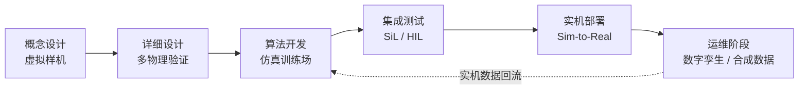
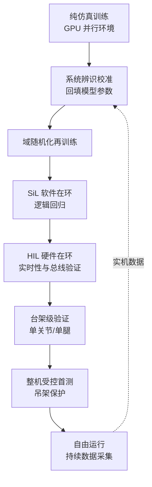
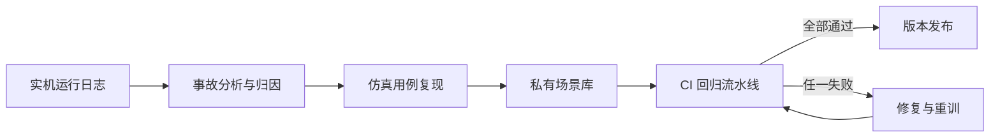

# 第 23 章 仿真与物理引擎

## 摘要

仿真是人形机器人从图纸走向真实世界的"中间试验场"：它把昂贵的硬件试错转化为廉价的数值实验，把稀缺的实机数据放大为海量的合成经验。本章从刚体动力学仿真的数学基础出发，系统阐述铰接体运动方程、正向动力学算法、接触建模与时间积分等物理引擎内核原理；随后逐一剖析 MuJoCo 物理引擎、NVIDIA Isaac Sim/Isaac Lab、Gazebo、Drake 系统工具箱、Genesis 生成式物理引擎与 ManiSkill3 等主流平台的架构特征与适用边界，并讨论 URDF 机器人描述格式与 MJCF 仿真格式构成的资产管线。在此基础上，本章深入 GPU 大规模并行仿真如何重塑强化学习训练范式，以及视觉与力觉传感器仿真、合成数据管线的工程实现。最后围绕 Sim-to-Real 迁移这一核心命题，给出域随机化、系统辨识与硬件在环测试（HIL）三层工具箱，并以 HumanoidBench、ManiSkill 等仿真基准说明受控比较的方法论。本章与第 14 章（控制）、第 18 章（策略学习）、第 25 章（评测体系）互为支撑。

**关键词**：物理引擎；刚体动力学；接触建模；MuJoCo；NVIDIA Isaac Sim；Gazebo；GPU 并行仿真；域随机化；Sim-to-Real 迁移；硬件在环测试

---

## 23.1 仿真在人形机器人开发中的定位

### 23.1.1 人形机器人为什么离不开仿真

人形机器人是本书所述所有机器人形态中对仿真依赖最深的品类之一，原因有四。

第一，**试错成本极高**。一台全尺寸人形机器人整机物料成本通常为数万至数十万美元量级，一次失控跌倒可能损坏谐波减速器、力矩传感器或结构件，维修周期以周计。仿真把"摔一万次"的成本压缩到电费水平，使得激进控制策略的探索成为可能。

第二，**强化学习（Reinforcement Learning, RL）的样本饥渴**。当下主流的腿足运动控制策略多由近端策略优化（Proximal Policy Optimization, PPO）等无模型强化学习算法训练，收敛往往需要数十亿步环境交互。以 50 Hz 控制频率计，单台实机一年不停机也只能积累约 16 亿步，且全程伴随磨损与安全风险；而 GPU 并行仿真可以在数小时内完成同等规模的采样。

第三，**数据采集的可扩展性**。遥操作采集实机示教数据的吞吐受限于操作员数量与设备台数；仿真中的合成数据管线可以程序化地生成场景、物体、光照与标注，规模几乎不受物理约束。NVIDIA Isaac Sim 支撑 GR00T 合成数据管道即是这一思路的产业实践。

第四，**安全与可重复性**。仿真环境可以精确复现同一初始条件，支持回归测试与受控比较，这对验证控制软件版本迭代至关重要。

!!! note "术语解释：仿真、数字孪生、合成数据、回归测试"
    - **仿真（simulation）**：用数学模型在计算机中重现物理系统的演化过程，用于预测、训练与验证。
    - **数字孪生（digital twin）**：与特定物理个体保持状态同步的高保真仿真副本，强调"一对一"映射；一般仿真则不绑定具体个体。
    - **合成数据（synthetic data）**：由仿真器程序化生成的传感器数据及其标注，用于训练感知或策略模型。
    - **回归测试（regression testing）**：每次软件变更后重新运行既有测试集，确认未引入性能退化。

### 23.1.2 仿真在整机开发流程中的角色

仿真贯穿人形机器人开发的完整生命周期，并在不同阶段扮演不同角色：

| 阶段 | 仿真角色 | 典型任务 |
|---|---|---|
| 概念设计 | 虚拟样机 | 构型比较、关节力矩谱估算、可达空间分析 |
| 详细设计 | 多物理验证 | 结构强度校核接口、热仿真耦合、线缆运动干涉检查 |
| 算法开发 | 训练场与试验台 | 控制器调参、RL 策略训练、规划算法验证 |
| 集成测试 | 在环验证 | 软件在环（SiL）、硬件在环（HIL）、回归测试 |
| 部署运维 | 数字孪生与数据工场 | 故障复现、合成数据生成、策略再训练 |



!!! note "术语解释：虚拟样机、软件在环、硬件在环、多物理仿真"
    - **虚拟样机（virtual prototype）**：在制造物理样机之前，用于评估设计候选方案的完整数字化模型。
    - **软件在环（Software-in-the-Loop, SiL）**：被测控制软件与仿真被控对象在同一计算环境内闭环运行。
    - **硬件在环（Hardware-in-the-Loop, HIL）**：真实控制器硬件与实时仿真的被控对象闭环运行，详见 23.7.4 节。
    - **多物理仿真（multiphysics simulation）**：同时求解结构、热、电磁、流体等多个物理场的耦合仿真。

### 23.1.3 仿真的能力边界：现实差距

仿真不是免费的午餐。仿真与现实之间的系统性偏差称为**现实差距（reality gap）**或**仿真到真实差距（sim-to-real gap）**，其主要来源包括：

- **接触力学误差**：足-地接触、手-物接触涉及黏滑、微凸体变形与冲击，任何接触模型都只是真实物理的近似；
- **执行器非线性**：减速器齿隙、摩擦、迟滞与温度漂移难以精确建模；
- **传感器失真模型不足**：相机的运动模糊、镜头的径向畸变、IMU 的偏置游走等常被简化或忽略；
- **未建模柔体与间隙**：线缆、蒙皮、足底泡棉、结构件弹性变形在纯刚体仿真中不可见；
- **渲染域差**：仿真图像与真实相机在纹理、光照、噪声分布上的统计差异，会直接劣化视觉策略的迁移表现。

因此，本章的方法论主线不是"如何把仿真做得更真"，而是"如何在承认仿真必然失真的前提下，让在仿真中得到的结论对现实仍然成立"——这正是 23.7 节 Sim-to-Real 迁移工具箱的出发点。

## 23.2 刚体动力学仿真的数学基础

### 23.2.1 铰接刚体系统的运动方程

人形机器人在仿真中通常被建模为**浮动基座（floating base）铰接刚体系统**：骨盆（基座）具有 6 个自由度的空间位姿，各肢体通过转动关节连接成树状运动链。其运动方程为

$$
\mathbf{M}(\mathbf{q})\,\ddot{\mathbf{q}} + \mathbf{C}(\mathbf{q}, \dot{\mathbf{q}})\,\dot{\mathbf{q}} + \mathbf{g}(\mathbf{q}) = \mathbf{S}^{\top}\boldsymbol{\tau} + \mathbf{J}_c(\mathbf{q})^{\top}\,\mathbf{f}_c
$$

其中 \(\mathbf{q} \in \mathbb{R}^{n+6}\) 为广义坐标（含浮动基座位姿），\(\mathbf{M}\) 为质量矩阵，\(\mathbf{C}\dot{\mathbf{q}}\) 为科氏力与离心力项，\(\mathbf{g}\) 为重力项，\(\mathbf{S}\) 为执行关节的选择矩阵，\(\boldsymbol{\tau}\) 为关节力矩，\(\mathbf{J}_c\) 为接触雅可比，\(\mathbf{f}_c\) 为接触力。物理引擎每一步的核心任务就是求解该方程的**正向动力学（forward dynamics）**：给定当前状态 \((\mathbf{q}, \dot{\mathbf{q}})\) 与作用力矩 \(\boldsymbol{\tau}\)，求加速度 \(\ddot{\mathbf{q}}\)，再做时间积分推进状态。

!!! note "术语解释：广义坐标、浮动基座、质量矩阵、选择矩阵、接触雅可比"
    - **广义坐标（generalized coordinates）**：完整描述系统位形所需的最小坐标集合；对人形机器人即基座位姿加全部关节角。
    - **浮动基座（floating base）**：不固定于惯性系、可在空间自由运动的根连杆，是腿足机器人与固定基座机械臂建模的本质区别。
    - **质量矩阵（mass matrix, \(\mathbf{M}\)）**：广义加速度到广义力的线性映射，对称正定，其条件数影响数值求解精度。
    - **选择矩阵（selection matrix, \(\mathbf{S}\)）**：把执行器力矩映射到对应关节；浮动基座的 6 个自由度无直接驱动，体现人形机器人的欠驱动特性。
    - **接触雅可比（contact Jacobian, \(\mathbf{J}_c\)）**：把关节空间速度映射为接触点空间速度，\(\mathbf{J}_c^{\top}\mathbf{f}_c\) 即接触力的广义力等效。

### 23.2.2 正向动力学算法：CRBA 与 ABA

直接对 \(\mathbf{M}\) 求逆的复杂度为 \(O(n^3)\)，对 30 余个自由度的浮动基系统并不经济。经典刚体动力学算法利用运动链的树状结构实现高效递推：

- **复合刚体算法（Composite Rigid Body Algorithm, CRBA）**：以 \(O(n^2)\)（树状结构下实际更优）的复杂度显式构造质量矩阵 \(\mathbf{M}\)，适合需要显式质量矩阵的场合，如基于模型的控制与某些接触求解器；
- **铰接体算法（Articulated Body Algorithm, ABA）**：不显式构造 \(\mathbf{M}\)，通过前向-后向两次递推以 \(O(n)\) 复杂度直接求出 \(\ddot{\mathbf{q}}\)，是 MuJoCo、Pinocchio 等高性能引擎与动力学库的首选。

工程实践中，正逆动力学与解析导数的计算通常直接调用成熟库：开源 C++ 库 Pinocchio 提供高效的刚体动力学、运动学与解析导数实现，被广泛嵌入控制器与仿真管线；Drake 系统工具箱则把动力学与数学规划求解器深度集成，面向基于优化的控制与分析。

### 23.2.3 接触建模：互补约束与惩罚法

接触是腿足与操作仿真的灵魂，也是最难以"既快又准"的环节。两条主流技术路线如下。

**约束式（constraint-based）接触**。把无穿透与库仑摩擦写成互补条件：法向速度 \(v_n \ge 0\)、法向力 \(f_n \ge 0\)、且二者互补 \(v_n \cdot f_n = 0\)，即接触点要么分离（\(f_n=0\)）、要么压紧无相对法向运动（\(v_n=0\)）。摩擦锥约束为

$$
\|\mathbf{f}_t\| \le \mu f_n
$$

其中 \(\mathbf{f}_t\) 为切向摩擦力，\(\mu\) 为摩擦系数。为便于数值求解，常将圆锥线性化为多棱锥，把问题转化为**线性互补问题（Linear Complementarity Problem, LCP）**或凸优化问题。MuJoCo 物理引擎的独特之处在于把接触建模为凸优化问题，允许软接触（contact softness）与正则化，在保证物理合理性的同时获得良好的数值稳定性与可微性潜力。

**惩罚式（penalty-based）接触**。允许接触体发生微小穿透 \(\delta\)，用虚拟弹簧-阻尼产生法向力

$$
f_n = k_p\,\delta + k_d\,\dot{\delta}, \qquad \delta > 0
$$

惩罚法实现简单、易于并行，是多数 GPU 仿真器的选择；但刚度 \(k_p\) 取值大时会引入刚性（stiff）微分方程，迫使积分步长缩小，且穿透深度与接触力的物理对应关系需要仔细标定。

!!! note "术语解释：互补条件、库仑摩擦锥、LCP、软接触、刚性方程"
    - **互补条件（complementarity condition）**：两个非负量不能同时为正（\(a\ge 0,\, b\ge 0,\, ab=0\)）的约束形式，刻画"接触或分离"的二选一逻辑。
    - **库仑摩擦锥（Coulomb friction cone）**：接触力必须落在以法向为轴、半角为 \(\arctan\mu\) 的锥内，否则发生滑动。
    - **线性互补问题（LCP）**：把摩擦锥线性化后得到的标准互补问题形式，可用 Lemke 算法或内点法求解。
    - **软接触（soft contact）**：在约束求解中引入正则化，使接触力随微小穿透连续变化，改善数值收敛性；MuJoCo 的接触模型即属此类。
    - **刚性方程（stiff equation）**：系统内时间常数差异悬殊的微分方程，显式积分需要极小步长才能稳定。

两条路线的工程对比如下：

| 维度 | 约束式接触 | 惩罚式接触 |
|---|---|---|
| 物理精度 | 高，无宏观穿透 | 取决于刚度标定，存在稳态穿透 |
| 数值稳定性 | 好，步长不受接触刚度限制 | 刚度大时要求小步长 |
| 并行友好性 | 求解器串行成分多 | 逐接触点独立计算，天然并行 |
| 可微性 | 需特殊处理（如凸优化隐式微分） | 直接可微 |
| 典型平台 | MuJoCo、Drake | GPU 并行仿真器（如 Isaac 系、Genesis 的可选模式） |

### 23.2.4 时间积分与数值稳定性

求得 \(\ddot{\mathbf{q}}\) 后，需要数值积分推进状态。常用方案包括：

- **显式欧拉（forward Euler）**：\(\dot{\mathbf{q}}_{k+1} = \dot{\mathbf{q}}_k + h\ddot{\mathbf{q}}_k\)，\(\mathbf{q}_{k+1} = \mathbf{q}_k + h\dot{\mathbf{q}}_k\)。实现最简单，但对振荡系统能量单调增长，稳定性差；
- **半隐式欧拉（semi-implicit Euler / symplectic Euler）**：先用新加速度更新速度，再用**新速度**更新位置。作为辛积分器，它在长时间仿真中能量误差有界，是物理引擎的主力方案；
- **隐式欧拉（implicit Euler）**：用下一时刻的量构造更新方程，需要解方程组，计算量大但数值阻尼天然抑制高频失稳，适合含接触的刚性系统；
- **高阶 Runge-Kutta（如 RK4）**：精度高但每步需多次动力学求值，且辛性质缺失，常见于对轨迹精度要求高、对能耗漂移不敏感的场景。

步长选择是精度与速度的关键权衡：一般而言，腿足接触的仿真步长取 \(0.5\)–\(2\) ms 可兼顾接触稳定性与吞吐；控制回路则以 20–50 Hz（策略层）到 500–1000 Hz（力矩层）的降采样频率运行。评价仿真速度的常用指标是**实时因子（Real-Time Factor, RTF）**，定义为仿真时间与墙上时间之比；RL 训练追求 RTF 远大于 1，而 HIL 测试则要求 RTF 恒等于 1。

### 23.2.5 Python 算例：单摆积分的能量漂移

以下算例对比显式欧拉与半隐式欧拉积分单摆时的能量行为，直观展示辛积分在长时程仿真中的优势——这一差异在数小时的人形行走仿真中会被进一步放大。

```python
# 单摆：显式欧拉 vs 半隐式欧拉的能量误差对比
# 动力学: theta_ddot = -(g/L) * sin(theta)
import numpy as np

g, L, m = 9.81, 1.0, 1.0     # 重力加速度、摆长、质量
h = 1e-3                     # 积分步长 (s)
T = 20.0                     # 仿真时长 (s)
steps = int(T / h)

def energy(theta, omega):
    return 0.5 * m * (L * omega)**2 - m * g * L * np.cos(theta)

def simulate(mode):
    theta, omega = 0.5, 0.0  # 初始摆角 0.5 rad
    E0 = energy(theta, omega)
    drift = []
    for _ in range(steps):
        alpha = -(g / L) * np.sin(theta)
        if mode == "explicit":           # 显式欧拉
            theta_new = theta + h * omega
            omega_new = omega + h * alpha
        else:                            # 半隐式欧拉：先更新速度
            omega_new = omega + h * alpha
            theta_new = theta + h * omega_new
        theta, omega = theta_new, omega_new
        drift.append(energy(theta, omega) - E0)
    return np.array(drift)

for mode in ("explicit", "semi-implicit"):
    d = simulate(mode)
    print(f"{mode:>14s}: 20 s 后能量漂移 {d[-1]:+.6f} J, 最大 |漂移| {np.abs(d).max():.6f} J")
```

典型输出显示：显式欧拉的能量随时间近似线性增长（系统被人为"注入"能量，表现为摆幅越来越大），而半隐式欧拉的能量误差呈有界振荡。物理引擎内部的阻尼、接触求解与积分器选择共同决定了这种数值伪影的量级，开发者在使用长时程仿真数据前，应对无扰动场景做能量守恒回归测试。

## 23.3 主流物理引擎与仿真平台

### 23.3.1 MuJoCo 物理引擎

**MuJoCo 物理引擎（MuJoCo Physics Engine）** 起源于华盛顿大学 Emo Todorov 团队，2021 年由 DeepMind 开源并持续维护，是具有丰富接触动力学的高保真物理引擎，广泛用于人形控制研究。其技术特征包括：

- **凸优化接触求解**：将接触动力学表述为凸优化问题，支持软接触与约束正则化，接触行为平滑且物理一致性好，这对足式行走与灵巧操作至关重要；
- **广义坐标动力学**：直接在关节空间递推，避免拉格朗日乘子法的大规模稀疏系统，配合 ABA 实现高吞吐；
- **MJCF 原生格式**：模型以 MJCF 仿真格式（见 23.4.2 节）描述，语义贴近控制需求；
- **C API + Python 绑定**：便于嵌入训练管线，长期是腿足控制与深度 RL 论文的事实标准仿真器。

MuJoCo 的典型用途是：全身控制与 MPC 的算法验证、中小规模（数十到数百并行环境）的策略训练、以及需要精确接触行为的操作任务仿真。其短板在于渲染能力相对朴素、GPU 大规模并行能力依赖后续版本与衍生工作（如 MJX）。

### 23.3.2 NVIDIA Isaac Sim 与 Isaac Lab

**NVIDIA Isaac Sim** 是构建在 Omniverse 平台上的 GPU 加速逼真机器人仿真器，基于 USD（Universal Scene Description）场景格式与 PhysX 物理引擎，核心优势是**照片级渲染**：RTX 光线追踪管线可生成带真实光照、材质与运动模糊的相机数据，因此成为合成数据生成与视觉策略训练的主力平台，并支撑 GR00T 合成数据管道。

**NVIDIA Isaac Lab** 是基于 Isaac Sim 构建的模块化学习框架，用于大规模机器人策略训练。它把 RL 环境、奖励项、观测与域随机化配置模块化，内置人形机器人（如 Unitree H1/G1 等）的运动与操作任务示例，是当前产业界训练人形机器人全身策略的常用入口。二者关系是：Isaac Sim 提供仿真与渲染底座，Isaac Lab 在其上提供面向学习的抽象层。

### 23.3.3 Isaac Gym 基准与 GPU 端到端强化学习

在 Isaac Lab 之前，**Isaac Gym** 以"物理与渲染均在 GPU 上、观测与动作张量不出显存"的端到端设计开创了高吞吐 RL 的先河。**Isaac Gym 基准（Isaac Gym Benchmarks）** 是构建其上的 GPU 加速强化学习基准集合，涵盖从倒立摆到灵巧手（如 Shadow Hand 转球）再到四足/人形行走的任务族，为策略训练与评估提供了统一的高吞吐比较环境。其历史意义在于证明：当单个 GPU 可同时推进数千个环境时，"仿真采样速度"不再是 RL 的瓶颈，研究重心随之转向奖励设计与 Sim-to-Real 方法本身。

!!! note "术语解释：端到端 GPU 管线、并行环境、张量 API、物理步进与策略步进"
    - **端到端 GPU 管线（end-to-end GPU pipeline）**：物理仿真、渲染、观测组装与策略推理全部驻留 GPU，避免 CPU-GPU 数据往返的同步开销。
    - **并行环境（parallel environments）**：在同一物理步骤内批量推进数千个独立环境实例，是 GPU 高吞吐的来源。
    - **张量 API（tensor API）**：以批量张量读写所有环境状态的接口，替代传统的逐环境函数调用。
    - **物理步进与策略步进**：物理以毫秒级小步长积分，策略每若干物理步执行一次，二者频率解耦。

### 23.3.4 Gazebo

**Gazebo** 是提供物理引擎、传感器模型与场景编辑功能的开源三维机器人仿真器，由 Open Robotics 维护，与 ROS 生态深度绑定。其特点是：

- **多物理引擎后端**：可选 ODE、Bullet、Simbody、DART 等后端，便于横向验证；
- **丰富的传感器插件**：相机、深度相机、激光雷达、IMU、力/力矩传感器均有现成模型，并以 ROS 话题发布；
- **SDF 场景描述与图形化编辑**：适合搭建结构化测试场景（仓库、楼梯、门廊）；
- **经典 Gazebo 与新一代 Gazebo（原 Ignition）**：后者重构为模块化库，改善了渲染与分布式仿真能力。

Gazebo 的物理吞吐与接触精度并不出众，但胜在生态：导航栈、MoveIt 运动规划、ros_control 控制器框架都可直接在 Gazebo 中端到端跑通，因此它至今仍是系统集成测试与教学场景的主力。

### 23.3.5 Drake 系统工具箱

**Drake 系统工具箱（Drake Systems Toolbox）** 是 MIT 面向基于优化控制与分析的系统建模工具箱，由丰田研究院（TRI）持续投入。与"通用仿真器"定位不同，Drake 的强项是**严谨的动力学与数学规划的联合**：其多体动力学实现强调数值精度（含静水压力接触模型 hydroelastic contact 等高保真接触表示），并与轨迹优化、LQR、MPC、可达性分析等工具链无缝组合。对于需要做形式化分析或高精度接触研究的场景（如双足行走的混合系统稳定性分析），Drake 提供了其他平台难以替代的深度；相应地，其渲染与 GPU 并行能力较弱。

### 23.3.6 Genesis 生成式物理引擎

**Genesis 生成式物理引擎（Genesis Generative Physics Engine）** 是 2024 年前后出现的新兴生成式通用物理引擎，面向机器人等领域。其设计目标是把刚体、软体、流体、可变形体统一在一个可微、GPU 加速的框架内，并以极高的仿真速度（官方演示中刚体场景吞吐显著高于传统引擎）和"生成式"理念——即用自然语言或程序化生成交互场景与任务——降低环境构建成本。对人形机器人而言，可变形体与软接触的统一建模有望改善足底泡棉、柔性蒙皮等长期被刚体假设忽略的环节；作为新兴平台，其生态与工程验证仍在积累中。

### 23.3.7 ManiSkill3 与 GPU 并行渲染

**ManiSkill3** 是面向具身 AI 的 GPU 并行机器人仿真与渲染基准平台，基于 SAPIEN 引擎构建。其特点是把**物理并行与渲染并行同时 GPU 化**，使得带视觉观测的操作任务也能获得高吞吐，弥合了"高保真视觉"与"大规模采样"长期不可兼得的矛盾。其任务集覆盖刚性/铰接物体操作、移动操作等，并配套演示数据与基线，详见 23.8.2 节。

### 23.3.8 平台能力对比

| 平台 | 物理内核 | 并行能力 | 渲染保真 | 接触质量 | 典型定位 |
|---|---|---|---|---|---|
| MuJoCo | 自研（凸接触） | CPU 为主，MJX 提供 GPU 路线 | 中 | 高 | 控制研究、RL 训练 |
| Isaac Sim / Lab | PhysX | GPU 大规模并行 | 高（RTX 光追） | 中高 | 合成数据、大规模 RL |
| Isaac Gym | PhysX | GPU 大规模并行 | 中 | 中 | 高吞吐 RL 基准 |
| Gazebo | ODE/Bullet/DART 等 | CPU 为主 | 中 | 中 | ROS 集成测试 |
| Drake | 自研（hydroelastic） | CPU | 中低 | 高（研究级） | 优化控制与分析 |
| Genesis | 自研统一求解器 | GPU 大规模并行 | 中高 | 中高（含软体） | 通用/生成式仿真 |
| ManiSkill3 | SAPIEN（PhysX 系） | GPU 物理+渲染并行 | 高 | 中 | 具身操作基准 |

选型的一般原则是：以接触精度与控制验证为先时选 MuJoCo/Drake；以视觉合成数据与大规模 RL 为先时选 Isaac 系或 ManiSkill3；以 ROS 全栈集成为先时选 Gazebo；探索软体/可变形交互时关注 Genesis。多数团队实际采用**多仿真器策略**，用两个以上引擎交叉验证关键结论，以降低单一引擎建模偏差带来的系统性风险。

## 23.4 机器人描述格式与资产管线

### 23.4.1 URDF 机器人描述格式

**URDF 机器人描述格式（URDF Robot Description Format）** 是基于 XML 的机器人模型格式，描述连杆、关节、惯性与几何，用于仿真和控制，是 ROS 生态的标准。其核心元素包括：

- `<link>`：连杆，含可视化几何（`<visual>`）、碰撞几何（`<collision>`）与惯性参数（`<inertial>`：质量、质心、惯性张量）；
- `<joint>`：关节，类型涵盖 revolute（转动）、prismatic（移动）、fixed（固定）等，含轴向、限位、动力学参数（阻尼、摩擦）；
- `<transmission>` 与 `<gazebo>` 扩展：描述执行器映射与仿真专用参数。

URDF 的局限也很明确：只支持树状结构（闭链需借助 hack）、不支持平行关节组与执行器详细模型、场景描述能力弱。工程上常以 xacro 宏机制参数化生成 URDF，以管理数十个关节的人形模型。

### 23.4.2 MJCF 仿真格式

**MJCF 仿真格式（MJCF Simulation Format）** 是 MuJoCo 的 XML 建模格式，用于描述具有接触、执行器和传感器的铰接刚体系统。相比 URDF，MJCF 的差异点恰好在"为仿真与控制而生"：

- **编译期展开**：MJCF 允许省略惯性参数，由编译器从几何与密度自动计算；
- **原生支持闭链与等式约束**：通过 `<equality>` 描述四连杆等闭环机构；
- **执行器与传感器一等公民**：`<actuator>` 支持电机、位置/速度伺服、肌腱（tendon）驱动，`<sensor>` 直接声明力/力矩、触觉等读数；
- **接触参数化**：每对几何可配置 condim、摩擦、软接触参数，与 MuJoCo 凸接触求解器语义对齐。

### 23.4.3 USD 与格式转换的工程现实

Isaac Sim 采用皮克斯提出的 **USD（Universal Scene Description）** 作为场景格式，其分层组合与高效实例化能力适合大型场景与 GPU 渲染。于是一个典型的人形机器人资产管线是：CAD → URDF/MJCF（控制与动力学语义）→ USD（Isaac 渲染语义），每一步都伴随信息损耗。常见转换问题包括：

- **惯性张量丢失或错误**：CAD 导出的视觉网格若无密度假设，惯性参数全错，直接导致动力学失真；
- **碰撞体膨胀**：直接把高面数视觉网格用作碰撞体会令碰撞检测慢一到两个数量级，必须做凸包简化或 primitive 近似；
- **关节方向与限位约定差异**：各格式对关节轴、零位、左右手系的约定不同，转换后需逐关节核对；
- **材质与摩擦参数语义不兼容**：渲染材质（PBR）与物理材质（摩擦、恢复系数）是两套体系，需分别维护。

!!! note "术语解释：凸包分解、primitive 近似、零位标定、资产管线"
    - **凸包分解（convex decomposition）**：把非凸网格拆分为若干凸体的并，兼顾碰撞检测速度与几何保真度。
    - **primitive 近似**：用球、胶囊、盒等基本几何替代网格碰撞体，检测最快但几何误差最大。
    - **零位标定（zero calibration）**：确定模型关节角零位与实机编码器零位的对应关系，是仿真模型与实机对齐的第一步。
    - **资产管线（asset pipeline）**：从 CAD 模型到各仿真器可用模型的转换、校验与版本管理流程。

### 23.4.4 人形机器人仿真建模的工程要点

人形机器人模型能否"以假乱真"，往往不取决于引擎而取决于建模细节：

1. **质量属性来源分级**：CAD 理论值 → 称重实测值 → 系统辨识修正值，可信度逐级提高；整机质心误差应控制在毫米级，否则平衡控制器在实机上会持续"惊讶"；
2. **执行器模型**：至少在关节空间加入速度环/力矩环一阶滞后、力矩饱和、齿隙与库仑摩擦；准直驱（QDD）关节还需建模电流环带宽；
3. **足底与地面的成对参数**：接触刚度、阻尼、摩擦系数须按"足底材料-地面材料"成对标定，并在域随机化范围内覆盖；
4. **传感器挂载位姿外参**：相机/IMU 相对连杆的外参误差会直接污染视觉策略与状态估计，需用标定流程（参见第 6 章与第 21 章相关内容）写入模型；
5. **碰撞对裁剪**：人形机器人几何对数量大，应为不可能相触的连杆对显式禁用碰撞检测，换取可观的加速。

## 23.5 GPU 大规模并行仿真与策略训练

### 23.5.1 从 CPU 串行到 GPU 并行：吞吐量的数量级跃迁

传统 CPU 仿真受限于核心数，并行数十个环境已接近极限。GPU 并行仿真把状态表示为批量张量，碰撞检测、约束求解与积分全部以 kernel 形式批量执行，单卡可并行数千至上万个环境。设单环境物理吞吐为 \(s\) 步/秒，并行 \(N\) 个环境的理想总吞吐近似为

$$
S_{\text{total}} \approx N \cdot s \cdot \eta(N)
$$

其中 \(\eta(N)\) 为并行效率，在 GPU 未饱和前接近 1，饱和后随 kernel 调度与显存带宽竞争下降。工程上的经验是：把环境数开到吞吐曲线拐点附近（而非最大值），并保证观测组装、奖励计算与策略前向同样在 GPU 上完成，避免每步的显存-内存往返吞噬收益——这正是 Isaac Gym 端到端 GPU 管线的设计哲学。

### 23.5.2 HumanoidVerse 等多仿真器训练框架

**HumanoidVerse** 是面向 Sim-to-Real 人形机器人学习的多仿真器训练框架。其设计思想值得专门讨论：单一仿真器的建模偏差是系统性的（特定的接触求解器、特定的积分器、特定的执行器模型），在单一引擎中训练到收敛的策略，可能过拟合到该引擎的"物理口味"。HumanoidVerse 把训练环境与上层算法解耦，使同一策略可在多个仿真后端中训练与评估，相当于在"引擎空间"做了又一重随机化，从而检验策略的鲁棒性。这一思路与域随机化互补：域随机化随机化的是**参数**，多引擎训练随机化的是**求解器结构**。

### 23.5.3 并行训练的工程权衡

大规模并行并非多多益善，需权衡以下因素：

| 因素 | 影响 | 工程建议 |
|---|---|---|
| 显存容量 | 限制环境数与观测维度 | 视觉观测用低分辨率+显存内预处理 |
| 物理-策略频率比 | 决定每策略步的物理步数 | 典型取 10–50，视控制带宽而定 |
| 环境异构性 | 域随机化增加 kernel 分支 | 参数向量化存储，避免逐环境条件语句 |
| 早期终止 | 失败环境重置造成利用率不均 | 分桶重置或短 episode 拼接 |
| 随机种子管理 | 影响可复现性 | 种子与环境 ID 绑定，记录完整配置 |

此外，高吞吐会掩盖样本效率问题：当一小时可收集百亿步时，算法之间的比较应转向**墙上时间收敛速度**与**最终实机性能**，而非传统的样本复杂度指标，评测方法相应调整（参见第 25 章）。

## 23.6 传感器仿真与合成数据

### 23.6.1 视觉传感器渲染管线

视觉传感器仿真分两个层次。**几何层**由渲染引擎负责：光栅化或光线追踪生成 RGB、深度、语义分割与实例分割图，Isaac Sim 的 RTX 管线与 ManiSkill3 的 GPU 并行渲染分别代表"单场景高保真"与"批量场景高吞吐"两端。**噪声层**负责注入真实传感器的失真：镜头畸变、滚动快门、运动模糊、曝光噪声、深度相机的空洞与量化条纹、激光雷达的多路径回波等。只渲染"干净"图像而忽略噪声建模，是视觉策略 Sim-to-Real 失败的常见原因。

### 23.6.2 力觉与本体感觉仿真

人形机器人的本体感觉传感器（关节编码器、IMU、足端力/力矩传感器、关节力矩传感器）在仿真中按"真值+噪声模型"生成：从动力学状态提取理想读数，再叠加偏置、随机游走、量化与延迟。工程上应特别注意两点：其一，IMU 的仿真必须包含重力投影与角速度的科氏耦合项，否则基于 IMU 的状态估计在迁移时出现系统性偏差；其二，接触力的仿真读数应与实机传感器的安装位置、滤波特性对齐——仿真中"免费"的全局接触真值不应直接暴露给策略，否则策略会学到实机上不可获得的特权信息（除非刻意用于非对称 Actor-Critic 的教师-学生框架）。

### 23.6.3 合成数据管线

合成数据的价值在于把"采集-标注"的人力流程变成"程序化生成"的算力流程。一条典型的人形机器人合成数据管线包含：场景与物体资产生成 → 位姿与光照随机化 → 物理仿真推进 → 多模态传感器渲染 → 自动标注（边界框、分割、关键点、接触状态）→ 数据集导出。NVIDIA Isaac Sim 支撑 GR00T 合成数据管道即是该范式的产业化样板：在仿真中大规模生成操作轨迹与视觉观测，用于预训练或增强人形机器人基础模型。需要注意的是，合成数据与真实数据的**配比**、以及合成分布对真实分布的**覆盖度**，比绝对数量更重要；数据基础设施与配比方法详见第 21 章。

## 23.7 Sim-to-Real：跨越现实差距

### 23.7.1 现实差距的来源分解

**Sim-to-Real 迁移（Sim-to-Real Transfer）** 是将仿真中训练的策略或控制器迁移到真实机器人的技术总称。把 23.1.3 节的定性讨论落到可操作层面，可将现实差距按可处理方式分为三类：

- **可参数化差距**：质量、摩擦、延迟、刚度等连续参数——用域随机化覆盖，用系统辨识收缩；
- **结构性差距**：齿隙、迟滞、软体变形等非参数化效应——需要建模补充（如在观测中加入历史以隐式辨识）或结构设计规避；
- **感知分布差距**：渲染与真实图像的统计差异——用视觉域随机化、真实数据混合或域自适应弥合。

### 23.7.2 域随机化

**域随机化（Domain Randomization）** 是训练时随机化仿真参数以提升策略对真实世界模型失配鲁棒性的 Sim-to-Real 技术。形式化地，设仿真参数 \(\boldsymbol{\xi}\)（质量、摩擦、延迟、外力扰动等）服从分布 \(p(\boldsymbol{\xi})\)，则策略训练目标从单一环境下的回报最大化变为期望回报最大化：

$$
\max_{\pi}\; \mathbb{E}_{\boldsymbol{\xi}\sim p(\boldsymbol{\xi})}\left[\, J(\pi;\, \boldsymbol{\xi}) \,\right]
$$

典型的人形机器人随机化参数包括：连杆质量与质心（±10% 量级）、关节摩擦与阻尼、地面摩擦系数与刚度、执行器增益与延迟、IMU/编码器噪声、外力推扰与足底地形。工程要点有三：

1. **范围标定**：随机化范围必须覆盖真实参数分布（由系统辨识给出先验），过宽会拖慢收敛并学出保守策略，过窄则迁移失败；
2. **观测历史**：搭配数步历史观测可使策略隐式在线辨识环境参数（相当于把 \(\boldsymbol{\xi}\) 变成部分可观测），显著提升迁移鲁棒性；
3. **课程式收敛**：先窄范围学技能、后宽范围学鲁棒，比全程宽随机化收敛更快。

### 23.7.3 系统辨识与实机校准

**系统辨识（System Identification）** 是根据测量的输入输出数据建立动态系统数学模型、使仿真与现实一致的过程。对单关节，可通过扫频或阶跃激励拟合驱动链路参数（增益、延迟、摩擦曲线）；对整机，则在约束（如双脚支撑）下采集激励轨迹，以最小化预测与实测力矩/运动的残差为目标优化惯性参数：

$$
\min_{\boldsymbol{\theta}}\; \sum_{t} \left\| \boldsymbol{\tau}_{\text{meas}}(t) - \boldsymbol{\tau}_{\text{model}}\big(\mathbf{q}_t, \dot{\mathbf{q}}_t, \ddot{\mathbf{q}}_t;\, \boldsymbol{\theta}\big) \right\|^2
$$

其中 \(\boldsymbol{\theta}\) 为待辨识的惯性、摩擦与执行器参数。辨识结果一方面回填仿真模型，缩小现实差距本身；另一方面给出域随机化范围的实证依据。两者关系是：系统辨识"把仿真拉向现实"，域随机化"让策略对剩余误差不敏感"，二者联合构成主流 Sim-to-Real 工作流。

### 23.7.4 在环验证：SiL、HIL 与硬件在环测试

在策略上机之前，工程流程要求在环验证层层设防。**硬件在环测试（Hardware-in-the-Loop, HIL）** 是真实硬件控制器与被控对象实时仿真模型交互的验证方法，可安全、可重复地测试控制软件。人形机器人典型的在环阶梯为：

1. **SiL**：控制软件（编译为目标平台同构的可执行文件）与仿真器在工控机闭环，验证逻辑正确性；
2. **HIL**：控制软件运行在真实车载计算平台上，通过真实总线接口（EtherCAT/CAN）与实时仿真器闭环，验证实时性、驱动链路与通信时序；
3. **单关节/单腿台架 HIL**：部分真实执行器参与闭环，验证机电接口；
4. **整机受控首测**：吊架保护下的低幅度动作验证，逐步放开包络。



HIL 对仿真的特殊要求是**硬实时**：仿真必须以墙上时间同步推进（RTF = 1），任何超时都会表现为控制器侧的总线丢帧。因此 HIL 通常使用确定性调度（实时内核）与精简物理模型，而非 RL 训练用的高吞吐变体。

## 23.8 仿真基准与回归验证

### 23.8.1 HumanoidBench 与全身任务基准

**HumanoidBench** 是基于 Unitree H1 机器人形态的全身人形运动与操作仿真基准，提供 40 余项任务，用于 VLA 与控制算法的受控比较。其任务覆盖纯移动（行走、奔跑、平衡）、纯操作（伸取、搬运、插放）与移动-操作耦合（loco-manipulation，如边移动边推物）三类，并采用统一的机器人模型与环境参数，使跨算法比较具备意义。对人形机器人研究而言，HumanoidBench 的价值在于把"全身协调"这一核心难点从轶事式演示变成可量化比较的协议；其局限在于仅覆盖仿真、且形态绑定 Unitree H1，向其他机型与真实硬件的外推仍需额外验证。评测体系的整体方法论见第 25 章。

### 23.8.2 ManiSkill 与操作技能基准

**ManiSkill** 基准面向可泛化操作技能，提供标准化任务、仿真环境与评估协议；其第三代平台 ManiSkill3（见 23.3.7 节）以 GPU 并行物理与渲染支撑大规模评测。对以操作能力为核心卖点的人形机器人，ManiSkill 系列提供了从演示数据、基线策略到成功率的完整比较栈，可用于在上机前筛掉明显不达标的策略。

### 23.8.3 场景库与回归测试

除公开基准外，企业内部的**私有场景库**是仿真验证体系的主体：把历史上每一次实机失败（滑倒、碰撞、超温、通信中断）转化为可复现的仿真用例，纳入持续集成（CI）流水线，任何软件版本必须通过全量回归才能发布。场景库的健康度指标包括：用例数量与覆盖率、失败用例的复现保真度（仿真复现与实机日志的一致性）、以及新用例从实机事故到入库的周期。这一"事故驱动场景库"的做法把仿真从研发工具升级为组织级的安全资产。



## 23.9 本章小结

本章围绕"仿真如何可信地服务于人形机器人"展开。数学层面上，浮动基铰接体方程 \(\mathbf{M}\ddot{\mathbf{q}}+\mathbf{C}\dot{\mathbf{q}}+\mathbf{g}=\mathbf{S}^{\top}\boldsymbol{\tau}+\mathbf{J}_c^{\top}\mathbf{f}_c\) 与接触互补条件定义了物理引擎的求解对象，CRBA/ABA 算法与辛积分器决定了其速度与长时程稳定性。平台层面上，MuJoCo 以凸接触求解见长，NVIDIA Isaac Sim/Isaac Lab 以照片级渲染与 GPU 规模化训练见长，Gazebo 胜在 ROS 生态集成，Drake 面向优化控制的严谨分析，Genesis 与 ManiSkill3 代表可微统一物理与全 GPU 管线的新方向；URDF 与 MJCF 则构成模型资产的双重语义标准。方法论层面上，GPU 并行把 RL 采样瓶颈转化为算法问题，而 Sim-to-Real 的现实差距需要系统辨识（收缩模型误差）、域随机化（钝化策略敏感性）与 SiL/HIL 在环验证（工程兜底）三层工具联合应对。仿真基准（HumanoidBench、ManiSkill）与私有场景库则把比较与回归制度化。下一章将在此基础上讨论从感知到行动的端到端软件栈，以及仿真产物如何部署到车载计算平台。
