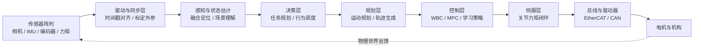
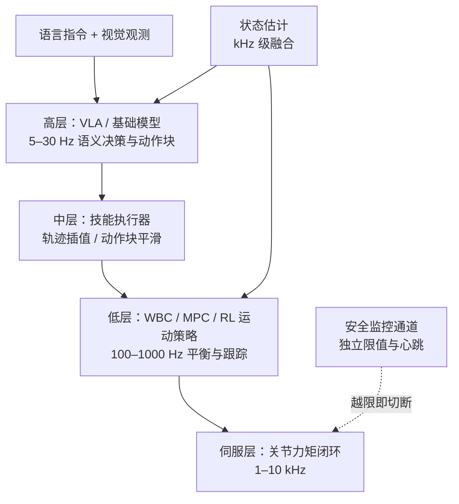
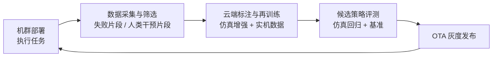

# 第 24 章 端到端软件栈

## 摘要

人形机器人的智能最终体现为一条从光子与力信号进入、到电流流入电机结束的完整数据通路。本章以"端到端软件栈"为对象，把前述各章的算法与硬件串联为可部署的系统：首先给出感知、决策、规划、控制、执行五层架构与毫秒到秒级的频率分层，讨论模块化栈与端到端学习栈两种范式及其融合趋势；随后逐层剖析多传感器接入与时间同步、状态估计、任务规划与运动规划、全身控制与关节伺服的工程实现，以及 RT-1/RT-2、Octo、OpenVLA、π0、GR00T N1 等视觉-语言-动作模型接入栈内的分层推理方式。本章的重点落在**边缘部署**：车载计算平台的功耗与算力约束、端侧 VLA 推理的量化与编译优化、Linux RT-PREEMPT 与 QNX 等实时操作系统、以及端到端延迟预算的分解方法；最后讨论 ROS 2 中间件、LeRobot 开源栈、OTA 软件更新、机群管理平台与车队数据飞轮构成的部署后运维闭环。本章与第 14 章（控制）、第 19 章（VLA）、第 21 章（数据）、第 22 章（中间件）深度衔接，并为第 26 章整机系统案例提供软件视角的分析框架。

**关键词**：端到端软件栈；系统架构；频率分层；状态估计；任务规划；全身控制；VLA 分层推理；端侧 VLA 推理；实时操作系统；OTA 软件更新；机群管理；数据飞轮

---

## 24.1 端到端软件栈的总体架构

### 24.1.1 从感知到行动的数据通路

人形机器人软件栈的"端到端"有两层含义：系统工程意义上的**信号通路端到端**（传感器采样到电机力矩输出），与机器学习意义上的**模型端到端**（观测直接映射到动作的可微模型）。本章覆盖二者，并以后者如何嵌入前者为主线。一条典型的实时数据通路如下：



通路上任何一环的延迟、抖动或丢帧都会沿链路放大，因此端到端栈设计的第一原则是**全链路预算化**：为每一环分配延迟、带宽与计算预算，并保留裕量（详见 24.6.4 节）。

### 24.1.2 分层架构与频率分层

人形机器人软件栈按时间尺度自然分层，各层频率相差数个数量级：

| 层级 | 功能 | 典型频率 | 典型延迟预算 | 典型实现 |
|---|---|---|---|---|
| 任务层 | 指令理解、任务分解 | 事件触发（秒级以上） | 数百 ms | LLM / PDDL 规划器 / 行为树 |
| 规划层 | 路径与轨迹生成 | 1–20 Hz | 数十 ms | MoveIt / OMPL / MPC |
| 策略层 | 视觉运动策略推理 | 5–50 Hz | 20–200 ms | VLA / 扩散策略 / RL 策略 |
| 控制层 | 全身控制、状态估计 | 100–1000 Hz | 1–10 ms | WBC / 分层 QP / 卡尔曼滤波 |
| 伺服层 | 关节力矩/位置闭环 | 1–10 kHz | < 1 ms | 驱动器固件 / FOC |

这种"慢思考、快反应"的频率分层并非偶然：高层处理的信息量大但容许延迟，低层信息量少但对抖动零容忍。各层之间通过**定义良好的状态接口**（任务目标、参考轨迹、期望力矩）解耦，使得任一层的实现可以替换——例如用学习策略替换手工规划器——而不扰动其他层。

!!! note "术语解释：频率分层、状态接口、延迟预算、抖动、看门狗"
    - **频率分层（frequency hierarchy）**：软件栈各层按控制带宽分层运行、层层降采样输出的架构。
    - **状态接口（state interface）**：层与层之间传递的明确定义的数据契约，如"期望关节位置+速度+前馈力矩"。
    - **延迟预算（latency budget）**：为链路各环节分配的最大允许处理时间之和，须小于上层要求的响应时限。
    - **抖动（jitter）**：周期任务实际执行时刻相对理想时刻的偏差；伺服层抖动会直接转化为力矩噪声。
    - **看门狗（watchdog）**：监控任务心跳的硬件或软件定时器，超时未喂狗则触发安全停机。

### 24.1.3 两种范式：模块化栈与端到端学习栈

**模块化栈**把感知、定位、规划、控制拆为独立模块，各模块可用最成熟的技术实现（几何视觉 + 模型控制），优点是各模块可独立验证、故障可隔离、行为可解释，是工业部署的主流；缺点是模块间误差级联、手工规则难以覆盖长尾场景。**端到端学习栈**以单一可微模型（如 VLA）直接从观测映射到动作，优点是上限高、随数据扩展，缺点是可解释性与可验证性弱、对分布外场景缺乏保证。

当前人形机器人产业的实践是**混合架构**：学习与模型方法按层级互补——底层平衡与关节伺服仍由模型控制保证实时性与稳定性，高层技能与语义理解由学习模型提供泛化能力。两种范式与混合路线的对比如下：

| 维度 | 模块化栈 | 端到端学习栈 | 分层混合（主流实践） |
|---|---|---|---|
| 可验证性 | 高，逐模块认证 | 低，黑箱 | 安全层可验证，智能层统计评估 |
| 长尾泛化 | 弱，依赖规则枚举 | 强，随数据扩展 | 较强，学习层承担 |
| 实时性保证 | 强 | 受推理延迟限制 | 强，安全闭环不依赖大模型 |
| 失效可解释性 | 高 | 低 | 中，按层归因 |
| 数据需求 | 低 | 极高 | 中高 |

本章 24.5 节将详细讨论这种"分层混合"的接入方式。

## 24.2 感知与状态估计层

### 24.2.1 多传感器接入与时间同步

人形机器人通常搭载多目相机、深度相机、IMU、关节编码器、足端力/力矩传感器与关节力矩传感器，数据率从百 Hz（相机）到 kHz（编码器）不等。典型传感器接入规格如下：

| 传感器 | 典型数据率 | 典型接口 | 同步要求 |
|---|---|---|---|
| 全局快门相机 ×2–4 | 30–120 Hz | MIPI / GMSL / USB3 | 帧级硬触发，曝光同步 |
| 深度相机 | 30–90 Hz | USB3 / 以太网 | 与 RGB 帧对齐 |
| IMU（骨盆/头部） | 200–1000 Hz | SPI / UART | 与编码器共同时钟域 |
| 关节编码器 ×30+ | 1–10 kHz | 总线内嵌（EtherCAT/CAN） | 分布式时钟同步 |
| 足端力/力矩传感器 | 500–2000 Hz | EtherCAT / 模拟采集 | 与控制周期对齐 |

接入层的第一工程难题是**时间同步**：不同传感器的采样时刻必须对齐到统一时钟，误差需控制在毫秒级（视觉与 IMU 融合时要求亚毫秒）。常用手段包括硬件触发、PTP（Precision Time Protocol，精确时间协议）网络对时、以及软件时间戳插值补偿。第二难题是**标定外参的一致性**：相机-IMU-关节链的外参（关节-相机-IMU 联合标定方法参见本知识图谱相应方法条目）一旦因碰撞、温度或装配松动而漂移，下游所有融合结果都会出现系统性偏差，因此栈内需内置外参在线自检与报警。

!!! note "术语解释：时间同步、硬件触发、PTP、外参、时间戳插值"
    - **时间同步（time synchronization）**：把多个传感器的采样时刻对齐到统一时间基准的过程。
    - **硬件触发（hardware trigger）**：用物理信号线同时触发多传感器采样，同步精度最高。
    - **PTP（IEEE 1588）**：通过网络交换带硬件时间戳的报文实现亚微秒级对时的协议。
    - **外参（extrinsic parameters）**：传感器坐标系之间（或传感器与机器人连杆之间）的相对位姿。
    - **时间戳插值（timestamp interpolation）**：在两个采样点之间线性插值位姿，补偿非同步采样的软件手段。

### 24.2.2 状态估计：本体感觉融合

状态估计是连接物理世界与所有决策层的"事实来源"。人形机器人的核心估计量是浮动基座的位姿与速度，通常以扩展卡尔曼滤波（EKF）或因子图融合以下信息：

- **腿部里程计（legged odometry）**：利用接触假设下支撑足速度为零的约束，由关节编码器与正运动学推算基座运动；
- **IMU**：提供高频角速度与加速度，补偿编码器的低速率与传动柔性；
- **接触状态**：由足端力/力矩传感器或关节力矩残差判定，决定里程计更新是否可信；
- **外部观测**：视觉或激光特征对基座位姿的低频校正，抑制漂移。

工程要点在于**接触检测的鲁棒性**：滑动误判为静止会直接污染里程计；以及**估计延迟的上界**：状态估计必须赶在 WBC 周期前完成，典型预算为数毫秒。

!!! note "术语解释：扩展卡尔曼滤波、因子图、腿部里程计、接触检测、零速更新"
    - **扩展卡尔曼滤波（Extended Kalman Filter, EKF）**：对非线性系统做局部线性化的递归状态估计器，计算量小，是嵌入式融合的主力。
    - **因子图（factor graph）**：把估计问题表示为变量节点与约束因子节点的图结构，用批量优化求解，精度高、可平滑历史轨迹。
    - **腿部里程计（legged odometry）**：利用支撑足与地面无滑动的约束，由关节编码器推算基座运动的估计方法。
    - **接触检测（contact detection）**：判定各足是否处于支撑状态，是腿部里程计可信性的前提。
    - **零速更新（zero-velocity update, ZUPT）**：在确认支撑足静止时把其速度观测强制置零，以抑制 IMU 积分漂移。

### 24.2.3 场景理解：从几何到语义

面向操作的场景理解输出三类产物：**几何层**（占据栅格、深度点云、可通行区域），服务于避障与落脚点选择；**物体层**（目标检测、6D 位姿、关节物体的开合状态），服务于抓取与操作规划；**语义层**（场景图、 affordance 可供性标注），服务于任务规划与 VLA 的语言条件。在端到端学习栈中，这三类产物往往不是显式中间表示，而是被压缩进视觉编码器的特征里；但即便在混合架构中，显式的占据与位姿估计仍是安全相关功能（碰撞避免）的可信来源。

## 24.3 决策与规划层

### 24.3.1 任务规划：从符号规划到大模型规划

**任务规划（Task Planning）** 是生成实现目标的高层动作序列的过程，常用 PDDL（Planning Domain Definition Language）等符号表示：把"抓取-搬运-放置"抽象为带前置条件与效果的动作算子，由规划器搜索解序列。工程化部署中，行为树（Behavior Tree）因其可维护性与反应式执行被广泛采用：它把技能组织为选择、序列、并行与条件节点，运行时可被外部事件打断并局部重试，比一次性生成的计划序列更适合动态车间环境。近年大语言模型（LLM）作为任务规划器兴起：把自然语言指令分解为技能调用序列，其开放词汇能力弥补了符号规划领域知识手工编码的瓶颈，但需配合执行反馈校验与失败重规划机制（神经-符号推理路线）以抑制幻觉。

!!! note "术语解释：PDDL、行为树、技能原语、反应式执行、失败重规划"
    - **PDDL（Planning Domain Definition Language）**：规划领域定义语言，用谓词、动作算子、前置条件与效果描述任务规划问题。
    - **行为树（Behavior Tree, BT）**：以树状结构组织控制流的任务调度形式，节点返回成功/失败/运行中三态。
    - **技能原语（skill primitive）**：任务层可调用的最小封装能力，如"抓取某物""走到某点"。
    - **反应式执行（reactive execution）**：执行过程中根据最新感知实时改变后续动作，而非盲行既定计划。
    - **失败重规划（replanning on failure）**：技能执行失败时，把失败原因反馈给规划层重新生成序列的机制。

### 24.3.2 运动规划：MoveIt 与采样规划器

运动规划把任务层的离散目标细化为连续无碰撞轨迹。**MoveIt 运动规划（MoveIt Motion Planning）** 是 ROS 生态中常用的运动规划框架，集成 **OMPL（Open Motion Planning Library）** 等规划器、逆运动学求解与碰撞检测，广泛用于机械臂及人形机器人的全身运动规划；OMPL 提供 RRT*、PRM、BIT* 等基于采样的运动规划算法，在高维构型空间中具有概率完备性。对人形机器人，运动规划的特殊约束包括：全身碰撞对数量大（含自碰撞）、平衡约束需与控制层协调、以及规划-执行异步问题（规划耗时期间环境已变化），工程上常用"规划于粗模型、执行时在线避障"的两级结构。

!!! note "术语解释：概率完备性、自碰撞、构型空间、规划-执行异步、在线避障"
    - **概率完备性（probabilistic completeness）**：采样规划器在采样数趋于无穷时以概率 1 找到可行解（若解存在）的性质。
    - **自碰撞（self-collision）**：机器人自身连杆之间的碰撞，人形机器人因肢体密集而必须显式检查。
    - **构型空间（configuration space, C-space）**：以全部关节角为坐标的空间，规划即在其中搜索从起点到目标的无碰撞路径。
    - **规划-执行异步（plan-execute asynchrony）**：规划完成时环境已偏离规划假设，导致轨迹过时的问题。
    - **在线避障（online obstacle avoidance）**：执行层基于最新感知对参考轨迹做局部修正的能力。

### 24.3.3 规划与控制之间的接口设计

规划层输出与控制层输入之间的接口形态，决定了系统的可组合性。三种常见形态：**轨迹接口**（时间参数化的关节/末端轨迹，控制层纯跟踪），简单但失去在线调节能力；**目标接口**（落脚点、末端目标位姿，控制层自主生成运动），实时性好但可控性弱；**参考+约束接口**（参考轨迹附加可行域与接触时序），是全身 MPC 的标准做法，兼顾性能与在线性。接口选型与整机控制架构的对应关系见第 14、15 章。

## 24.4 控制执行层

### 24.4.1 全身控制与模型控制族

控制层把人形机器人的全部关节与接触点统一协调。**全身控制（Whole-Body Control, WBC）** 协调所有关节与接触点，以同时实现平衡、注视、操作等多任务；其常用实现**分层 QP 全身控制（Hierarchical QP WBC）** 按优先级堆叠多个任务并通过级联二次规划求解，确保高优先级任务（如不摔倒）优先于低优先级任务（如手臂姿势）满足。**模型预测控制（Model Predictive Control, MPC）** 基于预测模型反复求解有限时域最优控制问题并仅执行首步控制量，是质心轨迹与接触力规划的主流。交互柔顺由**阻抗控制（Impedance Control）** 与**导纳控制（Admittance Control）** 提供：前者调节末端呈现的质量-阻尼-弹簧特性，后者把测得外力转换为期望运动轨迹。上述方法的数学细节见第 14 章，本章关注其栈内集成约束：WBC/MPC 必须在 1–10 ms 内完成单次求解，且对状态估计延迟敏感。

控制层的集成验收通常包含四项硬指标：**求解耗时**（最坏情况而非平均值，须小于周期的一定比例，为其他实时任务留裕量）、**约束可行性**（QP 不可行时的松弛与降级行为必须明确）、**接触切换瞬态**（落脚/抬足时刻的力矩冲击须限制在执行器带宽内）、以及**失效注入测试**（人为延迟状态估计或丢失总线帧，验证控制器的安全响应）。这些指标与第 23 章 HIL 测试矩阵直接衔接。

### 24.4.2 关节伺服与现场总线

控制层输出的期望关节力矩/位置经现场总线下发至各关节驱动器。**EtherCAT** 是基于标准以太网帧的高性能工业现场总线，其"飞读飞写（processing on the fly）"机制让从站在帧经过时即时读写数据，配合分布式时钟（Distributed Clocks, DC）实现微秒级同步，是支撑 1 kHz 级全身力矩控制的主流选择；**CAN 总线**（含 CAN FD）则以成本低、布线省、抗干扰强，广泛用于对带宽要求较低的上身关节与灵巧手。两种总线的栈内分工对比如下：

| 维度 | EtherCAT | CAN / CAN FD |
|---|---|---|
| 典型控制频率 | 1–4 kHz | 0.1–1 kHz |
| 同步机制 | 分布式时钟（DC），微秒级 | 无原生同步，靠报文时间戳 |
| 带宽 | 100 Mbit/s 共享 | 1 Mbit/s（FD 数据段更高） |
| 拓扑 | 线型/菊花链为主 | 总线型，多主仲裁 |
| 典型安装部位 | 下肢大关节、全身主干 | 手腕、灵巧手、传感器节点 |
| 成本与布线 | 较高 | 低，双绞线即可 |

伺服层的关键指标是**周期抖动**：1 kHz 控制周期下，抖动应控制在数十微秒以内，否则力矩指令的时间离散误差会激发关节振动。工程实现上，EtherCAT 主站线程须绑定专用 CPU 核并运行于实时调度类（见 24.6.3 节）；总线拓扑（菊花链/星型）、线缆应力释放与连接器锁止等机电细节见第 6、9 章。

### 24.4.3 安全监控与降级策略

端到端栈必须假设任何模块都会失效，并内置独立的安全监控通路：

- **限值监控**：关节位置/速度/力矩、电机温度、母线电流的硬限值，触发即切断动力（STO，Safe Torque Off）；
- **心跳监控**：策略推理、状态估计、总线通信的看门狗心跳，超时进入保持姿态或受控下蹲；
- **行为合理性监控**：独立通道比对指令与估计状态的一致性（如指令行走但 IMU 显示倾倒趋势），触发紧急制动；
- **降级策略**：算力或传感器部分失效时，从全身自主模式降级为低速遥控或静止保持模式。

安全通路应独立于智能主通路供电与计算，这是 IEC 61508 等功能安全标准对安全相关系统的基本要求（标准符合性详见第 12 章）。

## 24.5 学习型策略的接入：VLA 与端到端栈

### 24.5.1 模仿学习策略在栈中的位置

模仿学习族方法把专家示教压缩为策略网络，在栈内通常占据"策略层"位置。**行为克隆（Behavior Cloning）** 通过监督学习训练策略复现专家示范，是技能学习的基线；**动作分块变压器（Action Chunking with Transformers, ACT）** 用变压器以 CVAE 形式一次性预测未来一段动作序列并经时间集成平滑执行，显著降低长时程精细操作中的误差累积，其与 ALOHA 低成本双臂遥操作平台的组合开创了"低成本采集+端到端策略"的范式；**扩散策略（Diffusion Policy）** 将动作分布建模为条件去噪扩散过程，可生成多峰且平滑的机器人动作，在精细操作任务上表现突出。三者的栈内特征对比如下：

| 维度 | 行为克隆（BC） | ACT | 扩散策略 |
|---|---|---|---|
| 动作表示 | 单步回归 | 动作块（CVAE+Transformer） | 条件去噪扩散过程 |
| 多峰分布建模 | 弱 | 中 | 强 |
| 长时程误差累积 | 严重 | 显著缓解 | 缓解 |
| 单次推理延迟 | 极低 | 低 | 较高（多步去噪） |
| 典型输出频率 | 10–50 Hz | 5–50 Hz（分块+集成） | 5–20 Hz |

三者的动作输出频率（5–50 Hz）天然介于规划层与控制层之间，需要底层有高速跟踪控制器承接——这是混合架构的第一个结合点。

### 24.5.2 VLA 模型谱系

视觉-语言-动作（Vision-Language-Action, VLA）模型把大规模视觉-语言预训练与机器人动作头结合，是端到端栈"智能内核"的当前主流候选。本知识图谱收录的代表性谱系如下：

| 模型 | 机构 | 架构要点 | 数据基础 |
|---|---|---|---|
| RT-1 | Google DeepMind | 基于 Transformer 的规模化真实世界机器人控制模型 | 约 13 万条实机示教（公开报道） |
| RT-2 | Google DeepMind | 将网络规模视觉-语言知识迁移到机器人控制的 VLA | 网络图文 + 机器人数据联合微调 |
| Octo | UC Berkeley 等 | 在异构跨具身数据上训练的开源通才机器人策略 | Open X-Embodiment |
| OpenVLA | Stanford 等 | 70 亿参数开源 VLA | Open X-Embodiment 的 97 万条片段 |
| π0 | Physical Intelligence | VLA 流（flow）模型，面向通用控制与开放世界泛化 | 跨具身多任务数据 |
| GR00T N1 | NVIDIA | VLA + 扩散 Transformer 动作头的人形机器人开放基础模型 | 实机 + 仿真合成数据（Isaac Sim 管道） |

该谱系的演进脉络清晰可见：从单臂单任务的 RT-1，到引入网络知识迁移的 RT-2，再到跨具身开源化的 Octo 与 OpenVLA，直至面向人形机器人、融合扩散动作头与合成数据管道的 GR00T N1。VLA 模型的内部结构与训练方法详见第 19 章，本章聚焦其**系统接入问题**。

### 24.5.3 分层推理：高层 VLA 与低层控制的混合架构

直接把 VLA 输出接到电机并不可行：VLA 推理频率（典型 5–30 Hz）远低于平衡控制所需的 500 Hz 以上。产业界的主流解法是**分层推理（hierarchical inference）**：



以 GR00T N1 的双系统设计为典型：慢系统（视觉-语言推理）产生意图与动作块，快系统（扩散 Transformer 动作头）细化出平滑关节命令，再交由底层全身控制执行。这种"语义慢、反射快"的结构与生物神经系统同源，也是端侧算力约束下的必然选择——大模型无法以千赫兹运行，而千赫兹回路也不需要大模型。

!!! note "术语解释：动作块、时间集成、双系统架构、技能执行器、非对称频率"
    - **动作块（action chunk）**：策略一次预测的未来 k 步动作序列，源自 ACT，现为 VLA 动作头的主流设计。
    - **时间集成（temporal ensemble）**：对重叠时刻的多个动作块预测加权平均，抑制执行抖动。
    - **双系统架构（dual-system architecture）**：慢速语义推理系统与快速动作生成系统协作的架构，GR00T N1 为代表。
    - **技能执行器（skill executor）**：把高层技能调用转化为底层控制接口（轨迹、目标、约束）的中间件。
    - **非对称频率**：高层大模型低频推理、底层控制器高频运行，中间以缓冲队列衔接的架构特征。

### 24.5.4 端侧、边缘与云端推理的边界

VLA 推理放在哪里，是端到端栈的顶层架构决策。三者的权衡如下：

| 维度 | 端侧（车载） | 边缘（场站服务器） | 云端 |
|---|---|---|---|
| 延迟 | 最低且确定（数十 ms 级） | 受局域网质量影响 | 受广域网波动影响大 |
| 可用性 | 断网可运行 | 依赖场站网络 | 依赖持续连接 |
| 隐私与合规 | 数据不出机 | 数据不出场 | 需跨境/脱敏处理 |
| 模型规模上限 | 受显存与功耗限制（7B 级需量化） | 中 | 几乎无上限 |
| 更新频率 | 随 OTA | 灵活 | 最灵活 |

行业趋势是**默认端侧、按需上云**：安全相关与反应式能力必须端侧闭环（这也是端侧 VLA 推理条目强调延迟、连接性与隐私三重约束的原因），而慢速、非安全关键的语义推理（如日报生成、任务后分析）可卸载到云。混合方案要求栈内实现**推理位置无关的接口**：同一策略服务既可由本地模型也可由远程模型提供，并按网络状态动态切换，且任何切换都不得中断底层安全闭环。

## 24.6 边缘部署与端侧推理

### 24.6.1 车载计算平台的功耗与算力约束

人形机器人端侧计算面临硬约束：电池容量有限（典型整机 0.5–2 kWh），计算负载每增加 100 W 都会直接侵蚀续航；同时计算单元必须承受行走带来的持续振动与温度循环。典型配置是"异构双区"：安全区由低功耗实时控制器（MCU/实时 SoC）运行伺服与安全监控；智能区由 GPU SoC（如 Jetson 系列嵌入式模组）运行感知、策略与规划，其可用算力通常为数十至数百 TOPS（INT8），功耗预算 15–60 W。两类计算区的职责划分如下：

| 计算区 | 硬件形态 | 运行内容 | 关键约束 |
|---|---|---|---|
| 安全/实时区 | MCU、实时 SoC | 关节伺服、总线主站、安全监控 | 硬实时、确定性、功能安全 |
| 智能区 | GPU SoC（嵌入式） | 感知、状态估计、策略推理、规划 | 算力/功耗比、显存容量 |
| 网关区（可选） | 通信模组 | 云端链路、OTA、日志上传 | 断网降级、数据压缩 |

算力选型方法学与电源完整性设计见第 6 章，本章关注给定算力后的**软件侧优化**。

!!! note "术语解释：TOPS、显存带宽、功耗预算、热设计功耗、降频"
    - **TOPS（Tera Operations Per Second）**：每秒万亿次整数运算，是边缘 AI 芯片算力的常用标称（通常指 INT8）。
    - **显存带宽（memory bandwidth）**：单位时间可搬运的显存数据量；对大模型推理往往比算力更早成为瓶颈。
    - **功耗预算（power budget）**：分配给计算子系统的最大功率，超出即侵蚀续航或触发热保护。
    - **热设计功耗（Thermal Design Power, TDP）**：散热系统可持续排出的热功率，决定算力的持续可用水平。
    - **降频（thermal throttling）**：温度超限时芯片自动降低频率，使标称算力不可用，是高温环境的隐性风险。

### 24.6.2 端侧 VLA 推理：量化、编译优化与延迟分解

**端侧 VLA 推理（On-Device VLA Inference）** 指将视觉-语言-动作模型直接部署在机器人内置边缘计算设备上，而非卸载到边缘或云端服务器，以满足延迟、连接性和隐私约束。其工程工具链包括：

- **量化（quantization）**：把权重与激活从 FP16 压缩到 INT8/INT4，显存占用与内存带宽近似按比例下降，代价是精度损失需用校准集控制；70 亿参数模型 FP16 约 14 GB，INT8 约 7 GB、INT4 约 3.5 GB，量化是把 7B 级 VLA 塞进车载显存的关键手段；
- **编译优化**：用 TensorRT 等推理编译器做算子融合、内核选择与显存复用，通常可再获可观加速；
- **动作头重构**：扩散/流匹配动作头的多步去噪是延迟大户，可用蒸馏（consistency 类方法）或少步采样压缩；
- **投机与异步**：视觉编码与语言编码可跨周期复用（场景未变时不重算），动作块预测与执行流水线并行。

VLA-Perf 等端侧推理评测研究表明，VLA 推理延迟对模型规模、量化配置与动作头设计高度敏感，选型必须以实测为准。以参数量为 \(N_p\) 的模型为例，权重显存占用近似为

$$
M_{\text{weights}} \approx N_p \times b, \qquad b \in \{2\,\text{B (FP16)},\ 1\,\text{B (INT8)},\ 0.5\,\text{B (INT4)}\}
$$

推理延迟则可分解为

$$
T_{\text{VLA}} = T_{\text{vision}} + T_{\text{lang}} + T_{\text{action-head}} + T_{\text{pre/post}}
$$

并逐项对照预算优化；当单项超支无解时，架构选项是把高层推理下沉为"事件触发"（仅在新指令或场景变化时运行），而非固定周期运行。

### 24.6.3 实时操作系统与调度

通用操作系统并非为硬实时设计，实时操作系统（RTOS）通过内核抢占、优先级调度和确定性中断响应满足微秒级时序要求。人形机器人常见选项包括：

- **Linux RT-PREEMPT**：使 Linux 内核大部分可抢占、中断线程化的补丁集，保留 Linux 丰富生态的同时提供数十微秒级调度延迟，是主控的常见选择；
- **Xenomai**：双内核方案，实时任务运行于 Cobalt 实时核，延迟可低至微秒级，但维护复杂；
- **QNX**：商用微内核实时操作系统，文件系统与网络栈均为用户态服务，可靠性与确定性俱佳，广泛用于汽车与安全关键系统；
- **Zephyr**：面向资源受限嵌入式设备的开源 RTOS，常用于传感器节点与电机控制器。

四者的工程对比如下：

| 维度 | Linux RT-PREEMPT | Xenomai | QNX | Zephyr |
|---|---|---|---|---|
| 调度延迟量级 | 数十微秒 | 微秒级 | 微秒级 | 微秒级 |
| 生态丰富度 | 极高（完整 Linux） | 高（复用 Linux 用户态） | 中 | 低（嵌入式） |
| 维护成本 | 低 | 高 | 中（商用授权） | 低 |
| 安全认证基础 | 需自建 | 需自建 | 有成熟认证案例 | 部分 |
| 典型安装部位 | 主控计算机 | 主控计算机 | 安全域控制器 | 关节/传感器节点 |

典型的调度设计是：EtherCAT 主站与 WBC 任务绑定独立 CPU 核、最高 SCHED_FIFO 优先级并锁定内存（mlockall）；策略推理与普通进程共享其余核，通过 cgroups 限制其抢占干扰；所有实时线程禁用动态内存分配与非确定性系统调用。内核与驱动层面的更多细节见第 6 章与第 22 章。

### 24.6.4 Python 算例：端到端延迟预算分解

以下算例演示如何为一个"相机进、力矩出"的控制链路做延迟预算分解，并计算最坏情况下的总延迟与有效控制频率。

```python
# 端到端延迟预算：相机曝光 -> 感知 -> VLA -> WBC -> 总线 -> 驱动器
# 目标：最坏情况总延迟 <= 上层任务要求的响应时限
stages = {
    # 阶段: (典型延迟 ms, 最坏抖动 ms)
    "相机曝光+传输":      (12.0, 3.0),
    "预处理+感知":        ( 8.0, 2.0),
    "VLA 推理(INT8)":     (45.0, 8.0),
    "动作块插值+WBC":     ( 2.0, 0.3),
    "EtherCAT 传输":      ( 0.5, 0.1),
    "驱动器响应+电机时间常数": ( 5.0, 1.0),
}

typ = sum(v[0] for v in stages.values())
worst = sum(v[0] + v[1] for v in stages.values())
print(f"典型端到端延迟: {typ:.1f} ms")
print(f"最坏端到端延迟: {worst:.1f} ms  (≈ 有效响应频率 {1000/worst:.0f} Hz)")
print("\n分阶段最坏延迟占比:")
for name, (t, j) in sorted(stages.items(), key=lambda x: -(x[1][0]+x[1][1])):
    print(f"  {name:<24s} {t+j:6.1f} ms  ({100*(t+j)/worst:.0f}%)")

budget = 100.0  # 上层允许的响应时限 (ms)
slack = budget - worst
print(f"\n预算 {budget:.0f} ms 下的裕量: {slack:+.1f} ms")
if slack < 0:
    print("结论：预算超支，需压缩最大延迟项（本例中为 VLA 推理）")
```

该例中 VLA 推理占最坏延迟的一半以上，印证了 24.6.2 节的论断：端侧大模型推理是端到端延迟预算的首要优化对象；当量化与编译优化仍不足时，降低策略层频率（以动作块换取执行平滑）是系统级的最后手段。

## 24.7 中间件与系统集成

### 24.7.1 ROS 2 与通信骨干

**ROS 2 中间件（ROS 2 Middleware）** 是基于 DDS 的发布/订阅和实时支持的事实标准机器人中间件，提供节点管理、话题/服务/动作通信、参数与生命周期管理。在端到端栈中，ROS 2 承担非实时或软实时域（感知、规划、人机交互、日志）的集成骨架；硬实时域（WBC、EtherCAT 主站）通常以独立实时进程运行，通过共享内存或实时安全发布器与 ROS 2 桥接。DDS 的 QoS 策略（可靠性、截止时间、持久性）需要逐话题调优：状态估计等高频话题用"尽力传输+保持最新"以换取低延迟，指令与参数更新用"可靠传输+持久化"以保证送达。中间件架构、DDS 选型与消息定义规范详见第 22 章，本节不再展开。

### 24.7.2 动力学库与算法组件

栈内的模型计算依赖成熟组件：**Pinocchio** 提供高效刚体动力学、运动学与解析导数计算，是 WBC/MPC 与仿真器共用的动力学内核；**OMPL** 与 **MoveIt** 提供规划能力（见 24.3.2 节）；MJCF/URDF 模型在运行时经模型解析器加载为统一的动力学数据结构。组件复用的关键工程纪律是**单一模型来源（single source of truth）**：仿真、规划与控制必须消费同一份机器人模型与标定数据，任何"控制用一份模型、仿真用另一份"的分叉都会把 Sim-to-Real 差距人为放大。

### 24.7.3 开源端到端栈：LeRobot

**LeRobot** 是覆盖数据集格式、遥操作、训练和部署的端到端 PyTorch 库，由 Hugging Face 维护。它把策略学习栈的四个环节——标准化数据集格式（LeRobotDataset）、遥操作采集接口、主流策略实现（ACT、扩散策略等）与部署推理——统一在一个框架内，显著降低了"从数据到上机"的集成成本。对人形机器人团队，LeRobot 类框架的价值在于提供经过验证的端到端参考实现：企业可在其数据格式与策略接口上构建私有管线，把工程投入集中在本体适配与安全层，而非重复搭建基础设施。相关数据基础设施的系统讨论见第 21 章。

### 24.7.4 日志、回放与调试工具链

端到端栈的可维护性取决于**可观测性（observability）**。工程上要求全链路日志满足三点：其一，**统一时间基准**——所有话题、总线帧与内部事件带同源时间戳，否则跨进程因果分析无从谈起；其二，**可回放（replay）**——以 rosbag 等格式记录的原始传感器流应能重新注入栈内，复现任何一次实机异常；其三，**确定性重放**——调试模式下固定随机种子与调度顺序，使"录到的 bug"可以稳定重现，这是定位偶发跌倒、偶发抓取失败等问题的前提。日志数据同时是第 23 章事故驱动场景库与 24.8.3 节数据飞轮的原料，因此日志系统的存储配额、环形缓冲与选择性上传策略必须在架构期一并设计，而非事后补丁。

## 24.8 部署后运维：OTA、机群与数据闭环

### 24.8.1 OTA 软件更新

**OTA 软件更新（OTA Software Update）** 是向已部署的人形机器人机群无线部署控制策略、固件和系统软件的技术。机器人 OTA 比手机/汽车 OTA 更敏感：一次有缺陷的控制策略更新可能直接造成物理事故。工程要求包括：A/B 双分区与失败自动回滚；更新的分级发布；更新包的签名校验与版本-硬件兼容性矩阵；以及更新前的强制仿真回归（与第 23 章场景库联动）——任何控制相关更新必须先通过全量仿真回归与 HIL 验证。典型的分级发布流水线如下：

| 阶段 | 范围 | 通过门槛 | 失败处置 |
|---|---|---|---|
| 仿真回归 | 全量场景库 | 100% 通过 | 阻断发布，回炉修复 |
| HIL 台架 | 代表配置 | 实时性与安全用例通过 | 阻断发布 |
| 单机灰度 | 内部测试机 1–2 台 | 连续无事故运行若干小时 | 自动回滚 |
| 小批量 | 5%–10% 机群 | KPI 不劣于现网版本 | 自动回滚并告警 |
| 全量 | 全部机群 | 灰度期 KPI 稳定 | 持续监控 |

### 24.8.2 机群管理平台

**机群管理平台（Fleet Management Platform）** 是跨多台已部署人形机器人进行任务编排、充电、健康监控和分析的云平台。其核心功能为：任务调度与工单派发（与工厂 WMS/MES 对接）；电池与充电编排（保证可用率的同时延长电池寿命）；健康监控（关节温度、力矩残差、振动谱的异常检测，支撑预测性维护）；以及 KPI 分析（任务成功率、平均故障间隔、干预次数）。机群平台的可用率目标直接决定商业模型的成立与否——单机能力再强，无法被编排为稳定运力的机群就无法形成收入。

### 24.8.3 数据飞轮与持续学习

**车队数据飞轮（Fleet Data Flywheel）** 是部署机器人车队产生的数据持续改进模型、模型反过来提升车队性能并产生更多数据的闭环系统。其运转机制为：



飞轮的两个工程要点：其一，**采集策略要偏向信息增量**——全量上传不可行，应按"失败、低置信、人类接管"触发采集；其二，**评测门槛必须高于现网版本**——候选策略只有在仿真回归与受控实机评测中同时优于现网，才允许灰度。数据闭环的存储、标注与合规基础设施详见第 21 章。

需要清醒认识的是，数据飞轮存在**冷启动问题**：机群规模不足时，采集数据的多样性有限，模型改进速度受限于部署规模而非算法能力。因此飞轮设计必须与仿真合成数据（第 23 章）和人类遥操作示教（第 17 章）形成三路互补的数据供给，任何单一来源都不足以支撑持续进化。

## 24.9 本章小结

本章把人形机器人软件从"算法集合"组织为"可部署系统"。架构上，端到端栈按任务层、规划层、策略层、控制层、伺服层做频率分层，层间以状态接口解耦，安全监控通路独立成链；模块化栈与端到端学习栈在"分层混合"范式下走向融合——ACT、扩散策略、OpenVLA、π0、GR00T N1 等学习模型占据语义与技能层，WBC、MPC 与阻抗/导纳控制守住实时与稳定层。

部署上，边缘计算的功耗与算力约束使端侧 VLA 推理（量化、编译优化、动作头重构）成为延迟预算的首要战场，Linux RT-PREEMPT、Xenomai、QNX 与 Zephyr 构成实时底座，ROS 2、Pinocchio、MoveIt/OMPL 与 LeRobot 提供集成骨架。运维上，OTA 软件更新、机群管理平台与车队数据飞轮把单台机器人扩展为可持续进化的运力网络。至此，本书完成了从材料与硬件（第 1–9 章）、制造与测试（第 10–13 章）、控制与智能（第 14–22 章）到仿真与软件系统（第 23–24 章）的技术链条闭环，后续章节转入评测、案例与产业视角。
