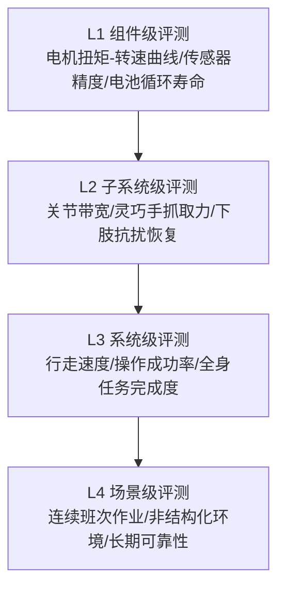
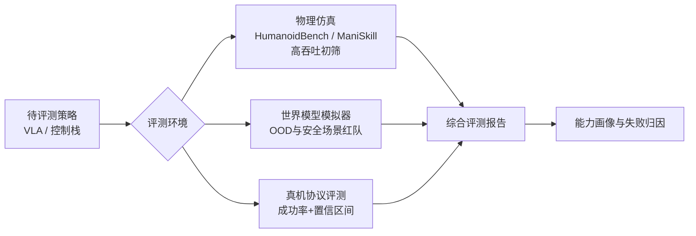
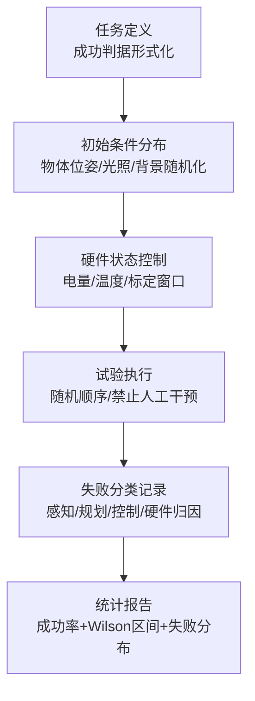

# 第 25 章 机器人评测体系

## 摘要

"这台人形机器人到底有多能干？"——这个看似简单的问题，目前整个行业的回答能力依然薄弱。演示视频可以剪辑，单一成功率可以挑场景，而量产部署需要的是**可复现、可比较、可归因**的评测体系。本章系统梳理人形机器人评测的方法论与工具栈。首先从评测的目的与层次结构出发，区分组件级、子系统级、系统级与场景级评测，并讨论仿真评测、真机评测与基于世界模型的生成式评测三条技术路线；随后按能力维度展开：运动控制与全身性能评测介绍 MPJPE、力矩变化分数（TVS）、HumanoidBench 与类人驱动评分（HLAS）；操作技能评测介绍 LIBERO、LIBERO-Plus、ManiSkill 与 Isaac Gym 基准，以及仿真保真度本身的评测方法；基础模型评测讨论 VLA 模型的泛化维度、人形机器人基础模型基准与用世界模拟器做策略红队测试的新范式；真机评测部分给出成功率的统计推断方法、评测协议设计要点与可靠性/耐久评测；最后讨论基准过拟合、演示-产品差距（demo-to-product gap）等现存问题与趋势。本章与第 12 章（认证合规）共同构成人形机器人"验证与市场层"的方法论闭环：前者回答"机器人够不够好"，后者回答"机器人够不够安全合法"。

**关键词**：评测基准；HumanoidBench；LIBERO；ManiSkill；HLAS；MPJPE；成功率统计；sim-to-real；泛化；世界模型评测

---

## 25.1 评测的目的与层次结构

### 25.1.1 为什么评测是具身智能的瓶颈

大语言模型领域有 MMLU、HumanEval 等相对成熟的公共基准，模型能力的每一次跃迁都有量化记录可循。人形机器人领域则不然：各厂商发布会上的跑酷、叠衣、搬运演示令人眼花缭乱，但外界无法回答三个基本问题：

1. **可复现吗？** 演示是多少次尝试中挑出的成功片段？初始条件是否被精心设计过？
2. **可比较吗？** 机器人 A 能叠 T 恤、机器人 B 能搬运 20 kg 箱子，谁的能力更强？
3. **可外推吗？** 在这个房间会做的任务，换个光照、换个物体、换个户型还会吗？

这三个问题分别对应评测的三个基本属性：**可复现性（reproducibility）、可比性（comparability）与泛化预测力（generalization predictiveness）**。评测体系的价值不仅是学术排名，更是产业链的"通用货币"：本体厂商需要它向客户证明能力边界，模型公司需要它筛选算法，投资者需要它识别营销与真实进度的差异，认证机构（第 12 章）需要它把"安全"与"能力"的论证数据化。

!!! note "术语解释：演示-产品差距（demo-to-product gap）"
    为 staged 演示优化的指标与可靠、可认证、可量产产品所要求的指标之间的系统性差距。演示追求单次的视觉冲击力，产品要求长时间无故障的期望性能。评测体系的核心使命之一就是把后者量化，让"演示很好"与"产品可用"之间的鸿沟可被测量，而不是被营销话术掩盖。

### 25.1.2 评测的层次金字塔

一个完整的人形机器人评测体系按抽象层级自下而上分为四层：



- **L1 组件级**：本书第 2–6 章讨论的各类硬件指标——执行器的峰值扭矩与持续扭矩（参见类人驱动评分 HLAS，25.2.4 节）、减速器精度等级、力矩传感器噪声底、电池能量密度。特点是测量手段成熟、有现成标准，但单看组件指标无法预测整机能力。
- **L2 子系统级**：关节的位置/力控带宽、灵巧手的最大抓取力与自由度利用率、下肢在推力扰动下的恢复能力。这一层开始出现"指标组合"问题——带宽、精度、负载往往不可兼得。
- **L3 系统级**：任务导向的评测，如行走速度、台阶通过率、指定操作任务的成功率与完成时间。学术基准（HumanoidBench、LIBERO 等）主要工作在这一层。
- **L4 场景级**：连续 8 小时班次作业的综合表现、平均故障间隔时间（MTBF）、在非受控环境中的任务泛化。这是产品真正关心的层，也是目前公开基准几乎空白的层。

层级之间存在经典的**聚合误差**问题：L1 全优不保证 L3 好用（集成损耗、控制瓶颈），L3 高分不保证 L4 可靠（耐久、维护性）。成熟评测体系必须在每一层设立独立指标，并研究层间映射关系。

### 25.1.3 三条评测技术路线

按评测环境的不同，当前有三条并行发展的路线：

| 路线 | 代表工具 | 优势 | 局限 |
|------|----------|------|------|
| 仿真评测 | Isaac Gym 基准、HumanoidBench、ManiSkill、LIBERO | 低成本、可并行、可精确复现 | sim-to-real 差距，接触/摩擦建模误差 |
| 真机评测 | 任务成功率协议、遥测数据、竞赛 | 真实性无可争议 | 成本高、吞吐低、复现性难保证 |
| 生成式/世界模型评测 | 基于视频世界模型的策略模拟器 | 兼具吞吐与视觉真实感，可造 OOD 场景 | 物理一致性尚无保证，尚处研究阶段 |

三条路线不是替代关系而是漏斗关系：仿真做大规模初筛，世界模型做分布外与安全场景的补充测试，真机做最终确认。25.4.3 节将介绍的"在 Veo 世界模拟器中评测 Gemini Robotics 策略"正是第三条路线的代表性工作。

### 25.1.4 评测指标的设计原则

无论是设计一个新基准还是评审一份评测报告，都可以用四条原则检验指标质量：

1. **单调性（monotonicity）**：指标增大应稳定对应能力的真实提升。若一个指标可以通过牺牲未测量的维度来刷高（例如以降低运动速度换取成功率），它就违反了单调性，必须配报告约束量（本例中为完成时间）。
2. **可分解性（decomposability）**：总分应能拆解到有物理或语义意义的分量，使低分可以直接定位到子系统或能力维度。HLAS 的五分量结构与 DSJE 的难度分层都是可分解性的范例；不可分解的单一黑箱分数（如某些综合排行榜的总分）诊断价值有限。
3. **抗操纵性（gaming resistance）**：指标定义应让"针对性优化"的成本高于"真实能力提升"的成本。初始条件公开且固定的基准极易过拟合，保密测试集与扰动扫描（LIBERO-Plus 式）是提高抗操纵性的主要手段。
4. **经济性（cost of measurement）**：指标的测量成本决定了它能被使用的频率。真机指标不可能做到每天回归，因此评测体系总是"便宜的代理指标做高频监控 + 昂贵的真实指标做里程碑确认"的组合，代理与真实之间的相关性本身需要定期校准。

---

### 25.1.5 本章的组织方式

25.2 节处理"身体能力"的评测（运动控制与全身性能），25.3 节处理"手上功夫"的评测（操作技能基准），25.4 节处理"大脑"的评测（基础模型与 VLA），25.5 节处理真机评测的统计与协议，25.6 节讨论体系的现存问题与趋势。阅读时可与本书其他章节对照：硬件组件指标对应第 2–6 章，运动控制原理对应全身控制与行走相关章节，安全相关的评测证据链对应第 12 章。

## 25.2 运动控制与全身性能评测

### 25.2.1 运动模仿误差：MPJPE 及其局限

基于动作捕捉或视频重定向的运动模仿（motion imitation）是当前人形机器人全身控制的主流范式之一。其最常用的评测指标是 **MPJPE（Mean Per-Joint Position Error，平均关节位置误差）**：

$$
\text{MPJPE} = \frac{1}{T}\sum_{t=1}^{T} \frac{1}{J}\sum_{j=1}^{J} \left\| \mathbf{p}_j^{robot}(t) - \mathbf{p}_j^{ref}(t) \right\|_2
$$

其中 \(\mathbf{p}_j(t)\) 为第 \(j\) 个身体关键点在世界系下的位置。MPJPE 直观、好算，但有一个深层缺陷：**它只度量模仿结果，不区分误差来源**。当某段动作模仿失败时，是策略网络能力不足，还是这段动作本身就"难学"（动力学上对强化学习不友好）？混为一谈会误导算法迭代方向。

针对这一问题，2025 年的工作 *Benchmarking Humanoid Imitation Learning with Motion Difficulty*（arXiv:2512.07248）提出了**力矩变化分数（TVS, Torque Variation Score）**：对参考动作的位姿施加小扰动，测量把扰动"纠正回去"所需的力矩变化幅值。该指标的物理含义是动作的动力学敏感度——高 TVS 动作在奖励地形上对应平坦区域，导致策略梯度消失，因而从原理上就难以用基于梯度的方法学习。实验表明 TVS 与 UHC、PHC+ 等主流方法的模仿误差强相关，从而支持三种实用工具：

- **最大可模仿难度（MID, Maximum Imitable Difficulty）**：刻画一个策略的能力上限——误差开始失控的 TVS 阈值，用于横向比较不同策略；
- **难度分层关节误差（DSJE, Difficulty-Stratified Joint Error）**：把 MPJPE 按动作难度分层报告，揭示"低难度动作上误差高 = 策略缺陷；高难度动作上误差高 = 任务本身难"的归因结构；
- **缺陷动作检测**：找出数据集中难度异常高的片段，用于动捕数据清洗与质量控制。

这一工作的示范意义超出运动模仿本身：**好的评测指标应当支持误差归因（attribution），而不仅仅是打分**。

### 25.2.2 HumanoidBench：全身运动与操作基准

**HumanoidBench**（arXiv:2403.10506）是目前引用最广的人形机器人全身控制仿真基准之一。它基于 Unitree H1 机器人形态构建，包含 40 余项任务，覆盖四类能力：

- **运动（locomotion）**：行走、跑步、爬楼梯等；
- **到达与操作（reaching / manipulation）**：搬运、推拉、物体交互；
- **移动操作（loco-manipulation）**：边走边操作，需要上下肢协调的全身任务；
- **灵巧手任务**：部分任务配置高自由度手部，考察精细操作。

其方法论价值在于**受控比较（controlled comparison）**：所有算法面对相同的机器人模型、物理参数与任务定义，差异只来自"大脑"。HumanoidBench 的实验也揭示了一个对行业有警示意义的现象：在该基准上，分层/分治结构（高层规划 + 低层预训练技能）普遍优于端到端强化学习基线，说明"一个网络直接学全身 40+ 任务"在当前算法与数据条件下尚不现实——评测结果反过来塑造了架构选择的共识。

局限性同样明确：任务与动作空间绑定 Unitree H1 形态，结论向其他人形平台的外推需谨慎；且纯仿真环境下的高分不等于真机能力（25.3.5 节讨论保真度评测）。

### 25.2.3 双足移动能力的经典物理指标

在学术基准之外，双足移动能力有一批源自生物力学与控制理论的经典指标，至今仍是论文与产品规格书的通用语言：

- **行走速度与归一化速度**：绝对速度（m/s）经腿长无量纲化得到弗劳德数（Froude number）\(Fr = v^2/(g l)\)，使不同体型机器人可比较；
- **运输成本（CoT, Cost of Transport）**：单位体重单位距离的能量消耗，
  $$
  CoT = \frac{P}{m g v}
  $$
  其中 \(P\) 为平均功耗。人类步行 CoT 典型值在 0.2 上下，双足机器人一般而言仍高出数倍至一个数量级，是衡量能效的核心指标；
- **抗扰恢复能力**：标准化推力扰动（规定冲量的推杆或摆锤）下是否保持不跌倒，以及恢复所需步数；
- **地形通过率**：台阶、斜坡、碎石、草地等标准地形包的成功率；
- **稳定裕度**：基于 ZMP/捕获点（Capture Point）的动力学裕度（其原理见本书设计原理相关章节），可作为仿真中的连续型指标。

### 25.2.4 类人驱动评分（HLAS）：硬件能力的量化基准

"这款机器人的执行器达到人类水平了吗？"厂商常做此类宣传，但峰值扭矩、峰值转速等单点规格说明不了关节能否在任务相关的位姿与速度下同时输出合适的扭矩、功率与耐力。2025 年的工作 *Human-Level Actuation for Humanoids*（arXiv:2511.06796）提出了一套可复现的框架，把"类人水平"变成可测量的量：

1. **自由度图谱（DoF atlas）**：采用 ISB（国际生物力学学会）惯例统一关节坐标系与活动范围定义，确保人体关节与机器人关节在同一坐标语义下比较；
2. **人类等效包络（HEE, Human-Equivalence Envelope）**：刻画人体关节在扭矩-功率平面上随位姿与速度变化的能力边界；
3. **类人驱动评分（HLAS, Human-Level Actuation Score）**：以参考人体为 1.0 的标量评分，可分解为五个物理有依据的分量——**工作空间覆盖度、HEE 包络覆盖度、力矩模式带宽、效率、热可持续性**。

HLAS 的工程价值在于**可分解性**：总分低时可以立即看出短板是活动范围不足（机械设计问题）、扭矩-功率包络缺口（电机/减速器选型问题）还是热可持续性差（散热设计问题），从而把评测结果直接转化为设计迭代输入（与第 3、4 章的执行器与电机设计讨论衔接）。这类"以人体为参照系"的指标代表了硬件评测的一个重要方向：不追求绝对数值的最大化，而追求与生物参照的可解释差距。

---

## 25.3 操作技能评测基准

### 25.3.1 LIBERO：终身学习与知识迁移

**LIBERO**（*Benchmarking Knowledge Transfer for Lifelong Robot Learning*，NeurIPS 2023，arXiv:2304.13470）以桌面短程操作任务为载体，研究的核心问题不是"单任务成功率"而是**知识迁移**：机器人学习器在一系列任务上顺序学习时，能否把先前任务的知识用于加速后续学习、并避免灾难性遗忘。为此 LIBERO 提供了程序化的物体与场景变化机制，并按变化维度组织任务套件——空间布局变化、物体类别变化、目标（指令）变化以及长时序组合任务，从而把"泛化"从模糊口号拆成可独立测量的维度。

LIBERO 对 VLA（视觉-语言-动作）时代的影响是深远的：它提供的标准化任务套件与评测协议，成为大量 VLA 模型论文报告泛化性能的默认选项之一；其"按变化维度解耦"的设计思想也被后续基准广泛继承。

### 25.3.2 LIBERO-Plus：鲁棒性的系统解剖

如果说 LIBERO 考察"学得快不快"，**LIBERO-Plus**（arXiv:2510.13626）则考察"在扰动下稳不稳"。它将 LIBERO 扩展到 **10,030 项任务**，沿七个扰动维度系统施压：

1. 相机视角变化；
2. 机器人初始状态变化；
3. 语言指令变化（同义改写、表述风格）；
4. 光照变化；
5. 背景变化；
6. 传感器噪声；
7. 物体布局变化。

这种"单变量扰动扫描"式的实验设计可以精确定位模型的脆弱维度。其分析结论对整个 VLA 领域有方法论意义：许多在标准 LIBERO 上报告高成功率的模型，在特定扰动维度（典型如相机视角与初始状态偏移）下性能大幅下降，说明基准内成功率掩盖了鲁棒性赤字。**基准设计的竞争正在从"任务数量"转向"扰动维度的系统性"**——这是评测体系自身进化的清晰信号。

### 25.3.3 ManiSkill 与 Isaac Gym 基准

**ManiSkill** 是面向可泛化操作技能的统一基准，提供标准化任务定义、仿真环境与评估协议，其特色在于强调大规模并行仿真吞吐与点云/RGB-D 等真实感观测，支持从模仿学习、强化学习到离线多任务训练的多种范式在同一协议下比较。

**Isaac Gym 基准**（Isaac Gym Benchmarks）建立在 NVIDIA Isaac Gym 之上，核心贡献是把物理仿真与策略学习全部搬上 GPU，端到端消除 CPU-GPU 数据往返，使强化学习的样本吞吐提升数个量级。对人形机器人而言，高吞吐意味着可以负担大规模并行地形随机化与域随机化（domain randomization）实验，这直接催生了近年"仿真训练 + 真机部署"双足行走策略的爆发。Isaac Gym 系工具链（及其后继 Isaac Lab）已成为人形运动策略训练与评测的事实基础设施之一。

### 25.3.4 基准选择的多维权衡

面对众多仿真基准，研究者应按评测目标选择工具：

| 基准 | 主要评测对象 | 形态 | 任务规模 | 特色 |
|------|--------------|------|----------|------|
| HumanoidBench | 全身运动 + 操作策略 | 双足人形（Unitree H1） | 40+ 任务 | 人形专用、受控比较 |
| LIBERO | 知识迁移/终身学习 | 桌面单臂 | 多任务套件 | 变化维度解耦 |
| LIBERO-Plus | VLA 鲁棒性 | 桌面单臂 | 10,030 任务 | 七维扰动扫描 |
| ManiSkill | 可泛化操作技能 | 多形态 | 大量任务 | 高吞吐、真实感观测 |
| Isaac Gym 基准 | RL 训练与评测吞吐 | 多形态 | 任务集 | GPU 端到端加速 |

需要警惕的是**基准不可通约性**：不同基准的成功率数字没有横向可比性，任何"A 模型在基准 X 上 90%，B 模型在基准 Y 上 80%"式的跨基准比较都是无效论证。跨模型比较必须锚定同一基准、同一协议、同一评测种子分布。

### 25.3.5 评测仿真器本身：保真度基准

仿真评测的有效性取决于仿真与现实的差距（sim-to-real gap），而这个差距本身也需要被评测。Collins 等人 2019 年的工作 *Benchmarking Simulated Robotic Manipulation through a Real World Dataset* 提供了一个"无需硬件"的保真度评测范式：发布真实机器人（Kinova MICO2 臂 + Robotiq 传感器，Qualisys 动捕记录）执行任务的真实世界数据集与标准化协议，让研究者把自己仿真器跑出的轨迹与之对比，用 **23 项运动学与动力学指标**量化偏差。该工作的启示在于：**仿真器不是一个"有或无"的假设，而是一个可以被基准化的模型**；在选择仿真栈（PyBullet、MuJoCo、Isaac 系等）时，保真度基准数据应和速度、功能一样进入选型决策。

---

## 25.4 基础模型与 VLA 评测

### 25.4.1 VLA 评测的特殊性

视觉-语言-动作（VLA）模型把感知、语言理解与动作生成统一到一个网络中，其评测比传统控制器困难得多，原因有三：

1. **开环指令空间是无限的**：传统基准评测"把红色方块放进碗里"，VLA 必须面对任意自然语言表述，指令理解本身成为误差来源；
2. **失败模式是语义化的**：模型可能"理解错误但执行完美"或"理解正确但物理失败"，需要分层归因；
3. **真机评测成本极高**：每个模型变体都要真机跑足够次数才有统计意义（25.5 节），迫使评测向仿真与世界模型迁移。

因此 VLA 评测通常按维度组织：**指令内泛化**（同任务新表述）、**视觉泛化**（新物体/新背景/新视角）、**语义泛化**（新指令组合）、**物理泛化**（新物体属性如重量、摩擦）。LIBERO-Plus 的七维扰动正是这一维度化思想的具体实现。

### 25.4.2 人形机器人基础模型基准

随着各家人形公司发布自己的"机器人基础模型"，独立的第三方评级开始出现。人形机器人基础模型基准（Humanoid Foundation Model Benchmark，humanoid.guide，2026 年发布）是代表性尝试：它从**十个能力维度**对人形机器人 AI 基础模型进行评级与比较，覆盖运动（locomotion）、操作（manipulation）、推理（reasoning）、仿真到现实迁移（sim-to-real transfer）等方面，面向公众开放查询。

这类"行业评级型"基准与学术基准互补：学术基准提供受控环境下的精确比较，行业基准提供跨厂商的全景地图。使用前者时要审读协议细节，使用后者时则要注意其评分方法论的透明度——评级所依据的证据（公开演示、技术报告还是第三方实测）决定了结论的可信度。

### 25.4.3 世界模型评测：生成式红队测试

真机评测贵、物理仿真又难以覆盖视觉多样性，于是一条新路线兴起：**用学习到的世界模型当评测环境**。2026 年的工作 *Evaluating Gemini Robotics Policies in a Veo World Simulator* 是标志性案例：研究者在机器人数据上微调 Veo2 视频生成模型，构建出动作条件化、多视角一致的世界模拟器，再配合生成式场景编辑，在 ALOHA 2 双臂任务上评测 Gemini Robotics 策略在三种设定下的表现：

- **正常（nominal）场景**：验证模拟器中评测结果与真机评测的一致性；
- **分布外（OOD）场景**：生成训练中未见过的视觉变化，测试策略泛化；
- **安全关键（safety-critical）场景**：生成危险情境（如人员闯入、障碍物出现），对策略做"红队测试"。

这一范式的深远意义在于：它把第 12 章讨论的 SOTIF"未知不安全场景"探索工程化了——过去要撞运气才能遇到的边缘场景，现在可以用生成模型批量制造并自动评测。其局限同样需要清醒认识：生成视频的物理一致性（接触、遮挡后的物体状态）没有硬保证，评测结论用于安全论证时必须以真机抽验兜底。世界模型评测是放大器，不是免测金牌。



### 25.4.4 数据集作为评测基础设施

在大模型时代，数据集与评测的边界正在消融：数据集定义了能力分布，评测则在该分布上抽样。与人形机器人评测关系密切的公开数据集包括：

- **Open X-Embodiment**：聚合多种真实机器人平台与机构演示数据的大规模跨具身（cross-embodiment）数据集，广泛用于 VLA 预训练；其平台多样性也使它成为"跨形态泛化"评测的数据基础；
- **DROID**：跨多个实验室与环境分布式采集的真实操作数据集，环境多样性直接服务于视觉与环境鲁棒性评测；
- **RH20T**：约 11 万条接触丰富的操作序列，包含视觉、力觉、音频与人类演示对，为力控/接触任务的评测提供参照；
- **AMASS** 等人体运动数据集：为 25.2.1 节的运动模仿评测提供参考动作源（其衍生的动捕质量问题正是 TVS 工作中"缺陷动作检测"工具的应用对象）。

评测设计者需要警惕数据集的**分布偏差**：用单一实验室、单一平台的数据训练，在该分布内评测出的高分，对外部世界的预测力有限。数据集构成（谁采的、在哪采的、用什么采的）应当成为评测报告的强制披露项。

---

## 25.5 真机评测方法与统计

### 25.5.1 成功率的统计推断

真机评测最基本的量是任务成功率。设独立重复试验 \(n\) 次成功 \(k\) 次，点估计 \(\hat{p} = k/n\)。但"20 次成功 19 次（95%）"与"1000 次成功 950 次（95%）"的可信度完全不同，必须报告置信区间。由于机器人试验次数通常有限，推荐使用 Wilson 区间而非正态近似：

$$
\frac{\hat{p} + \frac{z^2}{2n} \pm z\sqrt{\frac{\hat{p}(1-\hat{p})}{n} + \frac{z^2}{4n^2}}}{1 + \frac{z^2}{n}}
$$

其中 \(z\) 为标准正态分位数（95% 置信取 \(z \approx 1.96\)）。几个工程上有用的直觉：\(n=20\) 次全部成功时，95% 置信区间下限约只有 83% 左右；想把成功率区间宽度压到 ±5% 以内，需要数百次独立试验。这就是为什么严肃的 VLA 评测动辄要求每任务数百次 rollout，也解释了为什么"发布会上一次成功的演示"在统计上几乎不提供能力信息。

!!! note "术语解释：独立同分布（i.i.d.）假设的陷阱"
    成功率统计假设各次试验独立同分布，但真机评测中这一假设常被悄悄破坏：连续多次试验之间电池电量下降、电机温度升高、传送带上的物体位置残留上一次的影响、操作者为"救场"下意识调整初始条件。评测协议必须通过随机化试验顺序、控制硬件状态（温度、电量窗口）、自动复位与操作者盲化等手段逼近 i.i.d.，否则置信区间的数学保证失效。

### 25.5.2 评测协议设计要点

一份经得起审视的真机评测协议至少应包含以下要素：



- **成功判据形式化**：用可机械判定的状态条件描述成功（如"物体完全位于目标区域内且机器人回到待命姿态"），避免"看起来成功了"式的主观判定；
- **初始条件分布声明**：物体初始位姿的采样范围必须写明——只在中心 5 cm 区域内随机的"100% 成功率"与全桌面随机是两回事；
- **干预与接管记录**：任何人工介入（遥操作接管、手动复位策略内部状态）都必须计数并披露；遥操作辅助程度是自主性评测的关键变量；
- **失败归因分类**：把失败按感知错误、规划错误、控制执行误差、硬件故障分类统计，失败模式分布往往比总分更有信息量（呼应 25.2.1 节的归因思想）；
- **计算与时间成本**：任务完成时间、推理延迟、能耗应一并报告，防止"无限重试 + 慢速执行"刷高成功率。

### 25.5.3 自主性分级与隐藏变量

真机评测中最大的"隐藏变量"是**自主性程度**。两台都"完成任务"的机器人，可能一台全自主、一台依赖人类远程接管多次。评测报告应明确声明自主性分级，可参考的分级维度包括：感知是否机载、决策是否机载、是否需要人类介入恢复、是否预设了环境改造（如粘贴标记物、固定家具）。行业竞赛（如各类机器人挑战赛）的价值之一正是把这些变量显性化——在统一场地、统一规则、统一判罚下的横向比较，信息密度远高于各厂商自行发布的演示。

### 25.5.4 可靠性与耐久评测

场景级（L4）评测的核心是时间维度：机器人不是"会不会做"，而是"能连续做多久不坏"。关键指标包括：

- **MTBF（平均故障间隔时间）**与 **MTTR（平均修复时间）**，二者共同决定可用率 \(A = MTBF/(MTBF + MTTR)\)；
- **任务衰减曲线**：连续运行数小时内成功率/精度随时间的漂移（热漂移、磨损、电量下降的综合效应）；
- **加速寿命试验（ALT）**：通过提高应力水平（温度、负载、循环频率）加速失效，外推正常应力下的寿命，需要明确的加速模型假设；
- **维护性指标**：易损件（灵巧手腱绳、电池、足端缓冲材料）的更换周期与更换工时。

可靠性数据天然难以在论文阶段获得——它要求数百上千小时的累积运行。这也是为什么车队化部署（fleet deployment）的运营数据正在成为头部企业最深的护城河之一，也呼应了"数据飞轮"概念：运行数据反哺模型改进，改进后的模型再部署回车队。

### 25.5.5 Python 算例：Wilson 置信区间与试验次数规划

下面的代码实现 Wilson 区间，并回答两个评测排期中最常遇到的问题：（1）给定试验结果，成功率的可信区间是多少？（2）要把区间半宽压到目标值，需要多少次试验？

```python
import math

def wilson_interval(k, n, z=1.96):
    """Wilson score interval for a binomial proportion.

    k: 成功次数, n: 总试验次数, z: 标准正态分位数(95% -> 1.96)
    返回 (下界, 点估计, 上界)
    """
    p = k / n
    denom = 1 + z**2 / n
    center = (p + z**2 / (2 * n)) / denom
    half = z * math.sqrt(p * (1 - p) / n + z**2 / (4 * n**2)) / denom
    return center - half, p, center + half

def required_trials(p, half_width, z=1.96):
    """粗略估计把 Wilson 区间半宽压到 half_width 所需的试验次数。

    用正态近似半宽 z*sqrt(p(1-p)/n) 迭代逼近即可满足工程排期精度。
    """
    n = 1
    while True:
        lo, _, hi = wilson_interval(int(round(p * n)), n, z)
        if (hi - lo) / 2 <= half_width:
            return n
        n += 1

# 场景 1：发布会口径 "20 次试验全部成功"
lo, p, hi = wilson_interval(20, 20)
print(f"20/20 成功: 点估计 {p:.1%}, 95% 区间 [{lo:.1%}, {hi:.1%}]")
# -> 下界仅约 83%：小样本全胜并不能证明高成功率

# 场景 2：严肃评测 "400 次试验成功 372 次"
lo, p, hi = wilson_interval(372, 400)
print(f"372/400 成功: 点估计 {p:.1%}, 95% 区间 [{lo:.1%}, {hi:.1%}]")

# 场景 3：排期规划——真成功率约 90%，要求区间半宽 <= 3%
n = required_trials(0.90, 0.03)
print(f"真成功率 90% 时把半宽压到 ±3% 需要约 {n} 次独立试验")
```

运行结果会印证 25.5.1 节的直觉：20 次全胜的区间下界只有八成出头，而要把区间半宽压到 ±3%，在真成功率 90% 附近需要约四百次独立试验——按真机每次 rollout 含复位耗时一两分钟计，单任务仅统计验证就要占用一整天的机时。这就是真机评测贵的原因，也是仿真与世界模型评测（25.1.3 节）存在价值的经济学根源。

!!! note "术语解释：Wilson 区间与正态近似的区别"
    成功率的简单正态近似区间 \(\hat{p} \pm z\sqrt{\hat{p}(1-\hat{p})/n}\) 在 \(n\) 小或 \(\hat{p}\) 接近 0/1 时会给出超出 \([0,1]\) 的荒谬结果（例如 20/20 时区间宽度为零，暗示"绝对可靠"）。Wilson 区间通过对二项分布得分检验求逆构造，在小样本与极端比例下仍保持正确的覆盖率，是机器人评测报告应采用的默认形式；更保守的场合可使用 Clopper-Pearson 精确区间。

---

## 25.6 现存问题与发展趋势

### 25.6.1 基准过拟合与排行榜动力学

任何公开基准一旦成为社区焦点，都会触发**古德哈特定律**（"指标成为目标时便不再是好指标"）：模型开始针对基准任务过拟合，基准分数与实际能力的相关性衰减。机器人领域的特殊缓解手段包括：定期更换/扰动任务套件（LIBERO-Plus 式的扰动扩展）、保密测试集（held-out tasks）、真机复验，以及把评测从"单点成功率"升级为"多维能力画像"。评测体系自身也需要版本化与新陈代谢，一个五年不更新的基准基本只剩历史价值。

### 25.6.2 从离线基准到在线评估

评测的终局形态很可能是**持续在线评估**：机器人在真实部署中产生的每一次任务执行、每一次接管、每一次失败都进入评估流水线，形成随时间与软件版本演化的能力曲线。这把评测从"准入考试"变成"终身体检"，与第 12 章讨论的运行期合规监控合流。技术上需要解决的问题包括：隐私合规（家庭场景数据）、失败事件的自动挖掘与聚类、跨车队统计的偏差校正。

### 25.6.3 标准化：评测体系的最后拼图

当前各基准各自为政的格局不可能长期持续。可以预期的演进方向是：学术界继续产出任务套件与指标（HumanoidBench、LIBERO 系），行业联盟与标准组织（呼应第 12 章的标准体系）将其沉淀为测试规范，认证机构再把其中与安全相关的部分（如人机协作场景的避障能力测试）纳入合格评定证据链。届时，"评测—标准—认证"将构成从实验室到市场的完整信任链，这正是本专著第 12 章与本章合起来描绘的图景。

### 25.6.4 一张评测审查清单

作为本章方法论的落地，面对任何一份机器人能力声明（论文、发布会、白皮书、尽调材料），都可以用下面的清单快速审查其证据质量：

| 审查项 | 合格的表现 | 危险信号 |
|--------|------------|----------|
| 试验次数与区间 | 报告 \(n\)、\(k\) 与置信区间 | 只有"成功率 99%"而无样本量 |
| 初始条件 | 声明采样分布并随机化 | 固定初始位姿、摆拍式布置 |
| 自主性声明 | 明确遥操作接管次数与时机 | 回避"是否有人介入"的问题 |
| 失败展示 | 给出失败分类统计 | 只展示成功片段 |
| 环境多样性 | 多场地、多光照、多物体 | 单一实验室布景 |
| 基准锚点 | 在公共基准上可复现比较 | 只引用自定义私有测试 |
| 时间维度 | 报告连续运行时长与衰减 | 只有单次最佳成绩 |

一张清单无法替代完整的评测体系，但能把大多数营销话术与严肃证据区分开来——在基准标准化完成之前，这种"读者的自卫能力"本身就是评测生态的一部分。

---

## 25.7 本章小结

- 评测体系的核心属性是可复现性、可比性与泛化预测力；其价值在于把"演示-产品差距"量化，为产业链提供通用货币。
- 评测按层次分为组件级、子系统级、系统级与场景级，层间存在聚合误差，必须分层设立指标；按环境分为仿真、真机与世界模型三条路线，构成"仿真初筛 → 世界模型补测 → 真机确认"的漏斗。
- 运动控制评测正从"打分"走向"归因"：MPJPE 度量模仿结果，TVS 度量动作内在学习难度并支持 MID/DSJE 等归因工具；HumanoidBench 提供基于 Unitree H1 的 40 余项全身任务受控比较；HLAS 以人体为参照（=1.0）把执行器能力分解为工作空间、HEE 覆盖、带宽、效率与热可持续性五个分量。
- 操作技能评测以 LIBERO（知识迁移）、LIBERO-Plus（10,030 任务、七维扰动鲁棒性）、ManiSkill（可泛化操作）与 Isaac Gym 基准（GPU 高吞吐 RL）为代表；仿真器保真度本身可被基准化（Collins 等人的 23 指标方法）。
- VLA/基础模型评测按指令、视觉、语义、物理四个泛化维度组织；行业出现十维度的人形机器人基础模型基准；用世界模拟器（Veo2 微调）做 OOD 与安全关键场景红队测试是前沿范式，但不能替代真机验证。
- 真机评测必须报告 Wilson 置信区间并控制 i.i.d. 假设被破坏的风险；协议设计需形式化成功判据、声明初始条件分布、披露遥操作干预；可靠性评测（MTBF/MTTR、任务衰减、ALT）是场景级能力的核心，也是车队数据护城河所在。
- 基准过拟合是长期博弈，评测体系将向多维能力画像、在线持续评估与"评测—标准—认证"一体化演进。

---

## 参考文献

[1] Sferrazza, C., et al. (2024). *HumanoidBench: Simulated Humanoid Benchmark for Whole-Body Locomotion and Manipulation*. arXiv:2403.10506. https://arxiv.org/abs/2403.10506

[2] Liu, B., et al. (2023). *LIBERO: Benchmarking Knowledge Transfer for Lifelong Robot Learning*. NeurIPS 2023. arXiv:2304.13470. https://arxiv.org/abs/2304.13470

[3] *LIBERO-Plus: In-depth Robustness Analysis of Vision-Language-Action Models*. (2025). arXiv:2510.13626. https://arxiv.org/abs/2510.13626

[4] *Benchmarking Humanoid Imitation Learning with Motion Difficulty*. (2025). arXiv:2512.07248. https://arxiv.org/abs/2512.07248

[5] *Human-Level Actuation for Humanoids*. (2025). arXiv:2511.06796. https://arxiv.org/abs/2511.06796

[6] Collins, J., et al. (2019). *Benchmarking Simulated Robotic Manipulation through a Real World Dataset*.

[7] Choromanski, K., et al. (2026). *Evaluating Gemini Robotics Policies in a Veo World Simulator*.

[8] Makoviychuk, V., et al. (2021). *Isaac Gym: High Performance GPU-Based Physics Simulation For Robot Learning*. NeurIPS 2021 Datasets and Benchmarks.

[9] ManiSkill 系列版本：面向可泛化操作技能的统一基准与仿真环境.

[10] Open X-Embodiment Collaboration. (2023). *Open X-Embodiment: Robotic Learning Datasets and RT-X Models*.

[11] Khazatsky, A., et al. (2024). *DROID: A Large-Scale In-The-Wild Robot Manipulation Dataset*.

[12] humanoid.guide. (2026). *Humanoid Foundation Models Benchmark*. https://humanoid.guide/foundation-models/

[13] Goodhart, C. A. E. (1975). Problems of monetary management: the U.K. experience（古德哈特定律原始表述）.
