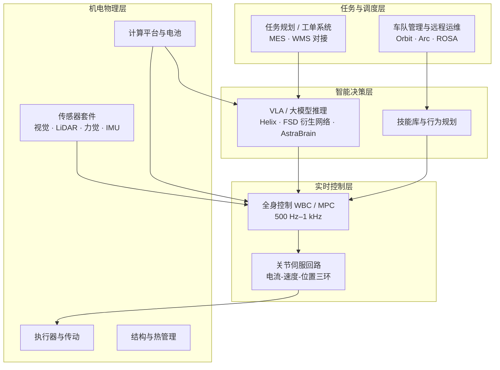
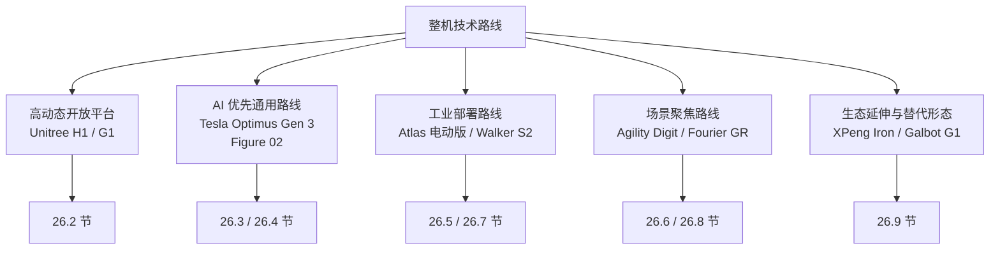
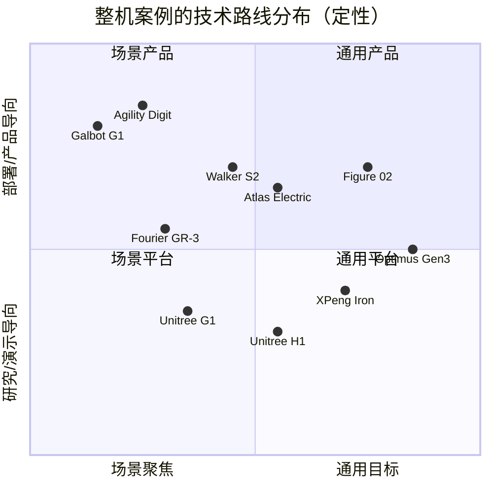

# 第 26 章 整机系统案例

## 摘要

前述章节从材料、零部件、子系统与算法等"自下而上"的视角剖析了人形机器人；本章转换到"自上而下"的整机视角，通过八个具有代表性的整机系统案例，考察真实产品如何在约束条件下完成系统集成与工程权衡。案例覆盖四条主要技术路线：以宇树 H1/G1 为代表的高动态开放平台路线，以 Tesla Optimus Gen 3 与 Figure 02 为代表的"AI 优先"通用路线，以 Boston Dynamics Atlas（电动版）与优必选 Walker S2 为代表的重载/工业部署路线，以 Agility Digit 与傅利叶 GR 系列为代表的场景聚焦路线，并兼论小鹏 Iron 的车企生态路线与银河通用 Galbot G1 的轮式底盘替代路线。每个案例均从定位与演进、系统架构、关键参数、部署进展与工程权衡五个维度展开，最后给出跨案例的横向对比与设计规律总结。本章所有参数均取自本知识图谱（KG）中的产品实体卡片（附录 D），缺失项标注"未公开"，不做臆测。

**关键词**：整机系统集成；Unitree H1/G1；Tesla Optimus；Figure 02；Atlas（电动版）；Agility Digit；Walker S2；Fourier GR；设计权衡；技术路线

---

## 26.1 整机系统集成：从零部件到系统

### 26.1.1 整机是约束条件下的系统权衡产物

人形机器人整机（humanoid robot system）的工程设计，本质上是在质量、功率、成本、算力与安全五大约束构成的多目标空间中寻找可行解。第 4–6 章分别讨论了执行器、传感与计算电源等零部件层面的技术，但零部件性能并不能简单相加：一台整机的最终表现取决于各子系统之间的**接口匹配**与**预算分配**。典型的整机预算包括：

- **质量预算**：结构件、执行器、电池、计算与线束之间的分配。一般而言，执行器占整机质量的 30%–45%，电池占 8%–15%，结构件占 25%–35%。
- **功率预算**：运动峰值功率与持续功率的区分。双足动态行走的瞬时电功率可达千瓦级，而计算与传感的持续功耗通常在百瓦量级。
- **自由度（DOF）预算**：腿部 6–7 DOF/腿、腰部 1–3 DOF、手臂 4–7 DOF/臂、灵巧手 6–22 DOF/手之间的取舍，直接决定成本与可靠性。
- **数据预算**：感知传感器的带宽、计算平台的 TOPS 与存储、以及控制回路的实时性要求（全身控制回路典型为 500 Hz–1 kHz）。

整机系统动力学可用浮动基刚体动力学统一描述（详见第 14 章）：

$$
\mathbf{M}(\mathbf{q})\ddot{\mathbf{q}} + \mathbf{C}(\mathbf{q},\dot{\mathbf{q}})\dot{\mathbf{q}} + \mathbf{g}(\mathbf{q}) = \mathbf{S}^{\top}\boldsymbol{\tau} + \mathbf{J}_c^{\top}\mathbf{f}_c
$$

其中 \(\mathbf{q}\in\mathbb{R}^{n+6}\) 为包含浮动基位姿的广义坐标，\(\mathbf{M}\) 为质量矩阵，\(\mathbf{S}\) 为驱动关节选择矩阵，\(\mathbf{J}_c\) 为接触雅可比，\(\mathbf{f}_c\) 为接触力。整机设计的许多权衡——例如足部质量对摆动惯量的影响、电池容量对续航与整机质量的耦合——都可以在该方程中找到对应的物理量。

### 26.1.2 整机评价的关键指标

为了跨案例对比，本章采用以下指标族：

| 指标 | 定义 | 工程意义 |
|------|------|----------|
| 峰值扭矩密度 | 关节峰值扭矩 / 关节模组质量（N·m/kg） | 决定动态运动能力上限 |
| 推重比类指标 | 负载能力 / 整机质量 | 决定实用搬运能力 |
| 能量自主性 | 电池容量 / 典型任务平均功率 | 决定单次作业时长 |
| 自由度结构 | 腿/腰/臂/手 DOF 分配 | 决定任务覆盖范围与成本 |
| 感知-计算配置 | 传感器套件 × 端侧算力 | 决定自主性与 AI 部署能力 |
| 开放性 | SDK、ROS2 支持、二次开发文档 | 决定生态与研究价值 |
| 部署成熟度 | 真实客户场景运行时长与规模 | 区分"演示"与"产品" |

!!! note "术语解释：演示指标与产品指标的鸿沟（Demo-to-Product Gap）"
    本知识图谱中的概念实体 `ent_concept_demo_to_product_gap` 指出：演示视频中的单次任务成功率、理想环境下的运动性能，与真实场景中要求的**平均无故障时间（MTBF）**、任务成功率 ≥99% 的稳定性、每日数小时的持续作业能力之间存在系统性鸿沟。本章在评价各案例时，将"是否有第三方客户场景的持续部署记录"作为区分演示与产品的关键判据。

### 26.1.3 整机系统的层次架构视图

尽管各厂商的技术路线差异显著，整机系统在功能层次上高度同构。以下层次视图可作为后文逐一分析各案例的统一框架：



阅读各整机案例时，一个有效的分析问题是：**该厂商的差异化究竟发生在哪一层？** 宇树的差异化在 L1（自研高扭矩密度关节）与生态开放性，Figure 的差异化在 L3（Helix VLA），Walker S2 的差异化在 L4（换电、多机协同与 MES 对接），而 Digit 的差异化贯穿 L1 形态学与 L4 的 RaaS 商业模式。整机竞争的实质，是在某一两层形成壁垒，同时在其余层次达到行业及格线。

### 26.1.4 本章案例的选择逻辑



案例选择遵循三条标准：其一，在 KG 中有经过人工与 AI 双重审校的产品实体卡片（附录 D）；其二，在真实场景中具有可验证的部署或量产记录；其三，合起来覆盖当前产业界的主要技术路线与商业模式。总计八个案例，对应 KG 中的 `ent_product_*` 实体族。

---

## 26.2 案例一：宇树 H1 与 G1——高动态电驱平台与开放生态

### 26.2.1 定位与演进

宇树科技（Unitree Robotics）从四足机器人电驱关节起步，将高扭矩密度准直驱（quasi-direct drive, QDD）关节技术迁移至人形平台。KG 实体 `ent_product_unitree_h1`（宇树 H1）于 2023 年发布，定位全尺寸高动态研究平台；`ent_product_unitree_g1`（宇树 G1）于 2024 年发布，以约 16,000 USD 的激进定价成为开发者和教育市场的入门级平台。

### 26.2.2 系统架构与关键参数

H1 采用宇树自研 M107 永磁同步电机关节，膝关节峰值扭矩 360 N·m，峰值扭矩密度约 189 N·m/kg，曾创造全尺寸人形机器人 3.3 m/s 奔跑速度纪录。基础版手臂为 4 DOF，可选 H1-2 升级至 7 DOF 手臂。G1 身高约 127 cm、体重约 35 kg，基础版 23 DOF，EDU 版可扩展至 43 DOF 并可选配 Dex3-1 五指灵巧手与 NVIDIA Jetson Orin 计算模块。

| 参数 | Unitree H1 | Unitree G1 |
|------|-----------|------------|
| 身高 / 体重 | 约 180 cm / 约 47 kg | 约 127 cm / 约 35 kg |
| 整机自由度 | 26–27 DOF | 23–43 DOF（基础版/EDU 版） |
| 关节峰值扭矩 | 膝 360 N·m（M107 电机） | 90–120 N·m |
| 运动速度 | 行走约 1.5 m/s；奔跑 3.3 m/s | 约 2 m/s |
| 续航 | 约 1.5–2 h（864 Wh） | 约 1.5–2 h（9,000 mAh 快拆电池） |
| 计算平台 | Intel Core / Jetson Orin NX（选配） | 8 核 CPU；EDU 版可选 Jetson Orin |
| 开放性 | ROS2 + Unitree SDK | ROS2 + Python/C++ SDK + OTA |
| 价格 | 约 90,000 USD | 约 16,000 USD 起 |

### 26.2.3 工程亮点与局限

**亮点**在于三点。第一，关节自研带来的成本结构与动态性能：准直驱方案省去了高减速比谐波减速器的成本与背隙问题，配合低减速比传动实现高带宽力控，这是 3.3 m/s 奔跑能力的物理基础。第二，产品矩阵的价格分层策略：G1 把整机入门门槛拉低至消费级，使其成为全球出货量领先的人形开发平台之一，广泛进入高校实验室与具身智能研究团队。第三，开放生态：ROS2 与 SDK 支持使其成为强化学习运动控制、VLA 部署验证等研究的主流硬件载体。

**局限**同样明确：H1 基础版手臂仅 4 DOF，无法完成需要手腕姿态调整的灵巧操作；G1 负载仅约 2 kg，不适合工业搬运；两者的电池续航约 1.5–2 小时，尚不足以支撑全天作业场景。宇树的定位因此清晰——**运动能力与开发平台**，而非端到端的工业作业产品。

---

## 26.3 案例二：Tesla Optimus Gen 3——制造垂直整合与数据闭环

### 26.3.1 定位与演进

Tesla Optimus（KG 实体族 `ent_product_tesla_optimus_gen1/gen2/gen3`）是整车厂将电动化、感知与制造能力向人形机器人迁移的代表。Gen 3 的核心升级在手部：单手自由度从 Gen 2 的 11 DOF 提升至 22 DOF，单手搭载约 25 个执行器，双手合计约 50 个执行器。面向量产的全新机体被称为 Optimus V3。截至 2026 年中，Optimus 主要在特斯拉弗里蒙特、奥斯汀等工厂内部测试与任务学习，尚未公开销售。

### 26.3.2 系统架构：FSD 方法论的机器人化

Optimus 的技术路线可以概括为"FSD 方法论的具身化"：

1. **纯视觉感知**：头部集成多颗 Autopilot 摄像头，通过占用网络（Occupancy Network）与鸟瞰（BEV）表征构建环境模型，不使用激光雷达。
2. **端到端策略学习**：基于模仿学习与强化学习训练全身运动与操作策略，底层由全身控制（Whole-Body Control, WBC）保证平衡与接触安全。
3. **高自由度灵巧手**：22 DOF/手 + 约 50 个手部执行器，目标是工具使用与柔性装配级别的操作能力。
4. **自研计算**：搭载特斯拉自研 AI5 芯片，面向本地大模型推理。

| 参数 | Optimus Gen 3 / V3 |
|------|--------------------|
| 身高 / 体重 | 约 173 cm / 约 57 kg（Gen 2 基准，V3 待确认） |
| 整机自由度 | 躯干 28+；手部 22×2 |
| 负载 | 双手搬运约 20 kg |
| 行走速度 | 约 1.2 m/s（V3 报道） |
| 主控芯片 | Tesla AI5 |
| 价格 | 目标 20,000–30,000 USD（长期目标，未正式销售） |
| 部署状态 | 特斯拉工厂内部测试与任务学习 |

### 26.3.3 工程亮点与局限

**亮点**：第一是**制造垂直整合**——特斯拉自研线性/旋转执行器、电池包与电源管理，并复用车规级供应链，这是其提出 20,000–30,000 USD 长期价格目标的底气所在；第二是**数据闭环（data flywheel）**——机器人在自有工厂中执行任务产生的数据直接回流训练，构成 KG 概念实体 `ent_concept_data_flywheel` 描述的自我增强循环，且特斯拉无需向客户支付数据获取成本。**局限**：截至 2026 年中，Optimus 尚无第三方客户场景的持续部署记录，多数性能数字来自官方演示与第三方分析；纯视觉方案在工业强光、粉尘环境下的鲁棒性仍需验证；其手部高自由度设计对执行器微型化与可靠性的要求极高，量产一致性是主要风险。

---

## 26.4 案例三：Figure 02——VLA 优先的通用人形

### 26.4.1 定位与演进

Figure AI 的 Figure 02（KG 实体 `ent_product_figure_ai_figure_02`，其后继为 `ent_product_figure_ai_figure_03`）于 2024 年 8 月发布，面向工业制造与物流场景。其最显著的架构特征是"AI 优先"：整机围绕自研 Helix VLA（Vision-Language-Action）模型设计，而非先造硬件后补智能。

### 26.4.2 系统架构与关键参数

Figure 02 搭载 Helix VLA 模型，可在 200 Hz 频率下控制上半身，实现对数千种未见过物体的零样本抓取；双 NVIDIA RTX GPU 模块提供约 3 倍于 Figure 01 的端侧推理能力；6 颗 RGB 摄像头与多模态传感器支撑环境感知。整机采用集成式线缆布局，2.25 kWh 电池集成于躯干。

| 参数 | Figure 02 |
|------|-----------|
| 身高 / 体重 | 约 168 cm / 约 70 kg |
| 整机自由度 | 28 DOF（手部 16 DOF/对） |
| 负载 | 手部 25 kg；整机搬运 20 kg |
| 行走速度 | 约 1.2 m/s |
| 续航 | 约 5 h（2.25 kWh 躯干电池） |
| 计算平台 | 双 NVIDIA RTX GPU 模块 |
| AI 架构 | Helix VLA（视觉-语言-动作） |
| 部署记录 | BMW Spartanburg 工厂实际任务验证 |

### 26.4.3 工程亮点与局限

**亮点**：Helix VLA 代表了"通用操作策略端到端化"的路线——用单一神经网络同时处理视觉理解、语言指令与动作输出，200 Hz 上半身控制频率说明 VLA 推理已能与实时控制回路耦合，而非仅在秒级做高层规划。其在 BMW Spartanburg 工厂承担底盘装配、物料搬运等与人协作工序，是通用人形机器人进入真实汽车产线的标志性案例之一。**局限**：单站试点规模有限，任务种类仍集中在结构化程度较高的搬运与装配辅助；VLA 模型的泛化能力对目标工件与工位布局的变化仍敏感，新客户部署需要重新采集数据与微调，边际部署成本尚未降至"即插即用"水平。

---

## 26.5 案例四：Boston Dynamics Atlas（电动版）——从液压到全电动的重载平台

### 26.5.1 定位与演进

Boston Dynamics 于 2024 年 4 月退役液压 Atlas，推出全电动版 Atlas（KG 实体 `ent_product_boston_dynamics_atlas_electric`，产品卡 `product_atlas_electric`），定位重载工业任务。这一转型本身就是重要案例：液压方案虽然功率密度与抗冲击能力突出，但存在泄漏维护、噪声与能效问题；全电动方案配合定制高功率电驱执行器，在保留动态能力的同时显著改善了可维护性与量产可行性。

### 26.5.2 系统架构与关键参数

| 参数 | Atlas（电动版） |
|------|-----------------|
| 身高 / 体重 | 约 190 cm / 约 90 kg |
| 整机自由度 | 56 DOF |
| 负载 | 瞬时 50 kg；持续 30 kg |
| 运动范围 | 髋、腰、颈 360° 连续旋转；最大臂展 2.3 m |
| 行走速度 | 约 9 km/h（第三方评测） |
| 续航 | 约 4 h（典型任务），支持电池自主热插拔 |
| 防护等级 | IP67；-20°C 至 40°C |
| 软件平台 | 自研实时控制栈 + Orbit 车队管理 |
| 部署方向 | Hyundai 制造基地、Google DeepMind 研究场景 |

### 26.5.3 工程亮点与局限

**亮点**：56 DOF 与多个 360° 连续旋转关节是独特的形态学设计——腰部与髋部的全周旋转使 Atlas 可以"不换脚步直接转身"，在狭窄工位中减少重定位步数，这是从液压时代继承并强化的运动学优势。30 kg 持续负载是目前电驱人形中的最高水平之一，配合 IP67 防护与宽温工作范围，面向的是严苛工业环境而非实验室。电池自主热插拔结合 Orbit 车队管理，目标是接近连续作业。**局限**：约 90 kg 的整机质量对地板承载与人机协作安全提出更高要求；价格未公开（第三方估计约 150,000 USD 量级）；其高动态能力对应的控制复杂度，使得二次开发生态远不如宇树等开放平台成熟，客户主要依赖厂商交付的完整解决方案。

---

## 26.6 案例五：Agility Robotics Digit——物流场景的产品化样本

### 26.6.1 定位与演进

Agility Robotics 的 Digit（KG 实体 `ent_product_agility_robotics_digit` 及其迭代 `ent_product_agility_robotics_digit_next_gen`）源自双足机器人 Cassie 的研究血统，是目前仓储物流领域部署最广泛的人形机器人之一。与追求"通用"的路线不同，Digit 从形态学开始就为单一任务族——在人类建筑环境中搬运周转箱（tote）——做优化。

### 26.6.2 面向任务的形态学设计

Digit 的设计处处体现任务牵引：头部躯干一体化降低感知-控制耦合复杂度；反向膝关节（后弯腿）构型使腿部在搬运箱体时不与箱体干涉，同时便于蹲起与楼梯通过；感知系统采用 4 颗 Intel RealSense 深度相机 + LiDAR + IMU + 力传感器，无需外部基础设施即可自主导航。

| 参数 | Digit |
|------|-------|
| 身高 / 体重 | 约 175 cm / 约 63.5–65 kg |
| 负载 | 16 kg（持续搬运 35 lb） |
| 行走速度 | 约 5.4 km/h |
| 续航 | 约 4 h（典型任务），自主对接充电 |
| 感知 | 4× Intel RealSense + LiDAR + IMU + 力传感 |
| 制造 | RoboFab 工厂，设计年产能 10,000 台 |
| 商业模式 | 直销 + RaaS（Robot-as-a-Service） |
| 客户 | Amazon、GXO、Spanx 等仓储客户 |

### 26.6.3 工程亮点与局限

**亮点**：第一是**商业部署成熟度**——Amazon、GXO 等第三方客户的真实仓库运行记录，使其成为跨越"演示-产品鸿沟"的少数样本；第二是**商业模式创新**，RaaS（KG 概念实体 `ent_concept_robot_as_a_service`）以订阅替代买断，把客户的 CapEx 转化为 OpEx，并将维护、软件更新与车队管理打包，降低了初期采购门槛；第三是 RoboFab 专用工厂所代表的量产准备。**局限**：任务谱系窄，上肢操作能力限于箱体级搬运，不具备五指灵巧操作；反向膝关节构型虽利于搬运，但与人类正向膝关节的运动学差异使其在拟人化任务（如驾驶座姿操作）中不占优。

---

## 26.7 案例六：优必选 Walker S2——工业人形的体系化交付

### 26.7.1 定位与演进

优必选（UBTECH）Walker 系列是中国厂商中工业交付记录最完整的人形产品线。Walker S1（KG 实体 `ent_product_ubtech_walker_s1`，2024 年 10 月发布）已进入比亚迪、东风柳汽、吉利汽车、奥迪一汽等汽车工厂实训；Walker S2（KG 实体 `ent_product_ubtech_walker_s2`，产品卡 `product_walker_s2`）是第二代工业型号，面向汽车制造、3C 电子与物流仓储。

### 26.7.2 系统架构与关键参数

Walker S2 拥有 52 DOF，双臂最大负载 15 kg，配备第四代五指灵巧手与 ±162° 腰部旋转，可完成拆箱、上料、质检、喷涂等工序。其核心工程亮点是**自主电池热插拔系统**：约 3 分钟内完成换电，支撑接近 24 小时连续作业。感知系统包括双目立体视觉、深度 LiDAR、六轴力传感器与 IMU；软件栈为 ROSA 2.0 操作系统与多模态大模型，支持多机协同与 MES 系统对接。

| 参数 | Walker S1 | Walker S2 |
|------|-----------|-----------|
| 身高 / 体重 | 172 cm / 76 kg | 约 176 cm / 约 70–75 kg |
| 整机自由度 | 41 DOF | 52 DOF |
| 负载 | 负载行走 15 kg | 双臂最大 15 kg |
| 灵巧手 | 第三代（6 阵列触觉） | 第四代五指灵巧手 |
| 行走速度 | 未公开 | 约 2 m/s |
| 续航/换电 | 未公开 | 约 2 h + 3 min 自主热插拔 |
| 计算平台 | 未公开 | X86 + NVIDIA Jetson Orin |
| 客户验证 | 比亚迪、吉利、奥迪一汽等 | 蔚来、比亚迪、空客等 |

### 26.7.3 工程亮点与局限

**亮点**：Walker S2 体现的是"工业人形的体系化"——不止于单机性能，而是把换电自动化、多机协同调度、与 MES（制造执行系统）对接作为整机产品的一部分交付。这正是工业客户真正购买的" uptime（有效作业时间）"，而非演示视频中的动作难度。其多车企实训记录也说明：汽车总装物流是当前工业人形最现实的切入点（详见第 27 章）。**局限**：约 2 小时的单电池续航决定了其对换电基础设施的依赖；单机成本（第三方估计 68,000–120,000 USD）相对于其可替代的工位人工成本，投资回收期仍偏长；喷涂等特种工序对防爆与防护等级的要求，目前仍需定制化改造。

---

## 26.8 案例七：傅利叶 GR-1 与 GR-3——医疗康复背景的场景迁移

### 26.8.1 定位与演进

傅利叶智能（Fourier Intelligence）从康复外骨骼与医疗机器人起家，其人形产品线呈现清晰的"力控技术迁移"路径：GR-1（KG 实体 `ent_product_fourier_gr1`，2023 年 7 月发布）是国内较早量产交付的双足人形平台；GR-3（KG 实体 `ent_product_fourier_gr3`，2025 年 8 月发布，内部代号 Care-bot）则明确转向交互陪伴与康养场景。

### 26.8.2 系统架构与关键参数

GR-1 采用自研 FSA（Fourier Self-Actuator）一体化执行器，集成电机、驱动器、减速器与编码器；从康复外骨骼迁移而来的力控技术使其在接触作业中具备柔顺控制能力，已进入多家三甲医院康复科用于步态训练与康复辅助。GR-3 则代表了另一种设计哲学：莫兰迪暖色调外观、软包覆材料内里、55 DOF 与 12 DOF 灵巧手、双电池热插拔约 3 小时续航，以及集成听觉、视觉、触觉的"全感交互系统"，目标场景是独居老人陪伴、儿童互动与康复辅助。

| 参数 | Fourier GR-1 | Fourier GR-3 |
|------|--------------|--------------|
| 定位 | 通用/康复人形平台 | 交互陪伴（Care-bot） |
| 身高 / 体重 | 165 cm / 55 kg | 165 cm / 71 kg |
| 整机自由度 | 44 DOF | 55 DOF |
| 关键指标 | 最大关节扭矩 230 N·m；双臂负载 10 kg | 12 DOF 灵巧手；全感交互 |
| 行走速度 | 5 km/h | 未公开 |
| 续航 | 未公开 | 约 3 h（双电池热插拔） |
| 典型客户 | 三甲医院康复科、科研 | 养老、家庭（预售） |

### 26.8.3 工程亮点与局限

**亮点**：傅利叶案例说明"场景 Know-how 可以反向定义整机"。康复场景对力控安全性、接触柔顺性的苛刻要求，恰好是医疗级产品的准入门槛；GR-3 的软包覆与亲和外观设计则直面家庭场景中"人对机器的心理接受度"这一非技术约束。**局限**：康复与陪伴场景对任务成功率、安全认证（如 ISO 13482 个人护理机器人标准）的要求远高于展示类场景，规模化部署进度受制于临床验证周期；陪伴场景的商业模型（客单价、续费率）尚未跑通，属于长周期赛道。

---

## 26.9 案例八：生态延伸与形态替代——小鹏 Iron 与 Galbot G1

### 26.9.1 小鹏 Iron：车企生态路线

小鹏 Iron（KG 实体 `ent_product_xpeng_iron`，产品卡 `product_xpeng_iron`）是"车企造人形"路线在中国的样本，与 Tesla Optimus 形成跨市场对照。其技术底座复用小鹏汽车体系：自研图灵 AI 芯片（40 核、3000 TOPS 级算力）、720° 鹰眼视觉、天玑 AIOS 与端到端大模型 + 强化学习。第一代 Iron 身高 178 cm、体重 70 kg、62 个主动自由度，手部 15 DOF 并支持触觉反馈，已在广州工厂 P7 产线进行拧螺丝、整理物料、看生产表单等实训，计划 2026 年底规模量产，未来面向门店导览与商业服务。

该路线的战略逻辑与 Optimus 一致：车企拥有电机、电池、感知、芯片与总装制造的现成能力，人形机器人是这些能力的"再封装"。风险也相同：真实第三方客户数据缺失，工厂内实训的任务广度有限。

### 26.9.2 Galbot G1：轮式底盘的务实替代

银河通用 Galbot G1（KG 实体 `ent_product_galbot_g1`）代表了对"人形必须双足"这一假设的反思。G1 采用 360° 全向轮式底盘替代双足行走，通过躯干升降（行程 65 cm）与折叠腿结构覆盖垂直作业区间，最大作业高度约 240 cm，身高 173 cm、体重约 85 kg。其 AI 系统 AstraBrain 采用纯视觉导航（无需二维码或 LiDAR），已在药店、便利店、仓储物流等场景实现 24 小时商用部署。

轮式方案的工程收益可以直接量化：双足机器人为维持姿态需持续消耗能量，轮式底盘将能量集中于上肢操作与计算，使续航显著延长；同时消除了动态平衡控制的失效模式，本质可靠性更高。其代价是无法通过楼梯、台阶等非结构化地形——但在药店、便利店等平整商业环境中，该约束几乎不出现。

!!! note "设计启示：形态服从任务，而非反之"
    Galbot G1 与 Digit 从两个相反方向说明同一原则：Digit 为在狭窄通道与楼梯环境搬运周转箱而保留双足，Galbot G1 为平整商业环境中的全天候作业而放弃双足。"人形"的合理性不来自形态本身，而来自**环境是为人类设计的**这一事实；当目标环境恰好平坦且规则时，轮式人形上半身是更优解。

---

## 26.10 跨案例横向对比

### 26.10.1 关键参数总表

| 机型 | 身高/体重 | 整机 DOF | 负载 | 速度 | 续航 | AI/计算 | 价格/模式 | 部署成熟度 |
|------|-----------|----------|------|------|------|---------|-----------|-----------|
| Unitree H1 | 180 cm / 47 kg | 26–27 | 未公开 | 跑 3.3 m/s | 1.5–2 h | Jetson Orin NX 选配 | ~90,000 USD | 科研平台出货领先 |
| Unitree G1 | 127 cm / 35 kg | 23–43 | ~2 kg | 2 m/s | 1.5–2 h | 8 核 CPU + Orin 选配 | ~16,000 USD | 开发者生态领先 |
| Optimus Gen 3 | 173 cm / ~57 kg | 28+ + 22×2 手 | ~20 kg | ~1.2 m/s | 2–4 h（估计） | Tesla AI5 | 目标 20–30k USD | 仅内部工厂 |
| Figure 02 | 168 cm / 70 kg | 28（手 16/对） | 手 25 kg | 1.2 m/s | ~5 h | 双 RTX GPU + Helix VLA | 未公开 | BMW 产线试点 |
| Atlas 电动版 | 190 cm / 90 kg | 56 | 持续 30 kg | ~9 km/h | ~4 h，热插拔 | 自研实时栈 + Orbit | 未公开 | Hyundai 早期部署 |
| Agility Digit | 175 cm / ~65 kg | 16–28 | 16 kg | 5.4 km/h | ~4 h，自主充电 | RealSense + LiDAR | RaaS | Amazon/GXO 仓库 |
| Walker S2 | 176 cm / ~72 kg | 52 | 双臂 15 kg | ~2 m/s | 2 h + 3 min 换电 | X86 + Orin + ROSA 2.0 | 未公开 | 多车企实训 |
| Fourier GR-1 | 165 cm / 55 kg | 44 | 双臂 10 kg | 5 km/h | 未公开 | 未公开 | 未公开 | 三甲医院康复科 |
| XPeng Iron | 178 cm / 70 kg | 62 | 未公开 | 未公开 | 未公开 | 图灵芯片 + 天玑 AIOS | 未公开 | 自有工厂实训 |
| Galbot G1 | 173 cm / 85 kg | 未公开 | 未公开 | 未公开 | 长（轮式） | AstraBrain 纯视觉 | 未公开 | 药店/便利店 24h |

### 26.10.2 技术路线的二维分布



### 26.10.3 跨案例设计规律

综合八个案例，可以提炼出以下整机设计规律：

1. **续航—质量—换电的三角权衡**：电池能量密度（第 3、6 章）决定了"加大电池"会同时推高整机质量与关节功率需求。Atlas 与 Walker S2 选择自主热插拔换电，Digit 选择自主对接充电，本质是用基础设施换 uptime，而非盲目堆电池容量。若任务平均功率为 \(P_{avg}\)，电池可用能量为 \(E_{bat}\)，换电/充电中断时间为 \(t_{int}\)，则有效作业占比为

$$
\eta_{uptime} = \frac{E_{bat}/P_{avg}}{E_{bat}/P_{avg} + t_{int}} = \frac{1}{1 + t_{int}\,P_{avg}/E_{bat}}
$$

   以 Walker S2 为例，约 2 h 续航与 3 min 换电意味着理论 uptime 上限约 97.5%，这正是"接近 24 小时连续作业"的算术本质。下面的 Python 算例对比了三种能量补给策略下的理论 uptime：

```python
# 整机 uptime 对比：电池扩容 vs 自主充电 vs 热插拔换电
# 约定：任务平均功率 P_avg (W)，电池可用能量 E_bat (Wh)
P_avg = 400.0  # W，工业搬运任务的典型平均功率量级

def uptime(E_bat_wh, t_interrupt_min):
    """返回理论有效作业占比 η"""
    t_run = E_bat_wh / P_avg * 60.0   # 单次作业时长 (min)
    return t_run / (t_run + t_interrupt_min)

strategies = {
    "基础电池 (500 Wh, 自主充电 60 min)": (500.0, 60.0),
    "加倍电池 (1000 Wh, 自主充电 60 min)": (1000.0, 60.0),
    "热插拔换电 (等效 800 Wh, 换电 3 min)": (800.0, 3.0),
}
for name, (e, t) in strategies.items():
    print(f"{name}: 单次作业 {e/P_avg:.2f} h, uptime = {uptime(e, t)*100:.1f}%")
```

   算例的结论是反直觉的：把电池容量加倍只能把 uptime 从约 55% 提升到约 71%，而 3 分钟热插拔换电可以直接越过 96%。这解释了为什么 Atlas、Walker S2 与 GR-3 均将换电自动化作为整机级功能而非售后附件来设计。

2. **自由度向手部集中**：2023 年的整机竞争焦点在腿部动态能力（H1 的 3.3 m/s），2025 年后的焦点转向手部（Optimus 22 DOF/手、Figure 16 DOF/对、Walker S2 第四代灵巧手）。原因在于腿部"能走到"已是及格线，而手部"能干活"才是客户付费点；手部执行器的微型化因此成为整机 BOM 中增长最快的部分。

3. **计算架构两级分化**：研究平台（G1、H1）采用通用 Jetson/x86 组合以换取开发生态；产品化整机（Optimus、Figure、XPeng）走向自研或大算力定制芯片，因为 VLA 模型的端侧推理对内存带宽与功耗的敏感度高于绝对 TOPS。

4. **部署成熟度与开放性负相关**：部署最成熟的 Digit、Walker S2 提供的是封闭交钥匙方案；开放生态最好的 G1/H1 主要服务科研。这一负相关反映了当前产业的现实——真实场景部署需要厂商深度介入，尚未形成"通用平台 + 第三方应用"的分工。

5. **场景聚焦先于通用**：Digit（物流箱体）、Galbot G1（药店便利店）、GR-3（康养陪伴）均在收窄任务域以换取可靠性指标。这与 KG 概念 `ent_concept_demo_to_product_gap` 的判断一致：跨越演示-产品鸿沟的最短路径是收窄场景，而非提升通用性。

---

## 26.11 本章小结

本章通过八个整机系统案例展示了人形机器人系统集成的主要技术路线与设计权衡。宇树 H1/G1 证明了高动态电驱关节自研 + 开放生态的平台价值；Tesla Optimus 与 Figure 02 展示了"AI 优先"路线中制造垂直整合与 VLA 端到端架构的两种形态；电动 Atlas 与 Walker S2 代表了重载/工业部署中形态创新与体系化交付的方向；Digit 与傅利叶 GR 系列则验证了场景聚焦路线的商业可行性；小鹏 Iron 与 Galbot G1 分别提示了车企生态迁移与轮式形态替代两条"非典型"路径。这些案例共同指向一个结论：整机设计的优劣无法用单一参数排序，而应放在"目标场景 × 商业模式 × 技术底座"的三维坐标系中评价。第 27 章将沿此思路，系统展开人形机器人的应用场景分析。
