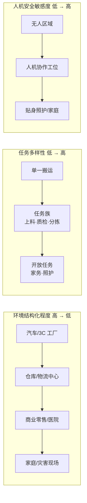
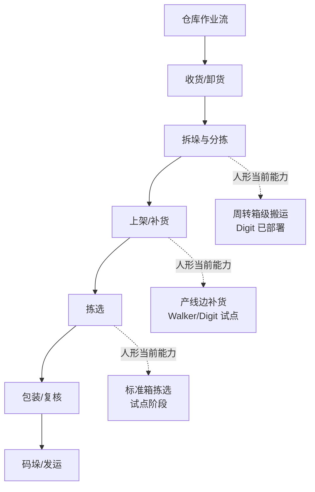

# 第 27 章 应用场景

## 摘要

人形机器人的价值最终要在具体场景中兑现。本章以"场景牵引"为主线，系统分析人形机器人的七类应用场景：仓储物流、汽车制造与工业装配、工业巡检与运维、医疗康复与养老照护、家庭与家用服务、商业零售与公共服务、科研教育与开发者生态。对每一类场景，本章按统一框架展开：场景定义与任务分解、人形形态的适配性分析、关键技术需求、基于知识图谱（KG）真实实体（Agility Digit、Walker S1/S2、Figure 02、Galbot G1、傅利叶 GR-1/GR-3、宇树 G1、EngineAI PM01 等）的代表性部署、以及当前瓶颈。本章的场景分类与分析维度参考了本项目应用调研工作流（`scripts/ai4sci_workstreams/applications/` 中的 warehouse_logistics、industrial_inspection、assistive_rehabilitation、home_assistive 四个调研方向定义文件）所设定的检索域与目标实体类型，并在章末给出跨场景的共性工程约束——安全标准、总拥有成本（TCO）模型、RaaS 商业模式与数据飞轮——为第 28 章的市场与投资分析奠定场景侧基础。

**关键词**：应用场景；仓储物流；汽车制造；工业巡检；医疗康复；养老陪伴；家庭服务；人机协作安全；TCO；RaaS

---

## 27.1 应用场景分析框架

### 27.1.1 为什么"场景"比"形态"更重要

第 26 章的整机案例对比表明，当前落地最成功的产品（Digit 之于仓储、Galbot G1 之于药店便利店）都是场景定义形态的产物，而非相反。应用场景分析回答三个递进问题：

1. **为什么是这个场景？** 该场景中是否存在足够大的劳动力缺口或危险系数，使机器人替代具备经济或伦理正当性；
2. **为什么是人形？** 该场景的环境是否为人类设计（台阶、门把手、货架高度、工具接口），使得仿人形态比重构环境更便宜；
3. **为什么是现在？** 执行器成本、VLA 模型泛化能力与电池技术是否已越过该场景的及格线。

只有三个问题同时得到肯定回答，场景才具备落地条件。本章对每类场景均按此逻辑检验。

### 27.1.2 场景分类学：三个正交维度

人形机器人应用场景可沿三个正交维度定位：

- **环境结构化程度**：从高度结构化的汽车焊装车间，到半结构化的仓库与医院，再到非结构化的家庭与灾害现场；
- **任务多样性**：从单一重复任务（搬运周转箱），到任务族（总装物流的数十种工位），再到开放任务（家庭家务）；
- **人机交互与安全的敏感度**：从无人仓库的低敏感度，到协作产线的中敏感度，再到养老、家庭场景的高敏感度。



一般而言，商业化成熟度沿"结构化程度高、任务多样性低、安全敏感度低"的角点优先突破：这正是仓储物流与汽车总装物流成为 2024–2026 年部署先锋的原因。

### 27.1.3 场景—能力映射矩阵

下表将七类场景映射到整机能力需求（能力定义见第 26.1.2 节）：

| 场景 | 移动要求 | 操作要求 | 续航/补给 | 安全等级 | 典型负载 | 代表整机（KG 实体） |
|------|----------|----------|-----------|----------|----------|---------------------|
| 仓储物流 | 平地行走、窄通道 | 箱体抓取、码垛 | 4 h+，自主充电 | 中（人机分区） | 10–20 kg | `ent_product_agility_robotics_digit` |
| 汽车制造/装配 | 产线行走、工位定位 | 双臂协作、工具使用 | 换电 24 h | 高（协作工位） | 5–15 kg | `ent_product_ubtech_walker_s2` |
| 工业巡检 | 全天候、楼梯/管廊 | 表计读取、阀门操作 | 长续航+宽温 | 中 | <5 kg | `ent_product_boston_dynamics_atlas_electric` |
| 医疗康复 | 低速平稳 | 柔顺力控接触 | 班次级 | 极高 | 接触力级 | `ent_product_fourier_gr1` |
| 养老陪伴 | 室内低速 | 轻操作、情感交互 | 热插拔 | 极高 | <3 kg | `ent_product_fourier_gr3` |
| 家庭服务 | 非结构化室内 | 多样家务操作 | 长续航 | 极高 | 1–5 kg | `ent_product_one_x_technologies_neo` |
| 商业零售 | 平整地面 | 货架取放、导览 | 24 h 轮班 | 高 | 1–5 kg | `ent_product_galbot_g1` |
| 科研教育 | 实验室 | 开放二次开发 | 1–2 h 可接受 | 低 | — | `ent_product_unitree_g1`、`ent_product_engineai_pm01` |

### 27.1.4 场景经济性的量化框架：TCO 与单位任务成本

场景能否成立，最终由总拥有成本（Total Cost of Ownership, TCO）与人工替代成本的比较决定。一个简化的 TCO 模型为：

$$
TCO = \frac{C_{robot} + \sum_{t=1}^{T} \frac{C_{maint}(t) + C_{energy}(t) + C_{integrate}(t)}{(1+r)^t}}{N_{task}}
$$

其中 \(C_{robot}\) 为购置成本（或 RaaS 模式下的年化租金），\(C_{maint}\)、\(C_{energy}\)、\(C_{integrate}\) 分别为维护、能耗与集成改造成本，\(r\) 为折现率，\(T\) 为服役年限，\(N_{task}\) 为全生命周期完成的有效任务数。机器人替代的人工成本阈值可写为

$$
C_{labor}^{eff} = w \cdot h_{shift} \cdot n_{shift} \cdot \eta_{task}
$$

其中 \(w\) 为小时综合用工成本，\(h_{shift}\) 与 \(n_{shift}\) 为班次时长与班次数以反映机器人可连班的优势，\(\eta_{task}\) 为机器人对该工位任务的有效覆盖率。当 \(TCO < C_{labor}^{eff}\) 时场景具备经济闭环。当前在多数工业场景中，约束项不在分母（任务数）而在分子中的 \(C_{integrate}\)——集成与改造成本常占首年部署成本的三至五成，这解释了为什么"为机器人改造产线"与"机器人适应产线"成为路线之争。

### 27.1.5 场景落地的驱动因素与时间窗口

"为什么是现在"这一问题可以分解为四股同时收敛的力量（KG 概念实体 `ent_concept_demo_to_product_gap` 对 2025–2026 年新浪潮的归纳）：

1. **AI 能力收敛**：大模型与 VLA（视觉-语言-动作模型，见第 19 章）使机器人获得了跨任务的感知、理解与泛化能力，任务编程从"逐工位示教"向"数据驱动学习"迁移，直接压缩 \(C_{integrate}\)。
2. **成本曲线收敛**：精密制造与供应链成熟（见第 7 章）使执行器、减速器等核心零部件成本快速下降，整机 BOM 进入工业客户 TCO 可接受的区间。
3. **劳动力结构收敛**：制造业与物流业用工成本上升、招工难与人口老龄化，抬高了 \(C_{labor}^{eff}\) 的阈值，使更多场景越过经济闭环线。
4. **资本收敛**：资本市场为头部玩家提供大规模资金，使其能够承受长验证周期的场景试点（如 Figure 在 BMW 的 11 个月部署）。

四股力量的方向一致但速率不同：AI 能力与成本曲线按季度变化，劳动力结构按年变化，而标准与认证体系按数年变化。场景落地的次序，本质上是各场景对这四股力量敏感度排序的结果。

---

## 27.2 仓储物流场景

### 27.2.1 场景定义与任务分解

仓储物流（对应应用调研方向 `warehouse_logistics`）覆盖拣选（picking）、包装（packing）、码垛/拆垛（palletizing/depalletizing）、货架补货与"最后一米"物料搬运。该场景的共性特征是：SKU 数量大、订单波动强、用工季节性明显，且仓库环境（通道宽度、货架高度、周转箱规格）围绕人体工学设计。



### 27.2.2 人形形态的适配性

仓库是人形机器人"环境为人设计"论证最强的场景：窄通道（通常 1.2 m 以内）、货架层板高度（人体可及范围）、周转箱把手与门把手均按人体尺度设计。轮式 AMR（自主移动机器人）在平面搬运上效率更高，但无法处理台阶、地坑边缘与需要"够到高处并双手操作"的工位；人形/双足形态恰好补齐这段"最后一米"。Agility Digit 的反向膝关节设计即针对"在狭窄通道中抱着周转箱蹲起"这一具体动作优化（见第 26.6 节）。

### 27.2.3 关键技术需求

| 能力 | 指标要求（典型） | 说明 |
|------|------------------|------|
| 持续负载 | 15–20 kg | 标准周转箱满载质量 |
| 单位时间吞吐 | 与人工节拍可比（数十箱/小时量级） | 决定 TCO 是否闭合 |
| 自主充电/换电 | 中断时间 < 5 min | 决定 uptime（见 26.10.3 节公式） |
| 车队管理 | 与 WMS 对接 | 任务调度而非单机智能 |
| 安全 | 人机分区或协作限速 | 无人区可放宽，混行区受限 |

### 27.2.4 代表性部署与瓶颈

KG 中的标杆案例是 Agility Digit（`ent_product_agility_robotics_digit`）：已在 Amazon、GXO、Spanx 等客户仓库执行周转箱分拣与搬运，以 RaaS 模式交付，并由年产能 10,000 台的 RoboFab 工厂支撑供给。银河通用 Galbot G1（`ent_product_galbot_g1`）则以轮式底盘 + 升降躯干方案在仓储与零售补货场景实现 24 小时部署，验证了"平整环境中轮式替代双足"的成本逻辑。

当前瓶颈主要在三点：一是拣选环节的 SKU 泛化——软包装、透明与反光物体对视觉-抓取策略仍是挑战；二是节拍差距——人形单箱处理时间仍高于熟练工人，需要靠连班优势（\(n_{shift}\) 项）弥补；三是 WMS 深度集成——机器人必须理解波次、库位与优先级语义，而非仅执行点对点搬运。

### 27.2.5 Python 算例：仓储搬运工位的经济性测算

以下算例用 27.1.4 节的 TCO 框架估算"人形机器人替代一名仓库搬运工"的临界条件。所有参数均为示意性假设值，用于展示测算方法而非给出行业结论：

```python
# 仓储搬运工位：人形机器人 TCO 与人工成本对比（示意性参数）
w = 25.0          # 人工综合用工成本 (USD/h)
h_shift = 8.0     # 单班时长 (h)
n_shift_human = 1.0   # 人工班次数（含休息，实际约 1 班有效）
eta_task = 0.85       # 机器人对工位任务的有效覆盖率

# 机器人侧：RaaS 年租金 + 集成 + 能耗 + 维护
rent_year = 60000.0     # RaaS 年租金 (USD)
integrate_year1 = 30000.0  # 首年集成改造成本 (USD)
maint_year = 8000.0     # 年维护 (USD)
energy_year = 1500.0    # 年能耗 (USD)
n_shift_robot = 2.5     # 机器人可连班等效班次数（换电/自主充电）
years = 5

# 人工年成本（单工位）
c_labor_year = w * h_shift * 250 * n_shift_human  # 250 个工作日
# 机器人年化成本
c_robot_year = rent_year + maint_year + energy_year + integrate_year1 / years
# 机器人实际替代的人工当量（连班 × 覆盖率）
c_labor_eff = c_labor_year * n_shift_robot * eta_task

print(f"人工年成本（单班）: {c_labor_year:,.0f} USD")
print(f"机器人年化成本:     {c_robot_year:,.0f} USD")
print(f"机器人替代的人工当量价值: {c_labor_eff:,.0f} USD")
print(f"经济闭环: {'成立' if c_labor_eff > c_robot_year else '不成立'}")
```

算例揭示了仓储场景的两个结构性特征：其一，**连班能力是经济性的主要杠杆**——机器人可运行 2 个以上班次时，即使单班节拍落后于人，年度总产出仍可反超；其二，**覆盖率 \(\eta_{task}\) 是敏感变量**——覆盖率从 0.85 降到 0.6 时闭环立即失效，这正是厂商优先部署"周转箱搬运"这类覆盖率高的窄任务，而把复杂拣选留待后续的原因。

---

## 27.3 汽车制造与工业装配场景

### 27.3.1 场景定义与任务分解

汽车制造是当前工业人形部署最密集的场景。总装车间的任务族包括：零部件分拣与配送（SPS 物流）、线束插接、螺钉拧紧、内饰件安装、质检与涂胶。这些任务的共同特点是：工位按人体工学设计、任务有一定多样性但环境高度结构化、且对"不停线"有极高要求。

### 27.3.2 代表性部署：从实训到产线

KG 产品实体记录了多家厂商在汽车场景的对标部署：

| 整机（KG 实体） | 客户/基地 | 任务 | 阶段 |
|-----------------|-----------|------|------|
| Figure 02（`ent_product_figure_ai_figure_02`） | BMW Spartanburg | 底盘装配、物料搬运 | 产线试点 |
| Walker S1（`ent_product_ubtech_walker_s1`） | 比亚迪、东风柳汽、吉利、奥迪一汽 | 总装物流、搬运、质检 | 多厂实训 |
| Walker S2（`ent_product_ubtech_walker_s2`） | 蔚来、比亚迪、空客等 | 拆箱、上料、质检、喷涂 | 企业交付 |
| Tesla Optimus Gen 3（`ent_product_tesla_optimus_gen3`） | 特斯拉自有工厂 | 电池分拣、物料搬运 | 内部测试 |
| XPeng Iron（`ent_product_xpeng_iron`） | 小鹏广州工厂 | 拧螺丝、整理物料、看生产表单 | 产线实训 |

这一表格本身揭示了一个产业事实：**整车厂既是最积极的客户，也是最积极的竞争者**（特斯拉、小鹏自研自用）。对第三方机器人厂商而言，汽车场景的战略价值在于工位密度高、可复制性强——一个工厂验证的工位方案可横向推广至数十个工厂。

### 27.3.3 关键技术需求

- **节拍与 uptime**：产线节拍以秒计，机器人要么嵌入节拍内（高动态要求），要么承担节拍外的物流任务（当前主流选择）。Walker S2 的 3 分钟自主热插拔换电正是为匹配三班倒连续生产而设计。
- **灵巧操作**：线束插接、卡扣安装要求 10+ DOF 灵巧手与力/触觉反馈；Walker S2 的第四代五指灵巧手与 Optimus 的 22 DOF 手均面向此类工序。
- **人机协作安全**：协作工位必须满足速度、力与接触压力限制（详见 27.9 节标准体系）。
- **系统集成**：与 MES（制造执行系统）对接，接受工单、上报状态——这是"机器人进厂"与"机器人参展"的分水岭。

### 27.3.4 瓶颈

主要瓶颈在于工位迁移成本：每换一个工位都需要重新采集示教或遥操作数据、调整夹具与重新验证安全，集成成本 \(C_{integrate}\) 高企。VLA 模型的零样本泛化（如 Figure Helix 对未见过工件的抓取）正在压缩这一成本，但截至 2026 年，"换工位即插即用"仍未实现。

### 27.3.5 工位分级：从物流工位到装配工位的爬坡路径

汽车总装车间的工位可按对人形机器人的友好程度分级，构成部署的爬坡路径：

| 工位等级 | 典型工位 | 环境约束 | 操作要求 | 部署状态（截至 2026 年） |
|----------|----------|----------|----------|--------------------------|
| G1 物流工位 | 料箱配送、SPS 分拣、空箱回收 | 开阔通道 | 箱体抓取与搬运 | 已多点部署（Walker、Digit 系） |
| G2 辅助工位 | 零件预装、质检辅助、表单核对 | 工位旁作业 | 双臂协作、视觉判定 | 试点验证（Figure@BMW、Iron@小鹏） |
| G3 线边工位 | 线束插接、卡扣安装、螺钉拧紧 | 嵌入产线节拍 | 灵巧手+力控、工具使用 | 演示到试点的过渡区 |
| G4 特种工位 | 喷涂、涂胶、焊接辅助 | 防爆/防护认证 | 工艺级精度 | 需定制化改造，尚未规模部署 |

这一分级说明：当前"机器人进厂"的实质是**先吃下 G1 物流工位的人力缺口**，再随灵巧手与力控能力成熟向 G2/G3 爬坡。任何声称"人形机器人即将全面替代产线工人"的论述，都混淆了 G1 与 G3 之间的技术距离。

---

## 27.4 工业巡检与运维场景

### 27.4.1 场景定义与任务分解

工业巡检（对应应用调研方向 `industrial_inspection`）覆盖设备目视检查、无损检测（NDT）辅助、表计与仪表读数、受限空间进入、以及与厂务控制系统的联动。典型客户为电力、石化、冶金与轨道交通运营方。

### 27.4.2 人形形态的适配性

巡检场景对人形的需求来自两点：其一，电厂、变电站等设施存在大量楼梯、爬梯与门槛，双足/人形通过性优于轮式底盘；其二，阀门、手柄、钥匙开关等操作接口为人手设计。不过该场景中专用机器人（挂轨式、四足式）竞争激烈，人形的差异化在于"巡检 + 简单处置"一体化——发现异常后能当场完成阀门调整等轻操作，而非仅回传图像。

### 27.4.3 关键技术需求与代表平台

- **环境适应性**：宽温（-20°C 至 40°C）、防护等级 IP65+、防爆认证（石化场景）；Atlas 电动版的 IP67 与宽温指标（`ent_product_boston_dynamics_atlas_electric`）即面向严苛工业环境。
- **感知**：红外热成像、声纹、气体检测与表计读数的视觉识别。
- **长续航与自主回充**：巡检路线长、点位稀疏，能量预算比搬运场景更紧张。
- **系统集成**：与 DCS/SCADA 等厂务系统对接，实现"巡检发现—工单生成—处置闭环"。

该场景的瓶颈是单次巡检价值密度低、机器人单价高，因此当前以"高危区域替代人工进入"（安全价值而非成本价值）作为主要立项理由，例如高温、辐射或有毒区域的例行检查。

### 27.4.4 向应急与特种场景延伸

工业巡检的技术栈（通过性、远程感知、耐恶劣环境）与灾害应急响应高度同源，因此巡检常被视为人形进入特种场景的跳板。需要指出的是，在废墟、瓦砾等极端非结构化环境中，人形未必是最优形态——KG 论文实体 `ent_paper_maur_roboa_construction_and_evaluat_2022`（"RoBoa：面向搜索救援应用的可转向藤蔓机器人的构建与评估"）展示了一条完全不同的路线：RoBoa 通过外翻柔性织物管实现 17 m 级细长构型，可钻进坍塌建筑的狭窄缝隙，这是任何人形机器人都无法进入的空间。该案例对场景分析的方法论意义在于：**特种场景的正确问题不是"人形能否进入"，而是"哪种形态的单位风险成本最低"**。人形在特种场景中的合理定位，更接近"危险环境中的通用作业者"（如核设施退役作业中的阀门操作与工具使用），而非极限空间的探索者。

---

## 27.5 医疗康复与养老照护场景

### 27.5.1 场景定义与任务分解

医疗康复与养老照护（对应应用调研方向 `assistive_rehabilitation`）包含物理治疗辅助、步态训练、老年人日常活动（ADL, Activities of Daily Living）支持、认知障碍人群的社交互动与提醒。该场景的评估指标与普通工业场景不同：除任务成功率外，还包括依从性（adherence）、参与度（engagement）与功能改善等临床指标。

### 27.5.2 代表性平台与研究证据

傅利叶是 KG 中该场景的核心实体族：GR-1（`ent_product_fourier_gr1`）已进入多家三甲医院康复科用于步态训练与康复治疗辅助，其力控柔顺性继承自傅利叶的康复外骨骼产品线；GR-3（`ent_product_fourier_gr3`，Care-bot）进一步面向独居老人陪伴与康复辅助，以软包覆外观、全感交互系统（听觉、视觉、触觉）与双电池热插拔支撑长时间陪伴任务。

研究侧的证据也在积累。KG 论文实体 `ent_paper_mishra_does_elderly_enjoy_playing_bin_2021`（"老年人是否喜欢与机器人玩宾果？——以人形机器人 Nadine 为例的案例研究"）报告了社交人形机器人 Nadine 作为自主宾果主持人在疗养院的部署：计算机视觉分析显示，机器人主持活动期间老年居民笑得更多、工作人员负担减轻。这类研究说明人形形态在**社交接受度**上的独特价值——人脸与肢体语言对老年人群的亲和力是非人形设备难以替代的。

### 27.5.3 关键技术需求

| 能力 | 要求 | 依据 |
|------|------|------|
| 柔顺力控 | 接触力闭环、碰撞检测与快速回退 | 与老人/患者直接身体接触 |
| 安全认证 | ISO 13482（个人护理机器人）等 | 详见 27.9 节 |
| 交互自然度 | 语音、表情、触觉多模态 | 依从性与参与度指标 |
| 持续运行 | 班次级续航、静默换电 | GR-3 双电池热插拔的设计依据 |
| 隐私合规 | 音视频数据的本地处理 | 养老场景的强隐私约束 |

### 27.5.4 瓶颈

康复医疗场景的规模化受制于临床验证周期与医保支付路径：作为"医疗设备"准入需要注册与临床评价，作为"消费产品"又难以支撑高单价。当前现实路径是机构（康复科、养老院）采购 + 按服务收费，家庭端放量仍需等待成本下降与标准完善。

### 27.5.5 康复服务闭环与评估指标

康复与照护场景的独特之处在于服务是一个"评估—干预—再评估"的临床闭环，机器人同时承担干预执行者与数据采集者的双重角色：


与工业场景以"单位时间吞吐"为核心指标不同，该场景的 KPI 体系以人为中心：训练依从性（患者完成处方训练的比例）、参与度（训练过程中的主动投入程度，可由视觉表情与动作幅度分析估计）、以及功能改善量（训练前后标准化量表得分差）。人形机器人在这一闭环中的价值主张不是替代治疗师，而是**放大治疗师的单位时间服务半径**——一名治疗师可同时监督多台设备的训练过程，这对治疗师长期短缺的康复医疗体系具有直接的结构性意义。

---

## 27.6 家庭与家用服务场景

### 27.6.1 场景定义与任务分解

家庭服务（对应应用调研方向 `home_assistive`）是任务多样性最高、环境结构化程度最低的场景：整理收纳、清洁、洗衣、取物、陪伴与紧急呼叫响应等。KG 产品实体中，1X Technologies 的 NEO（`ent_product_one_x_technologies_neo`）与傅利叶 GR-3 均以此类场景为目标；特斯拉亦将家庭服务列为 Optimus 的长期目标场景。

将家务任务按"操作强度 × 环境变异性"两个维度分级，可以看清自主化的爬坡路径：

| 任务等级 | 典型任务 | 操作强度 | 环境变异性 | 当前自主化程度 |
|----------|----------|----------|------------|----------------|
| L0 陪伴交互 | 语音提醒、情感交流、视频通话 | 无接触 | 低 | 已可产品化（GR-3 定位） |
| L1 轻取物 | 递水、取遥控器、送药 | 单手轻载 | 中 | 遥操作辅助下可用 |
| L2 整理收纳 | 桌面归位、衣物折叠 | 双手操作 | 高 | 演示级，成功率不稳定 |
| L3 复杂家务 | 洗碗、烹饪备餐、深度清洁 | 工具+液体+易碎品 | 极高 | 研究阶段 |

这一分级与 27.1.2 节的场景分类学一致：自主化沿着"低操作强度、低环境变异性"的角点先行，每一级的跨越都依赖数据飞轮积累的长尾任务样本。

### 27.6.2 为什么家庭是"最后"被攻克的场景

家庭场景的困难是系统性的：

1. **非结构化环境**：每个家庭的户型、物品摆放、光照条件均不同，感知与操作模型无法依赖先验地图；
2. **开放任务空间**：家务任务的物体种类与操作序列近乎无限，对 VLA 模型的泛化能力要求远超工厂任务族；
3. **安全与心理接受度**：与儿童、老人、宠物共处，对碰撞力、跌倒风险与"恐怖谷"效应均高度敏感；
4. **价格天花板**：家庭用户的支付意愿远低于工业客户的 TCO 阈值，要求整机 BOM 比工业机型低一个数量级。

KG 报告实体 `ent_report_humanoid_home_robot_safety_is_all_about_2026`（"Home Robot Safety Is All About Relationships"）指出，ISO 正在更新已实施 12 年的个人护理机器人安全要求，侧面反映了家用机器人安全标准随产品化进程而演进的状态。

### 27.6.3 当前可行的切入点

短期内家庭场景的现实路径是"收窄任务域"：以陪伴、提醒、轻取物等低操作强度任务切入（GR-3 的陪伴定位即此逻辑），通过遥操作辅助（human-in-the-loop）兜底长尾任务并同步积累数据，逐步扩大自主任务范围。这与 KG 概念 `ent_concept_demo_to_product_gap` 的判断一致——家庭场景的鸿沟最大，收窄切口是必经路线。

---

## 27.7 商业零售与公共服务场景

### 27.7.1 场景定义与代表部署

商业零售场景覆盖药店、便利店的货架补货与盘点、门店导览、促销互动与夜间无人值守运营。KG 中最完整的案例是银河通用 Galbot G1（`ent_product_galbot_g1`）：轮式全向底盘 + 65 cm 升降躯干覆盖最高约 240 cm 的作业高度，纯视觉导航无需改造门店基础设施，其 AstraBrain 系统支撑药店、便利店的 24 小时商用部署。小鹏 Iron 亦规划面向门店导览与商业服务。

### 27.7.2 场景特征与瓶颈

商业零售的技术门槛低于工业（任务族窄、环境半结构化），但存在独特约束：客流混行要求更高的动态避障与行为可预测性；门店夜间无人值守要求远程运维与异常自处置能力；单店付费能力有限，要求整机成本与运维成本足够低。该场景本质上是用机器人补齐零售业夜间与低峰时段的人力缺口，经济模型接近"共享员工"。

---

## 27.8 科研教育与开发者场景

### 27.8.1 场景定义与独特地位

科研教育是一个容易被忽视、却在 2024–2026 年实际出货规模最大的场景。高校与研究机构采购人形平台用于运动控制、强化学习、VLA 部署与具身智能研究；该场景对"任务成功率"不敏感，对开放性、文档与价格极度敏感。

宇树 G1（`ent_product_unitree_g1`）以约 16,000 USD 的定价、ROS2 与 Python/C++ SDK 成为全球出货量领先的人形开发平台之一；H1（`ent_product_unitree_h1`）以 3.3 m/s 奔跑能力服务高动态运动研究；众擎 EngineAI PM01（`ent_product_engineai_pm01`）以开源训练/部署代码与教育版配置切入算法教学与二次开发市场。

科研团队选型时的典型权衡可归纳如下：

| 选型维度 | 说明 | 代表选项 |
|----------|------|----------|
| 预算与可及性 | 单台采购价与到货周期 | G1 基础版、PM01 教育版 |
| 二次开发深度 | SDK 层级（关节级/任务级）、仿真模型完备度 | Unitree SDK + ROS2 |
| 算力扩展 | 是否可加装 Jetson Orin 等边缘计算 | G1 EDU 版 |
| 操作能力 | 是否可选配灵巧手 | G1 + Dex3-1、H1-2 升级手臂 |
| 运动性能 | 奔跑、跳跃等高动态验证需求 | H1 |

### 27.8.2 战略意义：生态与数据的前哨

科研教育场景的商业价值不在单台利润，而在三点：其一，培养了熟悉厂商 SDK 的开发者生态，形成平台粘性；其二，高校研究产出（论文、开源算法）反哺厂商技术路线；其三，为未来工业场景储备人才与集成商。从 KG 视角看，这一场景是整机厂商从"卖产品"走向"建生态"的跳板，也是第 28 章分析企业竞争格局时的重要变量。

---

## 27.9 跨场景的共性工程约束

### 27.9.1 安全标准体系

人形机器人在工作环境中与人密切互动，必须符合功能安全、电气安全、电磁兼容与机械安全等标准。KG 概念实体 `ent_concept_human_robot_collaboration_safety` 汇总的主要标准如下：

| 标准 | 适用范围 | 核心要求 |
|------|----------|----------|
| ISO 13482:2014 | 个人护理机器人 | 速度、力、接触压力限制 |
| ISO/TS 15066 | 协作机器人 | 人机协作安全要求（准静态/瞬态接触限值） |
| IEC 61508 | 功能安全 | 控制系统安全完整性等级（SIL） |
| ISO 13849 | 机械安全控制系统 | 安全相关控制部件的性能等级（PL） |
| IEC 62368 | 音视频与信息技术设备安全 | 电气安全、火灾风险 |

区域市场准入方面：欧盟要求 CE 标志，美国要求 UL 认证与 FCC 电磁兼容，中国有 CR 认证（中国机器人认证）与 CCC 等。对应用场景的直接含义是：安全敏感度越高的场景（养老、家庭），认证周期越长，场景放量节奏越受标准演进约束。

### 27.9.2 商业模式：从 CapEx 到 RaaS

机器人即服务（Robot-as-a-Service, RaaS，KG 概念 `ent_concept_robot_as_a_service`）以租赁或订阅替代买断，并打包维护、软件更新与车队管理。RaaS 把 TCO 公式（27.1.4 节）中的购置成本 \(C_{robot}\) 转化为可预测的年化运营支出，同时将可用性风险转移给厂商——这恰好匹配仓储、零售等对现金流敏感、且缺少机器人运维能力的客户。Agility Digit 的仓储部署即采用 RaaS 模式。

### 27.9.3 数据飞轮与场景选择

KG 概念 `ent_concept_data_flywheel` 描述的循环——部署产生数据、数据改进模型、模型提升性能并解锁更多部署——意味着场景选择具有战略复利：


特斯拉（自有工厂）、Figure（BMW 产线）、优必选（多车企实训）的场景策略均遵循此逻辑：先占据"数据密度 × 付费能力"最优的场景，再向相邻场景扩散。对创业者而言，场景选择的第一性问题不是"哪里需求最大"，而是"哪里的数据能让我最快变强"。

### 27.9.4 失效模式与运维

跨场景部署中反复出现的失效模式包括：跌倒（动态平衡失效）、抓取失败（感知或策略泛化不足）、电池/执行器热失控风险、以及网络中断导致的任务挂起。工程上的缓解手段是分层降级策略：任务失败时回退到安全姿态、远程遥操作接管、再到现场人工干预。运维体系（备件、OTA、预测性维护）的成本在规模化部署中可占 TCO 的显著比例，是场景经济性测算中不可省略的项。

---

## 27.10 本章小结

本章按"场景牵引"框架分析了人形机器人的七类应用场景。仓储物流与汽车制造凭借"环境结构化 + 任务族明确 + 付费能力强"成为当前部署先锋（Digit、Walker S1/S2、Figure 02、Optimus 的产线记录为证）；工业巡检以安全价值立项；医疗康复与养老照护（傅利叶 GR-1/GR-3）受临床验证与支付路径约束而呈长周期特征；家庭服务是任务多样性最高、鸿沟最大的终局场景，当前以陪伴等低操作强度任务切入；商业零售（Galbot G1）验证了轮式人形上半身的务实路线；科研教育（宇树 G1/H1、EngineAI PM01）则承担着生态与数据前哨的战略角色。跨场景的共性约束——安全标准、TCO、RaaS 与数据飞轮——决定了场景落地的节奏与次序：先结构化后非结构化、先工业后家庭、先窄任务后通用。

对读者的实践建议可归结为三句话：**评估场景时先看覆盖率再看节拍**（\(\eta_{task}\) 是 TCO 闭环的敏感变量）；**评估厂商时先看部署记录再看演示视频**（跨越 demo-to-product 鸿沟的判据是第三方场景的持续运行时长）；**评估时机时先看标准再看价格**（高安全敏感度场景的放量节奏由认证体系而非 BOM 决定）。第 28 章将在此场景图景之上，展开市场格局、企业竞争与投资逻辑的分析。
