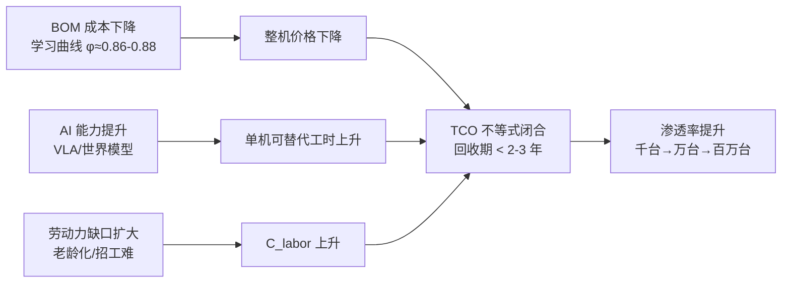
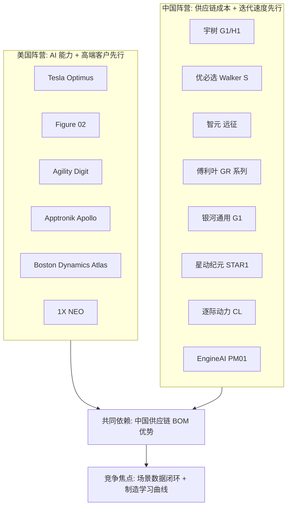
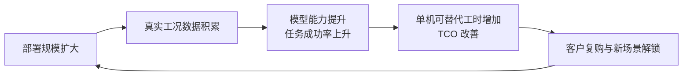
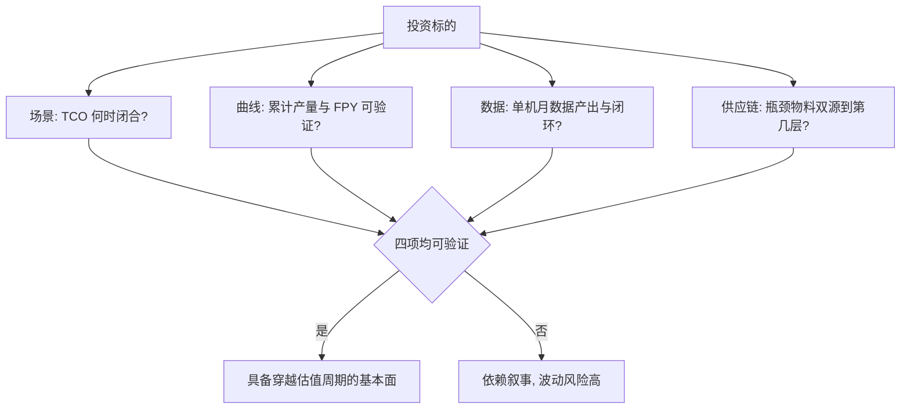

# 第 28 章 市场、企业与投资

## 摘要

人形机器人正从技术验证期进入商业验证期，市场规模预测、企业竞争格局与资本流动共同构成理解该产业的"第三视角"——前两者（技术与制造）已在本书前述章节展开，本章则回答三个问题：市场有多大、玩家有谁、钱在流向哪里。本章首先梳理行业公开预测（以知识图谱收录的美国银行研究所《Humanoid Robots 101》等报告为代表）给出的出货量、成本与渗透路径图景，并强调其作为分析师估计值的不确定性；随后按工业、物流、商业服务与家庭四级场景分析需求结构与付费能力；继而系统盘点全球主要整机企业——特斯拉（Tesla）、Figure AI、Agility Robotics、Apptronik、波士顿动力（Boston Dynamics）、1X Technologies、Sanctuary AI，以及宇树科技（Unitree）、优必选（UBTECH）、智元机器人（AGIBOT）、傅利叶（Fourier）、银河通用（Galbot）、星动纪元（Robot Era）、逐际动力（LimX Dynamics）、EngineAI、Astribot、乐聚（Leju）等中国企业群体——的产品定位与商业化进展；进一步梳理融资与估值动态、供应链投资主线与商业模式（整机销售、租赁与 RaaS）；最后讨论市场风险与投资框架。本章所有市场数字均为行业公开预测或公开报道口径，仅供量级参考。

**关键词**：市场规模；渗透率；总拥有成本；竞争格局；融资与估值；RaaS；供应链投资；具身智能

---

## 28.1 市场规模与增长预测

### 28.1.1 预测的共同骨架：三阶段渗透

尽管各机构数字差异巨大，行业公开预测在**渗透路径的形状**上高度一致。美国银行研究所《Humanoid Robots 101》（2025 年 4 月，知识图谱实体 ent_report_bofa_humanoid_robots_101_2025）给出的三阶段框架具有代表性：

1. **发展期（约 2025–2027）**：小批量工业与物流试点，全球年出货量在数千至数万台量级，客户在本质上购买的是"共同开发权"与数据采集入口；
2. **规模化商业采用期（约 2028–2034）**：商业服务与半结构化环境渗透，出货量进入十万至百万台量级，TCO（Total Cost of Ownership，总拥有成本）在部分场景闭合；
3. **大规模消费采用期（约 2035 以后）**：家庭与养老照护场景启动，保有量进入亿台量级。该报告的长期展望是：在其假设下，2060 年全球人形机器人保有量可达 30 亿台量级。

!!! note "关于预测数字的方法论警示"
    人形机器人尚不是标准规格产品，各机构预测对"人形机器人"的统计口径（是否含轮式底盘人形、是否含固定基座双臂）、单机价格假设、替代人工的弹性假设差异极大。本章所有市场数字均应理解为**行业公开预测的量级指示**，而非精确预言。同一报告也明确提示其 BOM 与出货预测存在内在不确定性。

### 28.1.2 出货与金额的量级图景

综合行业公开预测的共同区间（不同机构口径下的重叠部分），可以给出一个审慎的量级图景：

| 时间窗 | 全球年出货量级 | 单机均价量级 | 对应年产值量级 | 主导场景 |
|---|---|---|---|---|
| 2025–2027 | 千台–数万台 | 5 万–25 万美元（全尺寸工业型）；1.6 万美元起（科研型） | 数亿–数十亿美元 | 汽车/3C 工厂试点、科研 |
| 2028–2030 | 数万–数十万台 | 2 万–10 万美元 | 数十亿–数百亿美元 | 制造、物流搬运与分拣 |
| 2030–2035 | 数十万–数百万台 | 1.3 万–5 万美元（BOM 预测见第 13 章） | 数百亿–千亿美元级 | 商业服务、巡检、泛工业 |
| 2035 以后 | 百万台以上/年 | 1 万–2 万美元级 | 千亿美元级以上 | 家庭、养老、公共服务 |

驱动这一曲线的底层变量有三个：**BOM 成本曲线**（第 13 章已述，行业公开预测约 3.5 万美元→1.3–1.7 万美元）、**AI 能力曲线**（VLA 模型与世界模型，见第 19、20 章）、**劳动力缺口曲线**（制造业与老龄化社会的结构性用工缺口）。三者的时间对齐程度决定了预测落在区间的上沿还是下沿。

### 28.1.3 预测分歧的来源：为什么各机构数字相差一个数量级

同一年份的出货量预测，不同机构之间相差 5–10 倍是常态。分歧主要来自四个假设：

- **口径假设**：是否统计轮式底盘人形（如银河通用 G1）、是否统计固定基座双臂系统、是否统计"半人形"（无腿移动操作平台），口径宽窄直接造成数倍差异；
- **价格-需求弹性假设**：悲观方假设价格下降缓慢、场景仅覆盖高度结构化工厂；乐观方假设价格沿学习曲线快速下探、场景外溢至服务业；
- **AI 能力假设**：这是最大的隐性变量。若 VLA 模型在 2027–2028 年实现"单场景 99% 成功率"的跨越，渗透曲线取上沿；若长尾任务成功率长期卡在 90% 量级，客户将始终需要"人盯机器人"，TCO 无法闭合；
- **政策与劳动力假设**：补贴（如中国地方政府的采购与场景开放政策）可在短期内人为抬高出货；而就业保护性监管则可能压低渗透。

对读者的建议是：**关注预测的前提假设，而非预测的终值数字。**一个给出"BOM 降至 2 万美元、单场景成功率 99%、双班人力成本 5 万美元"三要素假设的预测，其信息量远高于一个孤立的"2030 年百万台"。

### 28.1.4 需求弹性：从 TCO 到渗透率的换算逻辑

市场规模的微观基础是单场景的 TCO 比较。客户（尤其是工业客户）的决策不等式可以写为

$$
\frac{P_{robot}}{Y} + C_{om} + C_{int} < C_{labor}
$$

其中 \(P_{robot}/Y\) 为整机价格按使用年限 \(Y\) 的年化成本，\(C_{om}\) 为年运维成本（含维保、能耗、保险），\(C_{int}\) 为集成与产线改造的年化成本，\(C_{labor}\) 为被替代岗位的年人力成本。以制造业双班岗位为例，发达经济体年人力成本典型在 4 万–8 万美元，中国沿海在 1.5 万–3 万美元；当整机价格降至 3 万美元以下、年运维低于 1 万美元时，投资回收期可压缩到 2–3 年，这正是 13.4.4 所述"BOM 降至 2 万美元级、TCO 开始闭合"的需求侧表达。渗透率对回收期的弹性极强：回收期每缩短一年，可触达的潜在客户池大致扩大一个数量级（经验法则，非精确规律）。



### 28.1.5 Python 算例：投资回收期的敏感性分析

下面的脚本计算不同整机价格与运维成本组合下，替代一个双班搬运岗位的投资回收期，演示 TCO 不等式对价格的敏感性（数字为量级演示，非特定产品报价）：

```python
# 人形机器人替代双班岗位的投资回收期敏感性分析
def payback_years(price, om_cost, int_cost, labor_cost, utilization=0.85):
    """
    price:      整机价格 (美元)
    om_cost:    年运维成本 (美元/年)
    int_cost:   一次性集成与改造成本 (美元)
    labor_cost: 被替代岗位年人力成本 (美元/年)
    utilization: 有效利用率 (考虑充电、故障、等待)
    """
    annual_saving = labor_cost * utilization - om_cost
    if annual_saving <= 0:
        return float("inf")
    return (price + int_cost) / annual_saving

scenarios = [
    # (整机价格, 年运维, 集成成本, 年人力成本, 标签)
    (150000, 30000, 50000, 60000, "当前全尺寸工业型 / 发达经济体双班岗"),
    ( 50000, 15000, 20000, 60000, "规模化后 / 发达经济体双班岗"),
    ( 30000, 10000, 10000, 60000, "BOM 闭合后 / 发达经济体双班岗"),
    ( 30000, 10000, 10000, 20000, "BOM 闭合后 / 中国沿海双班岗"),
    ( 16000,  8000,  5000, 20000, "消费级价格 / 中国沿海单班岗"),
]

for price, om, integ, labor, tag in scenarios:
    pb = payback_years(price, om, integ, labor)
    msg = f"{pb:5.1f} 年" if pb != float("inf") else "不闭合"
    print(f"{tag:<38s} 回收期: {msg}")
```

典型输出显示：在 15 万美元价位，即便替代发达经济体双班岗位，回收期也在 5 年以上，只有"劳动力保险"型客户愿意接受；当价格降至 3 万美元级，回收期进入 2 年以内，TCO 开始闭合；而在人力成本较低的市场，闭合需要更低的整机价格——这定量解释了为什么**中国整机厂的极致降本路线（如宇树 G1 的 1.6 万美元定价）对市场渗透具有杠杆意义**，也解释了为什么发达经济体市场反而是人形机器人早期渗透的甜点。

## 28.2 需求结构：场景分级与付费能力

### 28.2.1 四级场景的技术-经济矩阵

知识图谱中的应用实体（如 ent_application_industrial_manufacturing）与本书第 27 章的场景分析对应，本章从市场视角给出分级矩阵：

| 场景层级 | 典型任务 | 结构化程度 | 付费能力 | 替代逻辑 | 现状（公开口径） |
|---|---|---|---|---|---|
| L1 工业制造 | 物料搬运、上下料、工位间转运 | 高 | 强（资本开支预算） | 替代双班搬运/辅助工 | 多家整机厂已在汽车工厂开展试点 |
| L2 仓储物流 | 箱/袋搬运、分拣、装卸 | 中高 | 强（按吞吐计费） | 替代旺季弹性用工 | Agility Digit 等已签商业部署协议 |
| L3 商业服务 | 导览、巡检、零售补货、清洁辅助 | 中 | 中（运营预算） | 补充而非替代 | 小批量示范 |
| L4 家庭/养老 | 照护辅助、家务 | 低 | 弱但规模极大 | 创造新供给 | 1X 等公司启动家庭试点，远期场景 |

关键洞察是：**短期收入在 L1/L2，长期想象力在 L4，而 L4 的技术门槛（非结构化环境、安全、成本）恰恰最高。** 企业的场景排序能力，本身就是核心战略能力。

### 28.2.2 早期客户的真实动机

分析公开试点案例，早期客户付费动机通常不是当期 ROI，而是三者之一：

- **数据与工艺卡位**：整车厂引入人形机器人试点，核心收益是积累"机器人用工"的工艺知识与安全规范；
- **劳动力保险**：在招工难结构性加剧的地区，试点是对未来用工缺口的期权；
- **品牌与资本市场信号**：对整机厂自身而言，头部客户 logo 是最强的融资资产。

理解这一点，就能理解为什么现阶段"签约新闻多、复购新闻少"——行业仍处于以客户教育换取数据与迭代时间的阶段。

### 28.2.3 区域市场结构

从需求地理分布看，行业公开口径下的共识图景是：

- **中国**：最大的潜在制造场景（制造业用工基数最大）、最完整的供应链与最激进的地方政策支持（场景开放、采购补贴、数据采集中心建设）；同时人力成本相对较低意味着 TCO 闭合需要更低的整机价格（见 28.1.5 算例），市场将以"价格驱动型"渗透为主；
- **美国**：人力成本高、物流与零售业发达、AI 能力领先，是"能力驱动型"渗透的甜点市场；制造业回流政策为人形机器人提供了额外的需求叙事；
- **日本与欧洲**：老龄化程度最深，养老照护（L4）的支付意愿与紧迫性最强，但监管审慎、工会影响大，渗透节奏可能慢于中美；
- **其他新兴市场**：短期以科研与展示需求为主。

区域结构对企业的含义是：中国整机厂在本国市场必须打赢成本战，出海则必须补齐安全认证（CE、UL）与服务网络；美国整机厂在本国市场享受 TCO 红利，但其 BOM 若依赖中国供应链，则暴露于关税与出口政策的双重波动之下。

## 28.3 竞争格局：全球主要整机企业

### 28.3.1 北美阵营

| 企业（KG 卡片） | 代表产品 | 定位与进展（公开口径） |
|---|---|---|
| 特斯拉 Tesla（company_tesla / ent_oem_tesla） | Optimus | 垂直整合、自用工厂先行；公开目标指向大规模制造与长期 2 万美元级售价 |
| Figure AI（company_figure_ai / ent_oem_figure_ai） | Figure 02（product_figure_02） | 物流与制造场景；与汽车客户共创；自建 BotQ 工厂；融资规模为行业头部（见 28.4） |
| Agility Robotics（company_agility_robotics） | Digit（product_digit） | 物流搬运专注；RoboFab 专用产线按万台级规划；已签署商业部署 |
| Apptronik（company_apptronik） | Apollo | 源自 NASA 外骨骼/人形技术积累；与梅赛德斯-奔驰等公开合作试点 |
| 波士顿动力 Boston Dynamics（company_boston_dynamics） | 电动 Atlas（product_atlas_electric） | 动态控制技术标杆；电动化转型后聚焦工业应用，背靠现代汽车集团 |
| 1X Technologies（company_one_x_technologies） | NEO | 家庭场景先行者；采取遥操作辅助的家庭数据收集策略 |
| Sanctuary AI（company_sanctuary_ai） | Phoenix | 以灵巧操作与认知软件为核心卖点 |

### 28.3.2 中国阵营

中国阵营的特征是**数量多、迭代快、价格下探猛、供应链纵深强**。主要玩家（均有知识图谱企业卡片）：

| 企业 | 代表产品 | 定位与进展（公开口径） |
|---|---|---|
| 宇树科技 Unitree（company_unitree / ent_oem_unitree_robotics） | G1、H1、H2 | 消费级定价颠覆者；G1 自 1.6 万美元起售；运动控制能力突出 |
| 优必选 UBTECH（company_ubtech） | Walker S 系列 | 港股上市；聚焦汽车工厂实训场景，公开披露多笔车企合作 |
| 智元机器人 AGIBOT（company_agi_bot） | 远征 A2 等（product_agi_bot_a2） | 量产节奏激进；覆盖工业与商用服务；具身智能数据开源活跃 |
| 傅利叶 Fourier（company_fourier） | GR-1、GR-3（product_fourier_gr1 / gr3） | 康复医疗设备出身，延伸至通用人形 |
| 银河通用 Galbot（company_galbot） | Galbot G1 | 轮式底盘+双臂路线，聚焦零售与工业抓取，VLA 能力见长 |
| 星动纪元 Robot Era（company_star1） | STAR1 | 清华系背景；端到端模型与整机协同 |
| 逐际动力 LimX Dynamics（company_limx） | CL 系列 | 强化学习运动控制见长，从双足/四足延伸至人形 |
| EngineAI 众擎（company_engineai） | PM01、SE01（product_engineai_pm01） | 高动态运动能力；科研与开发者市场 |
| Astribot 星尘智能（company_astribot） | S1（product_astribot_s1） | 上肢操作速度与力控见长 |
| 乐聚 Leju（company_leju） | 夸父 KUAVO | 教育市场起家，开源生态策略 |
| 松延动力（company_songyan_dynamics） | N2 | 中小尺寸、极致性价比路线 |
| 魔法原子 MagicLab（company_magic_atom） | MagicBot | 追觅系背景，工业场景导向 |
| 小鹏机器人 XPeng Robotics（company_xpeng_robotics） | Iron | 车企背景，复用自动驾驶感知与制造体系 |

### 28.3.3 格局判断：三个结构性特征

**第一，中美双极，路径分化。** 美国阵营以 AI 能力与高端工业客户为先（Figure、Agility 绑定车企与物流巨头），中国阵营以供应链成本与迭代速度为先（宇树把入门价格打到 1.6 万美元级）。知识图谱中的供应链报告（如 ent_report_bofa_humanoid_robots_101_2025）明确指出：以中国供应链为主的 BOM 假设是当前成本预测的基础，这意味着**全球人形机器人产业在制造端深度依赖中国供应链**。

**第二，车企成为最大单一"孵化场景"。** 特斯拉自用、Figure 与宝马、Apptronik 与奔驰、优必选与多家中国车企——整车厂同时扮演客户、投资方与制造导师三重角色。其原因在于汽车工厂兼具"结构化程度足够高"与"人力成本足够高"的甜点属性，且车企理解大规模制造的学习曲线。

**第三，尚未出现真正的平台垄断者。** 与智能手机或电动车不同，人形机器人的"操作系统层"（运动控制、VLA、仿真栈）尚未收敛，硬件形态（轮式 vs 双足、谐波 vs 行星减速器、灵巧手自由度）仍在发散探索。知识图谱报告提到的"约 24 个月供应商窗口期"判断——在架构收敛前进入供应链——同样适用于对整机格局的判断：当前格局是**预选赛，而非决赛**。

### 28.3.4 整机企业的四种战略原型

剥离国别标签，当前整机企业的战略选择可归纳为四种原型，其资源配置逻辑截然不同：

| 战略原型 | 代表企业 | 资源配置重心 | 核心赌注 | 主要风险 |
|---|---|---|---|---|
| 场景深耕型 | Agility（物流）、1X（家庭） | 单一场景的可靠性、运营与服务网络 | 单场景 TCO 率先闭合形成现金流飞轮 | 场景天花板低，横向迁移成本大 |
| 平台通用型 | Tesla、Figure、智元 | 通用硬件平台+大模型+大规模制造 | 通用性跨越拐点后赢家通吃 | 资本消耗巨大，拐点时间不确定 |
| 成本颠覆型 | 宇树、松延动力 | 供应链整合与快速迭代 | 价格下探创造新需求池（科研、教育、轻商用） | 低价位对可靠性与品牌的反噬 |
| 技术外溢型 | 波士顿动力、逐际动力、Astribot | 单项技术长板（动态控制、强化学习、力控操作） | 长板技术成为行业标配，以授权/高端产品变现 | 长板被大模型或开源方案追平 |

值得注意的是，四种原型并非互斥：Tesla 同时是平台通用型与（潜在的）成本颠覆型；智元在平台路线之外也快速下探价格带。原型框架的价值在于提示投资者与从业者：**同一份行业新闻，对不同原型意味着完全不同的信号强度**——例如某车企试点订单，对场景深耕型是生存线，对平台通用型只是数据入口之一。



## 28.4 融资与估值

### 28.4.1 资本流动的总体图景

2023 年以来，人形机器人与具身智能成为全球硬科技投资最集中的赛道之一。公开报道口径下的总体特征：

- **头部整机公司单轮融资达到数亿至十亿美元级**，估值进入数十亿美元区间；Figure AI 的多轮融资为其公开报道中最瞩目的案例之一，投资方覆盖头部科技公司与主流风投；
- **中国具身智能公司融资密度极高**：知识图谱收录的 X Square Robot（ent_company_x_square_robot_secures_four_co_2026）连续完成四轮融资、估值超过 28 亿美元，且同时获得中国四大互联网科技巨头投资，是"模型公司+整机公司"双重叙事叠加资本追捧的典型样本；
- **上市公司通道打开**：优必选已在港股上市；多家供应链公司（绿的谐波、双环传动、拓普集团、三花智控等）在 A 股以"人形机器人概念"获得显著估值重估——资本市场对供应链的定价甚至先于整机的收入兑现。

### 28.4.2 估值逻辑的解剖

当前阶段整机公司估值不依赖当期收入（多数公司收入仍以试点与小批量为主），而是三层期权的叠加：

$$
V = V_{tech} + V_{data} + V_{mfg}
$$

- \(V_{tech}\)：技术领先期权——运动控制、VLA 模型、灵巧操作的可验证领先性（可通过公开基准与演示评估）；
- \(V_{data}\)：数据资产期权——部署规模即数据采集规模，工厂与客户现场数据是训练下一代模型的独占原料；
- \(V_{mfg}\)：制造学习曲线期权——率先跑完产能爬坡者获得成本曲线的先发位置（见第 13 章）。

!!! note "投资视角的尽调清单"
    评估一家人形机器人公司，比"演示视频"更可靠的信号包括：单任务成功率的量化披露与第三方复现、部署客户数与复购率、关键零部件自研/外购结构、FPY 与爬坡节奏的制造指标、数据闭环的自动化程度、以及单位机器人的月度数据产出量。演示可以排练，制造良率与复购无法排练。

### 28.4.3 融资结构的新特征

与上一轮机器人投资潮（2015–2018）相比，本轮有三个新特征：

1. **产业资本深度参与**：车企、电池厂、互联网平台以战投身份进入（X Square Robot 同时获四大互联网巨头背书是极端案例），产业资本同时带来订单与场景；
2. **"模型+整机"绑定融资**：资本市场更青睐"具身智能基础模型+自有硬件载体"的闭环叙事，纯硬件公司的估值溢价相对受压；
3. **地方政府基金大规模入场**（中国市场）：多地设立百亿级具身智能/机器人产业基金，配套建设数据采集中心与测试场，这一方面加速了产能建设，另一方面也埋下了区域产能同质化竞争的隐忧。

### 28.4.4 估值的锚：从 PS 到"单台部署价值"

在收入不足以支撑传统估值模型的阶段，市场实际使用的估值锚经历了三次漂移：

- **2023 年前后：团队锚**。以创始人背景（顶尖实验室、大厂履历）与融资阵容定价，本质是"人才期权"；
- **2024–2025 年：订单锚**。以车企/物流客户试点订单数量与头部客户 logo 定价，本质是"场景期权"；
- **2026 年起：部署锚**。领先指标转向累计部署台数、单台月度有效作业时长与数据回流量，估值开始与"单台部署价值×部署规模"挂钩。

这一漂移本身是行业成熟的信号：估值锚越接近运营指标，泡沫成分越低。对一级市场参与者而言，识别一家公司当前"被哪个锚定价"，比争论其绝对估值高低更有决策价值——团队锚定价的公司需要用技术尽调穿透，订单锚定价的公司需要验证订单的复购条款，部署锚定价的公司则需要审计其台数与作业时长的统计口径。

## 28.5 供应链投资主线

### 28.5.1 为什么"卖水人"先于"淘金者"兑现

整机的收入兑现依赖场景验证的长周期，而供应链的收入兑现只依赖整机厂的资本开支与试产放量。历史类比清晰：电动车浪潮中，先兑现业绩的是电池与结构件供应商。人形机器人的对应标的池（均有知识图谱卡片）：

| 环节 | 代表企业 | 投资逻辑要点 |
|---|---|---|
| 谐波/行星减速器 | Harmonic Drive Systems、Nabtesco、绿的谐波（Leaderdrive）、来福（Laifual）、双环传动（Shuanghuan）、中大力德 | 用量弹性最大：单机 30+ 个减速器；格局从日企双寡头向中日多极演变 |
| 丝杠（滚柱/滚珠） | GSA、Rollvis、Ewellix、南京工艺、贝斯特（Best）、鼎智（Dingzhi） | 直线执行器核心；高精度磨床产能是硬瓶颈 |
| 电机与驱动 | maxon、Kollmorgen、鸣志电器（Mingzhi/Moons'）、江苏雷利、步科、Nidec | 无框力矩电机与空心杯电机双赛道 |
| 传感器 | ATI、坤维（Kunwei）、Bota Systems、Heidenhain、Renishaw、奥比中光（Orbbec）、禾赛（Hesai）、速腾聚创（RoboSense） | 六维力/力矩传感器与编码器国产化弹性大 |
| 执行器总成 Tier 1 | 拓普集团（Tuopu）、三花智控（Sanhua） | 承接整机厂外包，复制汽车零部件成长路径 |
| 材料与磁材 | 中科三环、金力永磁（JL Mag）、正海磁材、宁波韵升、宝武镁业（Baowu Magnesium） | 稀土磁钢用量随机身电机数线性增长；轻量化镁/铝合金 |
| 电池 | 宁德时代（CATL）、亿纬锂能（EVE Energy） | 高倍率、高安全电池包的定制化机会 |
| 计算平台 | NVIDIA、地平线（Horizon）、黑芝麻（Black Sesame）、瑞芯微、全志（Allwinner） | 端侧大模型推理芯片的新增量市场 |

### 28.5.2 单机零部件价值量拆解

把 28.5.1 的环节进一步折算为"单台机器人的价值量"，可以更直观地看出弹性排序。以下为行业公开拆解口径下的典型量级（以全尺寸工业型、约 40 个自由度、配置灵巧手为例；实际值随方案浮动很大）：

| 环节 | 单机价值量量级（当前 / 规模化后） | 弹性来源 |
|---|---|---|
| 减速器（谐波+行星，30+ 个） | 数千–1.5 万美元 / 降至一半以下 | 用量 × 国产替代双重弹性 |
| 丝杠（直线执行器 10–14 根） | 数千–1 万美元 / 降幅更大 | 磨床产能释放与工艺成熟 |
| 电机（无框力矩+空心杯，40+ 个） | 数千美元级 | 国产化与平台化 |
| 力/力矩传感器（六维力 2–4 个+关节力矩） | 数千美元级 | 六维力传感器单价当前偏高，国产化空间大 |
| 计算平台（1–2 套 SoC） | 数百–数千美元 | 随模型端侧化略有上升 |
| 电池包（2–4 kWh） | 数百美元级 | 单价低但确定性高 |
| 结构与外观件 | 数百–数千美元 | 压铸化降本 |
| 灵巧手（1–2 只） | 数百–数千美元 | 自由度降配与国产方案 |

由此可得投资弹性排序的经验结论：**"高单价 × 高用量 × 高国产化替代空间"三者叠加的环节弹性最大**——当前时点最符合的是减速器、丝杠与六维力传感器；而电池、结构件属于"确定性高、弹性低"的配套逻辑。该排序会随 BOM 下降而动态变化：当执行器价值量压缩后，传感器与计算平台的相对占比反而上升。

### 28.5.3 供应链投资的两条风险线

- **技术路线风险**：谐波 vs 行星、滚柱丝杠 vs 其他直线方案、有刷 vs 无刷、激光雷达 vs 纯视觉——路线切换会使重资产产能沉没。知识图谱报告强调的"架构收敛前的窗口期"判断是双向的：它既是机会，也是押错路线的风险源；
- **地缘与政策风险**：稀土永磁的出口管制波动（知识图谱实体 ent_report_oceanwall_rare_earth_bottleneck_2025 对此有专门分析）会同时冲击海外整机厂与中国磁材出口商；算力芯片的出口政策则影响中国整机厂的高端计算配置。供应链投资必须对政策情景做压力测试。

## 28.6 商业模式：从卖硬件到卖劳动

### 28.6.1 三种商业模式的比较

| 模式 | 收入结构 | 对客户 TCO 的影响 | 对整机厂的要求 | 现状 |
|---|---|---|---|---|
| 整机销售（CAPEX） | 一次性硬件收入+维保 | 客户承担残值与利用率风险 | 渠道与服务网络 | 当前主流（科研市场几乎唯一模式） |
| 租赁（OPEX） | 月费 | 降低客户初始投入，回收期前置 | 资产负债表承压，需金融伙伴 | 物流场景开始出现 |
| RaaS（Robot-as-a-Service，按任务/工时计费） | 按搬运件数、按工时计费 | 客户 TCO 与产出直接挂钩 | 承担利用率风险，必须运营自持机队 | 早期探索；被视为终局形态之一 |

RaaS 的经济本质是**整机厂把"利用率风险"从客户转移到自己**，因此它要求极高的单机可靠性（MTBF）与极低的运维成本，并以远程运维平台为支撑——知识图谱中的 Formant（company_formant，product_formant_platform）与 Freedom Robotics（company_freedom_robotics）等机器人舰队管理平台正是这一模式的基础设施。

### 28.6.2 软件与服务的收入想象力

长期看，硬件毛利率将沿学习曲线被竞争压缩，利润池向三层软件迁移：**技能应用层**（特定工种的策略模型与工艺包）、**舰队运营层**（调度、远程接管、预测性维护）、**数据与模型服务层**（具身模型的持续训练与授权）。这与汽车行业的"软件定义汽车"叙事同构，但人形机器人的软件变现可能更快——因为客户购买的本就是"劳动"而非"设备"。

### 28.6.3 数据飞轮：商业模式与 AI 的耦合点

人形机器人商业模式区别于传统工业设备的关键变量，是每台售出设备都在产生训练数据。由此形成的数据飞轮为：



飞轮能否转动，取决于三个工程前提：**数据的自动化回流**（机器人端侧事件触发上传，而非人工拷贝）、**数据的可训练性**（传感器对齐、时间戳同步、任务标签体系，见第 21 章）、**能力提升的可度量性**（以任务成功率为核心指标的发布-验证闭环，见第 25 章）。凡是宣称 RaaS 或"数据资产"叙事的公司，尽调时都应追问这三条是否已落地——没有自动化回流管线的"数据飞轮"只是 PPT 飞轮。

### 28.6.4 商业模式选择的决策逻辑

三种模式并非替代关系，而是随技术与客户成熟度分层共存。整机厂的决策逻辑可以归纳为：

- **当单机可靠性尚未验证**（MTBF 短、现场故障率高）时，只能选择整机销售——把运维风险留在客户侧并由自己提供付费维保，同时以维保数据反哺可靠性改进；
- **当可靠性跨过阈值、但客户仍缺乏采购预算科目**时，租赁是过渡形态，整机厂需引入金融机构分担资产负债表压力；
- **当任务成功率与利用率都可预测、且场景按产出计费天然成立**（如按搬运件数）时，RaaS 才具备经济性，此时竞争焦点从硬件参数转向运营效率与资金成本。

换言之，商业模式是可靠性与运营能力的函数，而非单纯的销售策略选择。这也解释了 28.7 中尽调框架为何把 MTBF、复购率与作业时长列为核心指标：**它们同时决定一家公司在商业模式光谱上能站到什么位置。**

## 28.7 风险因素与投资框架

### 28.7.1 主要风险清单

1. **技术风险**：非结构化环境下的任务成功率仍远低于商用阈值；演示视频与真实部署之间存在"分布外泛化鸿沟"；
2. **需求风险**：工业客户试点向规模订单的转化率未经证实；若 2027–2028 年复购数据不及预期，估值体系将面临修正；
3. **成本风险**：BOM 下降依赖稀土磁钢、高精度加工设备等外部条件，成本曲线并非纯内生；
4. **政策与伦理风险**：就业冲击的舆论与监管回应、人机混行的安全责任认定（见第 29 章）；
5. **估值风险**：一级市场估值隐含了 2030 年后的兑现假设，任何单一明星公司的交付违约都可能引发赛道级回调。

### 28.7.2 一个简明的投资分析框架

综合本章，可以用四个问题检验任何一项人形机器人投资标的：

- **场景**：它的第一个"万台级场景"是什么？该场景的 TCO 不等式（28.1.4）在何价格点闭合？
- **曲线**：它处于学习曲线的哪个位置？累计产量、FPY、瓶颈工位节拍是否可验证？
- **数据**：每台部署机器人每月产生多少可用于训练的有效数据？闭环是否自动化？
- **供应链**：关键瓶颈物料（丝杠、减速器、磁钢、算力）的保供结构是什么？双源覆盖到第几层？



### 28.7.3 历史镜鉴：三轮机器人投资潮的教训

人形机器人并非第一次被资本追捧。回顾三轮机器人投资潮，可以得到冷静的对照：

1. **2010 年前后的服务机器人潮**：扫地机之外的陪伴、导购机器人大量涌现，绝大多数因"交互能力不足+场景伪需求"退出市场；教训是**没有任务成功率支撑的陪伴叙事不可持续**；
2. **2015–2018 年的协作机器人与物流机器人潮**：存活下来的是 AMR/AGV（如 Geek+、Quicktron 等仓储自动化公司，均有知识图谱卡片）这类"场景封闭、ROI 可算"的品类，而泛化的"轻量人形/双臂"项目大多沉寂；教训是**封闭场景的可计算 ROI 是穿越周期的必要条件**；
3. **2021 年至今的具身智能潮**：与前两轮的本质区别在于 AI 能力（大模型+模仿学习+强化学习）提供了真正的泛化可能性，且 BOM 曲线首次进入可闭合区间；但"AI 能力提升速度"与"资本耐心长度"之间的赛跑仍未分出胜负。

历史给出的投资纪律可以概括为一句话：**为可验证的任务成功率与可复算的 TCO 付费，为叙事保留折价。**

## 28.8 本章小结

- 行业公开预测在数字上发散、在形状上收敛：2025–2027 试点期、2028–2034 规模化商用、2035 后消费渗透；美国银行研究所《Humanoid Robots 101》给出的 BOM 轨迹（约 3.5 万美元→1.3–1.7 万美元）与 2060 年 30 亿台保有量展望是代表性参照，但均为分析师估计；
- 市场规模的微观基础是场景级 TCO 不等式；整机价格降至 3 万美元以下、回收期缩至 2–3 年是渗透率跃迁的临界条件；
- 竞争格局呈中美双极：美国以 AI 能力与高端客户先行，中国以供应链成本与迭代速度先行；车企是最重要的孵化场景；格局仍处于预选赛阶段；
- 资本端：头部整机融资达数亿至十亿美元级（Figure AI 为代表），中国具身智能公司融资密度极高（X Square Robot 估值超 28 亿美元为代表），估值由技术、数据、制造三层期权叠加；
- 供应链先于整机兑现业绩：减速器、丝杠、电机、力传感器、执行器 Tier 1（拓普、三花）、磁材、电池与计算平台构成投资主线，但须对技术路线切换与地缘政策风险做压力测试；
- 商业模式将从整机销售经租赁走向 RaaS，利润池长期向技能应用、舰队运营与数据模型服务迁移。

## 本章涉及的知识图谱实体

| 实体 ID | 名称 | 本章引用位置 |
|---|---|---|
| ent_report_bofa_humanoid_robots_101_2025 | 美国银行研究所《Humanoid Robots 101》 | 28.1.1, 28.3.3 |
| ent_report_oceanwall_rare_earth_bottleneck_2025 | 稀土瓶颈分析报告 | 28.5.2 |
| ent_report_unitree_unitree_g1_humanoid_agent_pric_2024 | 宇树 G1 售价公告 | 28.1.2, 28.3.2 |
| ent_company_x_square_robot_secures_four_co_2026 | X Square Robot 融资（估值超 28 亿美元） | 28.4.1 |
| ent_oem_tesla / ent_oem_figure_ai / ent_oem_unitree_robotics | 特斯拉 / Figure AI / 宇树科技 | 28.3 |
| ent_application_industrial_manufacturing | 工业制造应用场景 | 28.2.1 |
| 附录 D 企业/产品卡片 | company_/product_ 系列：Agility、Apptronik、Boston Dynamics、1X、Sanctuary、UBTECH、AGIBOT、Fourier、Galbot、Robot Era（star1）、LimX、EngineAI、Astribot、Leju、Magic Atom、松延动力、XPeng，以及 Harmonic Drive、Nabtesco、Leaderdrive、双环、GSA、Rollvis、Ewellix、maxon、Kollmorgen、鸣志、ATI、坤维、Orbbec、Hesai、RoboSense、拓普、三花、中科三环、金力永磁、CATL、亿纬、NVIDIA、地平线、黑芝麻、Formant、Freedom Robotics 等 | 28.3–28.6 |

## 参考

- Bank of America Institute. (2025-04). *Humanoid Robots 101*. https://institute.bankofamerica.com/content/dam/transformation/humanoid-robots.pdf （行业公开预测；数字为分析师估计值）
- Unitree Robotics. (2024). *Unitree G1 Humanoid Agent — Price from $16K*（知识图谱收录的企业公告实体）
- 知识图谱 research/companies/ 与 research/reports/ 实体族；附录 D：主要供应商与企业名录
- 本书交叉引用：第 6 章（供应链格局）、第 13 章（量产与规模化）、第 27 章（应用场景）、第 29 章（政策、监管与伦理）
