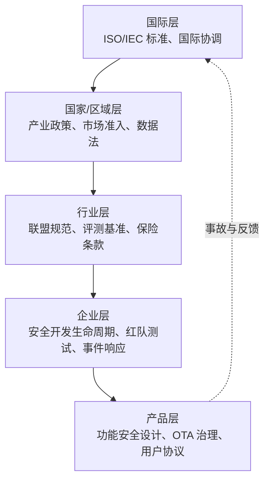
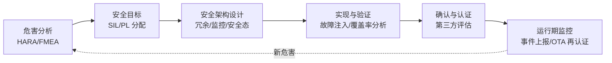
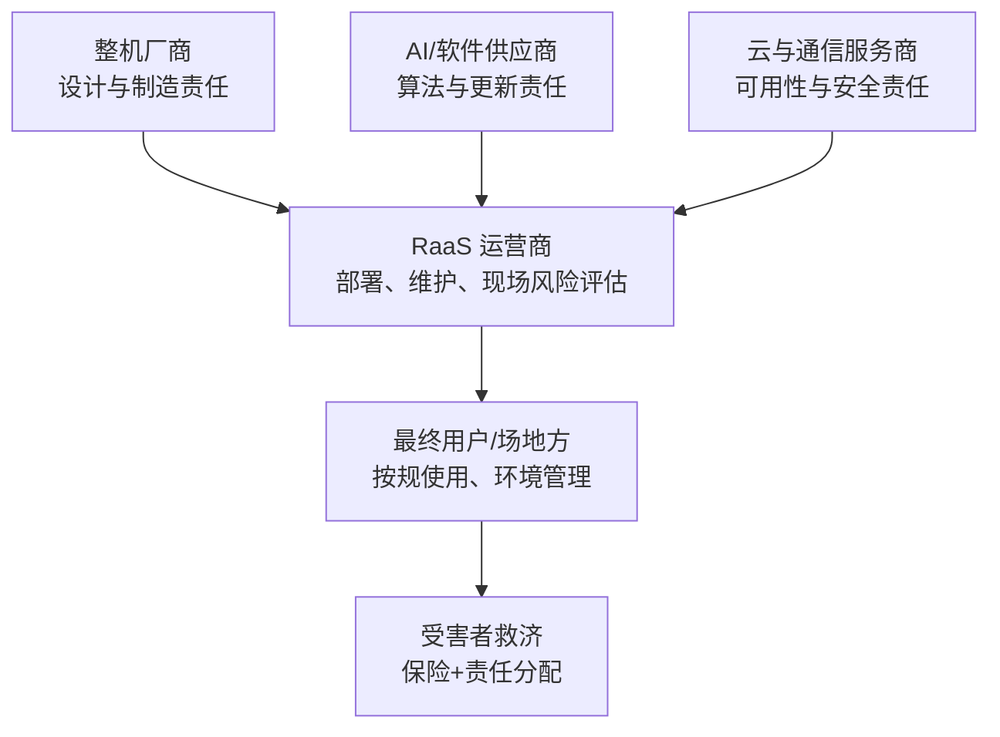
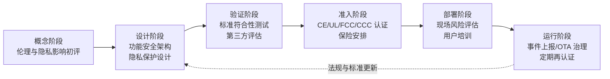

# 第 29 章 政策、监管与伦理

## 摘要

人形机器人是第一种以"人的形态"进入人类生活空间的机器：它具备物理施力能力、移动能力与日益增强的自主决策能力，因此其治理问题同时横跨产业政策、产品安全监管、数据隐私、责任归属与社会伦理多个维度。本章从工程与治理交叉的视角展开：首先梳理治理框架的层次结构与"演示指标与产品指标的鸿沟（Demo-to-Product Gap）"对监管提出的挑战；然后比较中国、美国、欧盟、日本、韩国等主要经济体的机器人与 AI 产业政策取向；接着系统介绍与人形机器人相关的安全标准体系（ISO/TS 15066、ISO 13482、ISO 13849、IEC 61508 等）与区域市场准入认证（CE、UL、FCC、CCC），并指出现行标准对人形机器人的覆盖缺口；随后讨论产品责任、保险与机器人即服务（RaaS）模式下的责任链条、数据治理与生物识别隐私；最后分析劳动力冲击、人机关系伦理、双重用途等社会影响，并给出治理工具箱与展望。本章的立场是：政策与伦理不是技术之后的外部约束，而是人形机器人系统设计的一等输入。

**关键词**：机器人政策；功能安全；人机协作安全；产品责任；数据隐私；生物识别；机器人伦理；监管沙盒；市场准入认证；社会影响

---

## 29.1 政策、监管与伦理概述

### 29.1.1 为什么人形机器人需要专门的治理讨论

与工业机械臂相比，人形机器人的治理难度来自四个结构性特征：

1. **物理具身性**：具身智能系统直接对物理世界施加作用力，软件缺陷可以造成人身伤害，这使"安全必须是内建的，而非事后加装的（Safety must be built in, not bolted on）"这一原则从自动驾驶领域自然延伸到人形机器人；
2. **空间开放性**：人形机器人的价值主张恰恰是在为人设计、没有围栏的非结构化环境中工作，传统工业机器人"隔离即安全"的范式不再适用；
3. **数据密集性**：机器人是移动的传感器平台，持续采集图像、语音、人脸、步态等数据，天然触及隐私与生物识别治理（见 29.5 节）；
4. **自主演化性**：数据飞轮（Data Flywheel）意味着产品出厂后能力仍在变化，以"出厂状态"为对象的一次性认证难以覆盖持续学习系统。

知识图谱中的"演示指标与产品指标的鸿沟（Demo-to-Product Gap）"概念提醒我们：面向舞台演示优化的指标（单次成功率、动作观赏性）与可认证、可量产、可投保的产品指标（平均无故障时间、失效模式覆盖率、可追溯性）之间存在系统性差距。监管与伦理讨论的对象必须是后者。

!!! note "术语解释：政策、监管、标准、伦理治理"
    - **政策（policy）**：政府为引导产业发展与风险防控制定的方针、规划与财政工具，通常不具有强制技术约束力。
    - **监管（regulation）**：具有法律约束力的规则体系，如市场准入、事故追责、数据保护法规。
    - **标准（standard）**：由标准化组织发布的技术规范，本身多为自愿性，但常被法规引用而获得事实强制力。
    - **伦理治理（ethics governance）**：超越合规底线的价值对齐与社会接受度管理，涉及公平、尊严、透明度等议题。

### 29.1.2 治理框架的层次

人形机器人的治理是多层嵌套结构，任何一层失灵都会把风险转嫁给其他层：

- **国际层**：ISO 与 IEC 制定跨国互认的安全与性能标准，降低贸易壁垒；
- **国家/区域层**：产业补贴、出口管制、产品责任法、数据保护法（如欧盟 GDPR、中国 PIPL）；
- **行业层**：保险费率、评测基准、最佳实践白皮书（行业报告如美国银行研究所的《Humanoid Robots 101》在资本市场层面也在塑造预期）；
- **企业与产品层**：安全开发生命周期、故障树分析、OTA 更新治理、事件上报机制。

### 29.1.3 从样机到产品：治理视角的七个跃迁

知识图谱的"从 0 到 1 的七个跃迁（Seven Transitions）"框架指出，人形机器人从原型到产品需要跨越技术、系统、供应链、制造、成本、验证与市场七个关口。其中**验证（validation）跃迁**与**市场跃迁**直接对应本章主题：验证跃迁要求把安全性从"演示中没摔倒"升级为可审计的证据链；市场跃迁要求回答责任、保险、数据合规与公众接受度问题。换言之，治理成熟度本身就是产品成熟度的一个维度。

### 29.1.4 与本书其他章节的关系

本章是全书治理维度的收口章节，与前文多处内容形成呼应：安全标准的工程落地与第 9 章的 V&V 流程、第 12 章的认证与质量标准直接衔接；数据隐私的技术实现依赖第 21 章的数据基础设施与第 24 章的软件栈设计；RaaS 责任链条与第 28 章的商业模式分析互为表里；就业冲击的讨论则以第 27 章的应用场景渗透路径为前提。读者可把本章视为"把前述各章的工程决策放进社会坐标系"的一章。

### 29.1.5 治理成熟度自评

在展开各节之前，给出一个企业治理成熟度的快速自评清单，后文各节将逐项展开：

| 维度 | 初级（样机阶段） | 中级（小批量） | 成熟（规模化部署） |
|---|---|---|---|
| 安全 | 依赖操作者看管 | 急停与限力等安全功能落地 | 按 SIL/PL 论证的安全架构+事件上报 |
| 合规 | 无认证计划 | 启动 CE/UL 等认证规划 | 多区域认证齐备、OTA 再认证流程化 |
| 责任 | 依赖免责协议 | 投保产品责任险 | 责任-保险-合同体系化，可追溯链完整 |
| 数据 | 无数据政策 | 隐私政策与最小化采集 | 隐私保护设计+跨境合规+数据飞轮治理 |
| 伦理 | 无专门讨论 | 演示透明度声明 | 伦理审查机制+用户控制权设计 |

## 29.2 主要经济体的机器人与 AI 政策

### 29.2.1 政策工具的类型学

各国政策手段虽多，但可归为五类工具：

| 工具类型 | 典型手段 | 作用环节 |
|---|---|---|
| 需求牵引 | 政府采购、示范项目、应用补贴 | 市场跃迁 |
| 供给扶持 | 研发资助、税收优惠、首台套保险补偿 | 技术与制造跃迁 |
| 要素保障 | 人才培养、数据开放、测试场地 | 系统与验证跃迁 |
| 风险规制 | 安全标准、市场准入、事故追责 | 验证与市场跃迁 |
| 国际博弈 | 出口管制、技术联盟、标准主导权 | 供应链跃迁 |

### 29.2.2 中国：顶层规划驱动的全链条布局

中国将人形机器人列为未来产业重点方向。2023 年，工业和信息化主管部门发布了人形机器人领域的专项指导性文件，提出到 2025 年建立创新体系、突破关键技术，到 2027 年形成安全可靠的产业链供应链体系的阶段性目标（注意：此处为政策目标的概括性转述，具体表述以官方文件为准）。其政策特征包括：

- **"机器人+"应用行动**：以制造、物流、医疗、养老、应急等场景为牵引，推动整机与场景方结对试点；
- **地方竞赛**：北京、上海、深圳、杭州等地相继出台人形机器人专项政策，建设创新中心、训练场与中试基地，形成"国家规划—地方落地—园区承载"的三级结构；
- **供应链自主导向**：针对减速器、丝杠、力矩传感器等薄弱环节设置攻关专项，与第 7 章讨论的供应链治理相呼应；稀土永磁等上游材料的供给格局（可参见行业报告对稀土瓶颈的分析）也被纳入产业安全视角；
- **标准先行**：国内标准化机构与行业联盟正在推进人形机器人术语、安全、测试方法等标准研制，并积极对接 ISO/IEC 国际标准化进程。

### 29.2.3 美国：研发资助与风险审慎并行

美国的机器人政策呈现"联邦研发资助 + 州层面应用监管"的双层结构：

- **研发端**：国家机器人计划（National Robotics Initiative）十余年来持续资助基础 robotics 研究，国防与航天体系（DARPA、NASA）则牵引了双足行走、遥操作等早期技术；近年 AI 政策资源进一步向具身智能倾斜；
- **企业生态主导**：产业政策相对间接，主要靠资本市场与大型科技公司（芯片、云计算、整机企业）垂直整合推进，Tesla、Figure AI、Unitree Robotics 等整机厂商与 NVIDIA 等计算平台供应商构成创新主力（公司案例详见第 28 章）；
- **规制端**：联邦层面无统一机器人法，安全主要通过 OSHA 职业安全框架、产品责任诉讼与行业标准（如 UL 认证）间接实现；自动驾驶领域的州级许可与事故上报制度被视为机器人监管的先例；出口管制（先进计算芯片、稀土供应链）则把人形机器人产业链卷入地缘博弈。

### 29.2.4 欧盟：风险分级与合规前置

欧盟以"先把规则立起来"著称，其与人形机器人最相关的制度包括：

- **人工智能法案（EU AI Act）**：按风险分级（不可接受风险、高风险、有限风险、最低风险）对 AI 系统施加差异化义务。人形机器人若用于执法、关键基础设施、就业筛选等场景，可能被划入高风险类别，需满足数据治理、技术文档、人类监督、稳健性等要求；
- **机械法规（Machinery Regulation）**：取代原机械指令，把"具有自我进化行为"的机器纳入视野，要求制造商进行风险评估并附符合性声明，是 CE 标志的法律基础之一；
- **数据与隐私**：GDPR 对机器人采集的个人数据（尤其是人脸、声纹等生物识别数据）设定严格处理条件；
- **责任制度**：欧盟长期讨论将产品责任框架适配 AI 与机器人，核心争点是缺陷举证责任与软件更新后的责任延续。

欧盟路径的特点是**合规前置**：产品在进入市场前就要完成大部分合规论证，这对初创企业构成成本压力，但也为通过认证的产品提供了信任溢价。

### 29.2.5 日本与韩国：社会需求牵引的机器人立国

- **日本**：以"Society 5.0"为总框架，把机器人视为应对少子老龄化的国家答案。"机器人革命"相关倡议推动制造业、护理、农业场景的机器人渗透；护理机器人（如移位辅助、陪伴型设备）享有专项补贴与保险支付通道。日本在人形机器人上有深厚积累（ASIMO 一代），其政策更强调人机共存的社会接受度建设；
- **韩国**：通过智能机器人开发与普及促进相关法律建立了从研发到市场的支持体系，设立机器人产业集群与实证特区；面向配送、导览等服务机器人的户外行驶规则、个人移动装置监管沙盒等制度试点较活跃；2023 年前后起，人形机器人被纳入国家战略技术讨论，大企业（汽车、电子集团）纷纷投资整机企业。

### 29.2.6 政策取向对比

| 维度 | 中国 | 美国 | 欧盟 | 日本 | 韩国 |
|---|---|---|---|---|---|
| 政策风格 | 顶层规划、全链条 | 研发资助、企业主导 | 合规前置、风险分级 | 社会需求牵引 | 特区试点、大财团带动 |
| 核心场景 | 制造、物流、养老、应急 | 制造、仓储、国防 | 工业、公共服务 | 护理、农业、服务 | 配送、导览、制造 |
| 规制重心 | 标准研制+供应链安全 | 诉讼与行业自律为主 | AI 法案+机械法规 | 社会接受度+护理支付 | 户外行驶与特区规则 |
| 对产业的含义 | 快速起量、政策窗口期 | 创新速度快、责任风险后置 | 进入门槛高、信任溢价 | 存量场景深、支付体系成熟 | 实证机会多、市场体量有限 |

需要提醒读者两点方法论上的注意：其一，政策文本与执行力度之间常有落差，评估一国环境时应同时观察财政资金的实际流向、试点项目的落地数量与地方政府的跟进速度，而非仅看规划标题；其二，人形机器人政策与更广义的 AI、半导体、新能源政策高度耦合，单看"机器人专项"会低估真实的支持力度与约束强度。对出海企业而言，合规架构设计应至少覆盖"总部所在国 + 主要制造地 + 主要销售地"三个法域的交叉要求。

### 29.2.7 标准主导权与供应链地缘政治

产业政策的最后一层是国际博弈，它沿两条主线展开：

- **标准主导权之争**：谁先把自己的技术实践写成国际标准，谁就为全球竞争者设定了合规成本结构。各主要经济体都在 ISO/IEC 的人形机器人与具身智能相关标准化活动中积极布局，国内企业联盟也在把量产实践中形成的测试方法推向国际提案。对工程团队而言，跟踪标准化进程不是文书工作——标准草案中的测试方法很可能就是两年后的准入门槛；
- **供应链安全与出口管制**：人形机器人产业链高度依赖少数关键环节——先进计算芯片、稀土永磁材料、精密减速器与丝杠。围绕稀土供给瓶颈的行业分析（如 Oceanwall 的稀土报告）与主要经济体的出口管制措施，已经把"关键物料的可获得性"从采购问题升级为国家政策问题。整机企业的应对通常是多源认证、战略库存与本土化替代的"组合拳"，这与第 7 章的供应链治理互为表里。

换言之，人形机器人企业的"合规半径"不止于产品本身，还覆盖其供应链的地理分布与技术来源——这在制定出海战略时必须前置评估。

## 29.3 安全标准与功能安全

### 29.3.1 与人形机器人相关的标准地图

现行可用的标准多诞生于工业机械臂与服务机器人时代，人形机器人通常需要"组合套用"：

| 标准 | 适用范围 | 与人形机器人的关系 |
|---|---|---|
| ISO 10218（工业机器人安全） | 固定基座工业机器人及集成单元 | 借鉴其风险评估与安全功能设计方法 |
| ISO/TS 15066（协作机器人安全） | 协作操作系统，含人机接触力/压力限值 | 人机协作场景的接触安全基准 |
| ISO 13482（个人护理机器人安全） | 个人护理与服务机器人（含服务人形） | 非工业环境服务人形机器人的主要安全依据 |
| ISO 13849（机械安全控制系统） | 安全相关控制部件，以 PL（性能等级）量化 | 急停、安全监控等安全功能的设计依据 |
| IEC 61508（电气/电子/可编程电子系统功能安全） | 通用功能安全，以 SIL（安全完整性等级）量化 | 安全相关电子系统的顶层方法论 |
| IEC 62368、UL 1740 等 | 音视频/ICT 设备安全、机器人与电动设备 | 电气安全、电池与充电安全 |
| FCC Part 15、EMC 指令 | 电磁兼容 | 无线通信与整机 EMC 合规 |

!!! note "术语解释：功能安全、SIL、PL、风险评估"
    - **功能安全（functional safety）**：系统在故障发生时仍能将风险控制在可接受范围内的属性，区别于"本质安全"。
    - **SIL（Safety Integrity Level）**：IEC 61508 定义的安全完整性等级，等级越高，系统性失效与随机硬件失效的允许概率越低。
    - **PL（Performance Level）**：ISO 13849 定义的控制系统安全性能等级，从 PLa 到 PLe 递增。
    - **风险评估（risk assessment）**：识别危险、估计伤害严重度与暴露概率、确定风险降低措施的系统性流程。

### 29.3.2 功能安全工程流程

人形机器人的安全相关功能——急停、关节力矩限制、跌倒保护、速度与分离监控——应遵循与第 9 章 V&V 流程衔接的功能安全开发生命周期：

关键工程实践包括：

- **安全态（safe state）定义**：对双足机器人而言"停机"不等于"安全"——断电自由倒地本身可能造成二次伤害，因此需要设计受控蹲下、抱膝跌倒、支撑手伸出等主动安全态，这是人形机器人区别于轮式平台的功能安全难点；
- **安全相关通道与非安全通道分离**：安全回路（急停、力矩切断）应在独立的、满足目标 SIL/PL 的通道上实现，不能依赖运行 AI 策略的通用计算平台（实时操作系统选型见第 6、22 章）；
- **失效模式与影响分析（FMEA）**：知识图谱将 FMEA 列为独立方法条目，其在人形机器人上的特殊挑战是"AI 组件失效"难以用传统随机失效模型刻画，需要结合场景库测试与运行监控。

!!! note "术语解释：安全论据、残余风险、故障注入"
    - **安全论据（safety case）**：用结构化的论证链（主张—论据—证据）说明"系统在特定场景下足够安全"的正式文档，是监管沟通与第三方评估的核心载体。
    - **残余风险（residual risk）**：采取所有风险降低措施后仍然存在的风险，需显式评估其可接受性并向用户披露，而非追求绝对零风险。
    - **故障注入（fault injection）**：在测试中人为制造传感器失效、通信丢包、执行器卡死等故障，验证安全机制按预期动作的方法，是安全验证覆盖率的直接证据。

### 29.3.3 区域市场准入认证

产品进入不同市场需满足各自的认证组合（知识图谱"区域准入认证（UL/FCC/CE）"条目对此有汇总）：

| 区域 | 主要认证/标志 | 性质 | 核心关注点 |
|---|---|---|---|
| 欧盟 | CE 标志（机械法规、EMC、无线电设备等） | 强制 | 自我声明+公告机构，风险评估文档 |
| 美国 | UL 认证、OSHA 工作场所要求 | 自愿/事实门槛 | 电气与火灾安全、保险接受度 |
| 美国 | FCC（电磁兼容与射频） | 强制 | 无线发射合规 |
| 中国 | CCC 认证、CR 机器人认证 | 强制/自愿 | 电气安全、机器人专项认证 |
| 日本 | PSE、电波法认证 | 强制 | 电气用品安全、无线合规 |

对创业公司而言，认证规划必须前置到设计冻结之前：安全功能的架构（如是否采用双通道急停）一旦定型，后期改造的代价远高于早期合规设计。

### 29.3.4 标准缺口：人形机器人"无标可依"的部分

尽管组合套用可覆盖大部分风险，人形机器人仍存在明显的标准空白：

1. **双足动态稳定性**：现有标准以静态倾覆或固定基座为前提，没有针对双足步行跌倒风险的测试方法与可接受准则；
2. **动态人机接触**：ISO/TS 15066 的力/压力限值框架基于准静态接触，行走中的机器人与行人的碰撞属于瞬态动力学问题；
3. **学习型组件的安全论证**：神经网络策略的行为无法用传统确定性方法穷举验证，如何给出安全论据（safety case）是开放问题，仿真到实物（sim-to-real）证据链的审计方法尚在探索；
4. **持续更新系统**：OTA 软件更新（见第 22、24 章）改变已认证产品行为后的再认证边界不清。

国际标准化组织内部已有针对人形机器人与具身智能的标准化讨论，但一般而言，从技术共识到标准发布需要数年周期——这正是监管沙盒（见 29.7 节）存在的理由。

### 29.3.5 电池、充电与运输安全合规

整机之外，能源系统是另一类高频合规触发点。人形机器人普遍搭载大容量锂电池组（见第 6 章），其治理要求贯穿三个环节：

- **产品层面**：电芯与电池包需通过目标市场的电气安全认证体系（如针对便携式设备电池的通用安全标准与运输测试规范），过充、短路、热失控蔓延的防护设计是认证测试的核心项目；
- **使用层面**：自动回充/换电站的消防条件、充电区与人员的隔离、BMS 故障时的降级策略，应纳入部署现场的风险评估；
- **物流层面**：大容量锂电池属于航空与陆运的受限货物，运输包装、荷电状态与随附文件有专门规范——这对跨境交付与售后备件物流是实打实的运营约束，必须在供应链设计中提前规划。

电池合规的特殊性在于它跨越"产品安全—运输安全—消防安全"三个监管体系，任何一个环节的疏漏都会演变为整机交付的瓶颈。

## 29.4 责任、保险与商业模式的法律维度

### 29.4.1 产品责任框架

产品责任（Product Liability）指制造商与销售商因缺陷或不安全产品造成人身伤害或财产损失所承担的法律责任，它直接适用于人形机器人。传统产品责任法区分三类缺陷：

- **制造缺陷**：个体产品偏离设计规格（如某台机器人的力矩传感器未标定）；
- **设计缺陷**：设计本身不合理（如膝关节缺少过热保护）；
- **警示缺陷**：未充分告知可预见风险（如未提示"湿地面禁止运行"）。

人形机器人给这一框架带来两个新难题：其一，**学习型行为的可归责性**——若伤害源于策略网络在训练分布外的泛化失败，缺陷究竟在数据、算法还是部署方？其二，**持续演化产品的责任时点**——OTA 更新后的行为偏离出厂状态，责任在制造方还是更新批准方？目前各法域普遍沿用在用产品责任与消费者保护框架处理，专门针对自主系统的责任立法仍在演进中。

### 29.4.2 RaaS 模式下的责任链条

机器人即服务（Robot-as-a-Service, RaaS）以租赁或订阅替代买断，并打包维护、软件更新与车队管理。RaaS 改变了责任结构：

在 RaaS 下，机器人长期不归用户所有，厂商通过 OTA 持续改变产品，"产品"与"服务"的边界模糊化，使得以服务合同为基础的责任约定（SLA、免责条款、保险安排）重要性上升。工程含义是：车队级的遥测、事件记录与可追溯性（第 21 章数据基础设施）不仅是运维工具，也是法律证据链。

### 29.4.3 保险与风险池

保险是人形机器人市场化的隐形基础设施。当前可行的路径包括：将机器人纳入企业财产险与公众责任险的附加条款；针对试点项目的专项产品责任险；以及政府引导的首台（套）重大装备保险补偿机制。精确定价的障碍在于缺乏事故统计数据——这又回到数据飞轮与车队遥测：只有大规模部署积累失效数据，保险定价才能从"保守拒保"走向"精算可保"。自动驾驶行业的经验（如机器人出租车行业报告所强调的"安全必须内建"原则）表明，可解释的安全论据与标准化事件上报是获得保险与监管信任的共同前提。

### 29.4.4 事件报告、召回与全生命周期治理

产品上市不是责任的终点。成熟的治理体系要求企业建立三条运行期机制：

1. **事件监测与上报**：借鉴汽车与医疗器械行业的做法，对跌倒伤人、失控碰撞、数据泄露等事件建立分级、限时上报制度，并向监管与同业适度共享。事件数据的行业级汇聚是标准修订与保险定价的公共品；
2. **缺陷调查与召回**：当批量性缺陷（如某批次电池热失控风险、某版固件的跌倒保护失效）被确认时，企业需要可追溯的产品序列号体系、远程停用能力与召回流程。对机器人而言，OTA 回滚是一种低成本"召回"手段，但前提是把每次 OTA 的影响评估、灰度发布与回滚预案制度化；
3. **退役与善后**：电池回收、数据清除（用户家庭数据必须在转售或报废前可验证地擦除）、备件供应年限承诺，既是环保与消费者保护要求，也是品牌信任的组成部分。

这些机制的共同基础是**可追溯性**：从零部件批次、固件版本到每一次 OTA 与每一起事件，全生命周期数据链是责任分配、缺陷定位与监管沟通的技术底座。

## 29.5 数据治理、隐私与生物识别

### 29.5.1 机器人作为移动传感器平台

一台进入家庭或医院的人形机器人，其传感器套件（RGB/深度相机、麦克风阵列、激光雷达、触觉）会持续采集环境中所有人的数据——包括未同意被采集的访客、邻居与患者。隐私与生物识别（Privacy and Biometrics）治理的对象包括人脸、声纹、步态等可识别生物特征，以及家庭布局、生活习惯等敏感推断素材。与手机 App 相比，机器人数据的风险更高：采集是持续且被动的、数据是多模态可交叉识别的、且可能上传云端用于模型训练（数据飞轮的暗面）。

### 29.5.2 主要法域的数据保护框架

- **欧盟 GDPR**：确立合法基础、目的限定、数据最小化、被遗忘权等原则，生物识别数据原则上属于特殊类别数据，处理条件极为严格；AI 法案进一步要求高风险系统的数据治理文档化；
- **中国《个人信息保护法》（PIPL）与《数据安全法》**：确立告知-同意、敏感个人信息单独同意、数据出境安全评估等制度；机器人企业还需关注生成式 AI 服务相关管理规定对模型训练数据的要求；
- **美国**：无联邦统一隐私法，州级立法（如加州的隐私法体系）与行业法规（医疗领域的 HIPAA）拼接适用，生物识别信息在部分州有专门立法，违规可引发高额集体诉讼；
- **其他**：日本 APPI、韩国 PIPA 等均对个人信息处理设定义务，跨境运营需逐一合规。

### 29.5.3 工程合规：隐私保护设计

隐私保护设计（Privacy by Design）要求把合规转化为架构决策：

| 技术手段 | 作用 |
|---|---|
| 端侧处理与匿名化（人脸模糊、骨架化后再上传） | 减少原始生物识别数据离机 |
| 数据分级与最小化采集（默认关闭麦克风持续录音） | 降低合规暴露面 |
| 本地化存储与差分隐私/联邦学习训练 | 兼顾数据飞轮与隐私 |
| 明示状态指示（录制指示灯、隐私模式物理开关） | 满足告知义务与社会接受度 |
| 数据保留期限与删除管线 | 支撑被遗忘权与审计 |

医疗健康（Healthcare Assistance）与家庭服务（Home Service）是隐私敏感度最高的两个应用场景：前者叠加医疗器械与患者数据监管（远程超声、医院人形机器人等研究已进入临床邻近场景），后者涉及未成年人与无同意能力人群，部署前的隐私影响评估应作为强制环节。

### 29.5.4 数据飞轮的合规闭环

数据飞轮是技术资产，也是合规负债的放大器：采集规模越大、模型迭代越快，一次合规缺陷（例如某批次数据缺乏有效同意）的波及面就越广——训练进模型的数据很难"删除"，这在 GDPR 被遗忘权语境下构成真实的技术-法律冲突。可行的工程缓解路径包括：

- **数据血缘（data lineage）管理**：每条训练样本记录来源、授权状态与时间戳，使"撤回某用户数据并重训或机器遗忘（machine unlearning）"在技术上可操作；
- **授权分级训练**：将数据按授权等级分区，核心模型只使用授权链完整的数据池，灰色数据仅用于受控评估；
- **合成数据替代**：以仿真与生成式数据（见第 23 章）替代部分真实人脸、语音数据，从源头降低隐私暴露；
- **定期合规审计**：把数据合规检查纳入每次模型发版的门禁（release gate），而非年度审计的事后补救。

换言之，第 21 章的数据基础设施不仅要服务模型性能，也要从设计之初就承载合规语义——"能训"与"该训"必须由系统强制区分。

## 29.6 伦理与社会影响

### 29.6.1 劳动力冲击与就业转型

人形机器人对就业的影响是公共讨论中最激烈的议题。行业研究（如美国银行研究所《Humanoid Robots 101》对数十年普及阶段的划分）普遍预计渗透将沿"结构化工业场景 → 半结构化物流/零售 → 非结构化家庭服务"的路径渐进展开，而非一夜之间替代人类。需要向读者澄清的几点判断：

- **替代的是任务而非职业**：大多数职业由多种任务构成，机器人先接管其中重复、危险、负重的部分，职业内涵随之重组；
- **劳动力缺口在先**：制造、物流、护理等目标场景在主要经济体普遍存在招工难，短期内机器人更多填补缺口而非挤出就业；
- **新岗位伴随出现**：遥操作员、机器人运维技师、数据标注与审计师、安全合规工程师等岗位已在增长；
- **分配效应需要政策对冲**：转型成本集中在低技能劳动者，再培训体系、社会保障与可能的税制调整（如关于自动化税负的公共讨论）属于产业政策与社会政策的交界，企业应将其纳入市场跃迁的风险评估。

### 29.6.2 人机关系伦理：陪伴、拟人化与尊严

人形外观带来特有的伦理问题：

1. **拟人化误导（anthropomorphic deception）**：人形与拟人交互会让用户高估机器人的理解与情感能力，对老年人、儿童等脆弱人群尤甚。面向居家老年人的访谈研究（如 Older Adults' Task Preferences for Robot Assistance in the Home, 2023）发现，老年人更希望机器人提供家务性物理协助而非社交陪伴，并希望保留对机器人行为的控制权——这提示"尊重用户自主"应优先于"制造亲密感"的设计冲动；
2. **照护场景中的尊严**：护理机器人若设计不当，可能让被照护者感到被监视、被物化；伦理设计要求保留人的最终决策权、避免以机器人替代必要的人际接触；
3. **透明度义务**：用户应始终明确自己在与机器交互，语音与行为设计不应刻意隐瞒机器身份；
4. **数据与情感操纵**：长期陪伴积累的偏好数据若被用于商业诱导，构成新型操纵风险。

### 29.6.3 双重用途与军事化

人形机器人技术是典型的双重用途（dual-use）技术：同一套全身控制、遥操作与自主导航栈可用于灾害救援，也可用于军事场景。当前的公共讨论焦点包括：武装机器人的责任归属、自主武器的国际人道法约束、以及遥操作"化身"在冲突中的使用。多数头部整机企业公开声明禁止产品的武器化用途，并在销售协议与远程运维中加入限制条款；但从治理角度看，企业自律需要与出口管制、国际公约讨论（如在特定常规武器公约框架下的长期辩论）相衔接。研究共同体内部的规范（如公开发表时对滥用风险的声明）也是负责任的扩散控制的一部分。

### 29.6.4 安全文化与演示伦理

最后回到行业内部：人形机器人领域高度依赖演示视频传播，这产生了"演示伦理"问题——经过剪辑的、单次成功的、有隐性人工辅助的演示会系统性扭曲公众、投资者乃至监管者的预期。知识图谱中"演示指标与产品指标的鸿沟"概念正是对这一现象的工程化表述。健康的安全文化要求：明示演示的自主程度（是否遥操作、是否加速播放）、公开失败案例与事故数据、对未验证能力使用审慎表述。这既是伦理自律，也是行业长期信誉的基础。

### 29.6.5 公平、可及性与数字鸿沟

最后一个社会影响维度是分配公平。人形机器人早期成本高昂，其收益天然向支付能力强的企业与家庭倾斜，可能加剧三重鸿沟：

- **企业间**：大型制造企业率先部署机器人降本增效，中小企业面临"不自动化则被淘汰、要自动化则无资金"的困境——RaaS 的订阅模式正是对这一问题的市场化回应，其普惠价值值得政策鼓励；
- **地区间**：机器人运维、数据服务等新岗位集中于技术中心城市，而被替代的岗位可能分布在更广泛地区，区域转型政策需要提前布局；
- **人群间**：老年人、残障人士本应是辅助机器人的最大受益者，但若产品设计以"典型年轻用户"为默认，他们可能反而被排除在外。无障碍设计、适老化交互（大字体、语音优先、物理急停按钮）应从需求阶段而非事后适配阶段进入产品定义。

公平性议题对工程团队的实际启示是：可及性（accessibility）与可负担性（affordability）是技术指标的一部分——第 13 章讨论的成本工程与第 27 章的场景选择，最终都会以社会接受度的形式反馈到产业的生命线上。

### 29.6.6 公众认知与风险沟通

社会接受度最终由公众认知决定，而公众认知很大程度上被两类极端叙事塑造：一类是"机器人即将取代人类"的恐慌叙事，另一类是"机器人已无所不能"的过度承诺叙事。二者都会扭曲治理讨论：前者催生过度防御性监管，后者埋下信任崩塌的隐患。负责任的风险沟通应遵循三条原则：

1. **区分"已验证能力"与"路线图预期"**：沟通材料中明确标注哪些功能已批量部署、哪些处于试点、哪些仍是研发目标；
2. **用可理解的方式披露风险**：向非专业用户说明机器人的能力边界（不能在湿滑地面运行、不能抱举超过额定重量的人），其重要性不亚于航空安全须知的演示；
3. **给公众参与留出通道**：在养老、医疗、教育等敏感场景部署前举行社区听证与试用反馈，把"被部署者"从被动接受者变为共同设计者。

历史经验（自动驾驶行业的发展起伏即是近例）表明，一次被放大的事故事件对全行业的冲击远超其统计意义——信任的建立以年计、崩塌以日计，风险沟通是对冲这种不对称性的必要投资。

## 29.7 治理工具箱与展望

### 29.7.1 面向企业的合规路线图

### 29.7.2 监管沙盒与敏捷治理

在标准与立法滞后于技术的窗口期，**监管沙盒（regulatory sandbox）**——在限定区域、限定时长、限定人群内豁免部分规则进行实证试验——成为各主要经济体都在采用的敏捷治理工具，中国的应用示范区、韩国的实证特区、日本的国家战略特区均有类似安排。对企业而言，沙盒是在正式合规路径明确前积累真实运行数据与监管互信的通道；对监管者而言，沙盒产出的事故与行为数据是制定正式规则的实证基础。

### 29.7.3 展望：从合规到价值对齐

人形机器人治理的长期走向有三个可预判的趋势：其一，标准体系将补齐双足动态安全与学习型组件论证的空白，形成真正"人形特化"的安全标准族；其二，责任与保险制度将随车队规模扩大而从个案谈判走向精算化、制度化；其三，随着具身通用智能（Embodied General Intelligence）能力的提升，治理重心将从"物理安全"扩展到"行为对齐"——机器人不仅要安全地行动，还要按人类价值观行动。第 30 章将从技术演进角度继续这一展望。

对本书读者而言，更实际的一个判断是：未来五到十年内，治理能力的差异将像技术能力的差异一样，成为区分头部企业与跟随者的分水岭——正如功能安全之于汽车工业、隐私合规之于移动互联网，人形机器人行业的赢家将是那些把合规与伦理内化为工程能力、而非外包给法务部门的公司。

### 29.7.4 研究共同体与开源生态的自律

治理不只是政府与企业的事。人形机器人领域高度依赖开源软件栈、公开数据集与预印本论文，研究共同体的自律构成治理的"第四支柱"：

- **数据集伦理审查**：动捕与遥操作数据涉及真人动作、语音与面部信息，采集时的知情同意、脱敏处理与使用范围限定，应像人体实验审查一样成为发布前置条件；
- **模型与权重的负责任发布**：具身模型可直接驱动物理机器人，发布方应在模型卡（model card）中说明训练数据来源、已知失效模式与禁用场景；
- **可复现性与评测诚信**：使用公开基准（如 HumanoidBench、LIBERO、ManiSkill 等，详见第 25 章）并报告完整评测协议，是抑制"演示夸大"最有效的同行约束；
- **安全研究共享**：跌倒保护、急停架构、对抗失效模式等安全相关的负面结果，共享的收益远大于保密——行业级的安全知识库是公共品。

### 29.7.5 给不同读者的行动清单

作为本章收束，把治理讨论转化为可执行的行动建议：

- **对整机与算法团队**：在下一个设计冻结点前完成功能安全架构评审与隐私影响初评；把事件记录与数据血缘能力排进近期迭代；
- **对创业者与管理者**：认证规划前置、保险方案询价前置、目标市场的法规监测机制前置——三项"前置"的成本远低于事后补救；
- **对研究者**：在论文与发布中明示演示的自主程度，优先使用公开基准，把安全相关的负面结果写出来；
- **对政策研究者**：关注双足动态安全、学习型组件论证、持续更新系统三大标准空白，它们既是学术问题也是立法素材。

## 29.8 本章小结

本章将政策、监管与伦理统一为"人形机器人系统设计的一等输入"。在产业政策层面，中国以顶层规划驱动全链条布局，美国依赖研发资助与企业生态，欧盟合规前置，日韩以社会需求牵引——五种路径各有对工程团队的实际含义。在安全监管层面，现行体系以 ISO/TS 15066、ISO 13482、ISO 13849、IEC 61508 与区域准入认证（CE、UL、FCC、CCC）组合套用，但双足动态安全、学习型组件论证与持续更新系统仍是标准空白。在法律层面，产品责任、RaaS 责任链条与保险机制共同构成市场化的隐形基础设施；在数据层面，隐私与生物识别治理要求隐私保护设计成为架构级决策；在社会层面，就业转型、人机关系伦理、双重用途与演示伦理要求行业以透明度换取长期信任。治理成熟度与技术成熟度必须同步演进，这是人形机器人从样机走向社会的必要条件。

政策与伦理常被视为"软"话题，但本章希望说明：它们最终都会沉淀为硬约束——认证测试不通过，产品就无法上市；责任链条不清晰，保险就无法定价；隐私设计不到位，数据飞轮就无法合法转动。把治理当作工程问题来处理，正是本书"从原理到产品"方法论在社会维度上的延伸。

## 延伸阅读（知识图谱条目）

- 标准：ISO 13482 个人护理机器人安全、ISO/TS 15066 协作机器人安全、ISO 13849、IEC 61508、区域准入认证（UL/FCC/CE）
- 概念：人机协作安全、隐私与生物识别、产品责任、机器人即服务（RaaS）、从 0 到 1 的七个跃迁、演示指标与产品指标的鸿沟、数据飞轮、具身通用智能
- 报告：美国银行研究所《Humanoid Robots 101》（2025）、NVIDIA《For Robotaxis, Safety Must Be Built In, Not Bolted On》（2026）、稀土瓶颈行业报告
- 论文：居家老年人对机器人辅助任务偏好的研究（2023）、远程超声的机器人与人类遥操作对比（2025）、Humanoids in Hospitals（2025）
- 应用场景：医疗健康、家庭服务

上述条目均可在本知识图谱的 `research/` 目录中检索到对应的结构化记录（含英文/韩文名、来源与关联实体），建议读者结合第 2 章介绍的知识图谱构建方法，把本章涉及的"标准—概念—报告—场景"作为一张可查询的子图来使用，而非一份静态书单。
