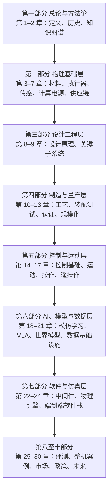
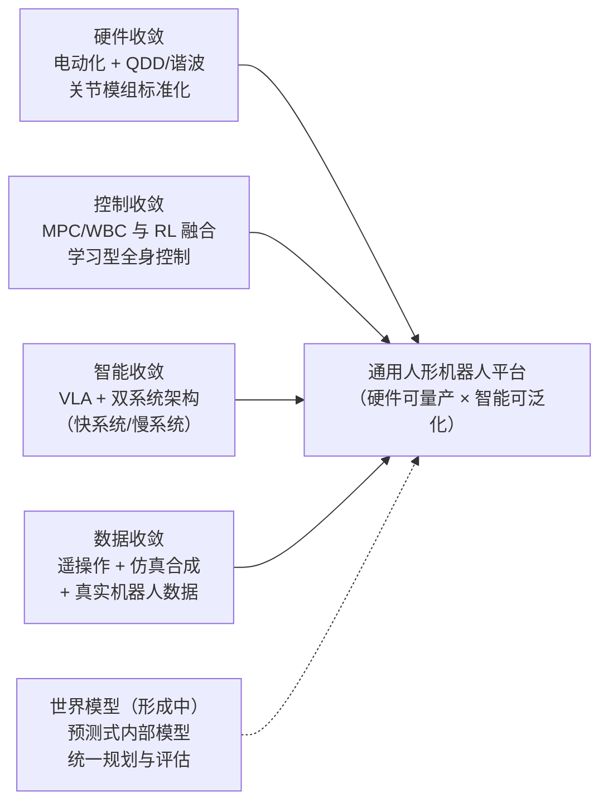
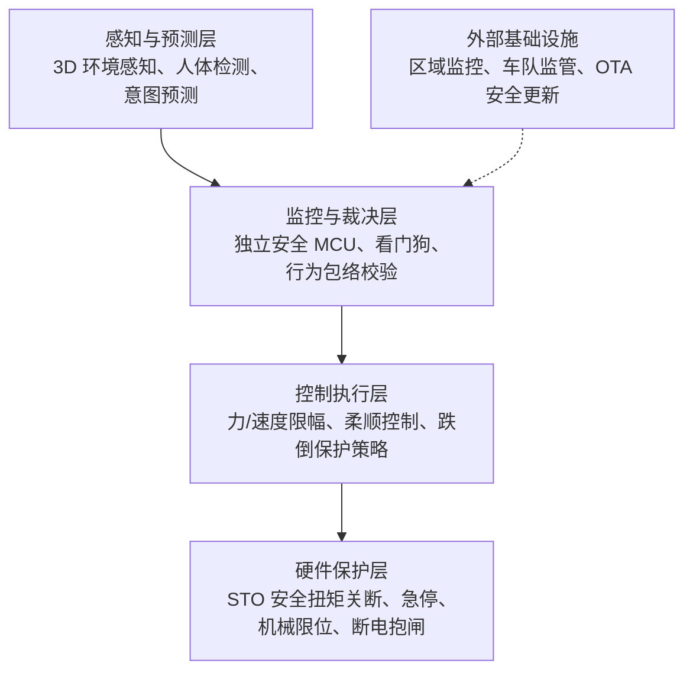
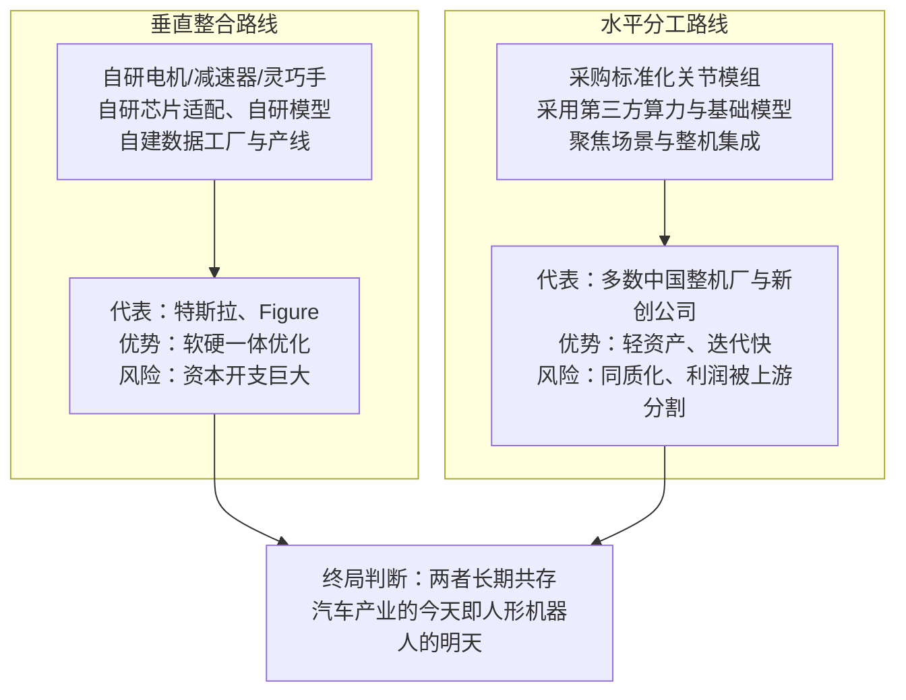
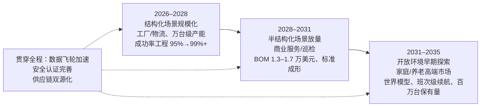

# 第 30 章 未来展望

## 摘要

本章是全书的收官章。前 29 章沿"物理基础—设计工程—制造量产—控制运动—AI 与数据—软件仿真—评测验证—整机市场—政策伦理"的主线，系统拆解了人形机器人的材料、执行器、传感、计算、供应链、子系统、工艺、算法与市场。本章在此基础上做一次综合性眺望：首先回顾全书脉络并以技术成熟度（Technology Readiness Level, TRL）框架盘点各层技术的位置；随后论述正在发生的四路技术收敛——硬件形态、运动控制、智能架构与数据管线的收敛，以及世界模型（World Model）作为下一个汇聚点的可能性；接着深入分析四个尚未解决的根本难题——泛化（Generalization）、安全（Safety）、成本（Cost）与能源（Energy），给出定量化的约束分析；然后刻画产业格局的演化方向，包括垂直整合与水平分工之争、稀土与供应链约束、数据飞轮（Data Flywheel）形成的新竞争壁垒；最后给出一份 2026–2035 年的五至十年路线图，明确各阶段的关键里程碑、度量指标与可能改写路线图的变量，并以"具身通用智能（Embodied General Intelligence, EGI）"作为全书的收束。本章的立场是工程审慎的：所有预测均标注其假设与不确定性，行业常识性数字以"典型地""一般而言"表述，分析师预测与已验证事实严格区分。

**关键词**：技术收敛；泛化；功能安全；BOM 成本；能源续航；世界模型；数据飞轮；机器人即服务；产业格局；路线图；具身通用智能

---

## 30.1 收官视角：全书脉络与技术成熟度盘点

### 30.1.1 本书的十部分逻辑主线

人形机器人是一个典型的"全栈"工程对象：它的能力上限由材料物理决定，能力下限由制造工艺决定，而能力能否变现则由市场与政策决定。本书的十部分结构，本质上是对这一对象自底向上的逐层剖析。



这一结构对应着一个重要事实：**任何一层的瓶颈都会成为整机的瓶颈**。钕铁硼磁体的矫顽力决定关节电机的峰值扭矩密度（第 3 章），关节模组的背隙与刚度决定全身控制（Whole-Body Control, WBC）的带宽上限（第 9、14 章），电池能量密度决定续航与可执行任务时长（第 6 章），而数据规模与多样性决定视觉-语言-动作模型（Vision-Language-Action, VLA）的泛化边界（第 19、21 章）。未来五年的技术进步，大概率仍将是这种"多层协同推进"而非单点突破。

### 30.1.2 从样机到产品：七个跃迁再审视

第 1 章介绍了"从 0 到 1 的七个跃迁（Seven Transitions from 0 to 1）"框架：一台人形机器人从实验室样机走向可销售的产品，需要依次完成**技术、系统、供应链、制造、成本、验证与市场**七个维度的跃迁。站在全书终点回看，这一框架的价值在于它解释了为什么 2023–2026 年的"演示繁荣"并不直接等于产业成熟。

- **技术跃迁**：单一技能（行走、抓取）在受控条件下可用——已由 Atlas、Optimus、Figure 02、宇树 H1/G1 等大量演示证实。
- **系统跃迁**：感知、决策、执行、能源、热管理在整机上长时间无故障协同——当前行业平均无故障时间仍是核心痛点，典型地以"天"而非"月"计。
- **供应链跃迁**：谐波减速器、行星滚柱丝杠、力矩传感器等关键部件从"定制件"变为"货架件"——正在发生（第 7 章）。
- **制造跃迁与成本跃迁**：从手工装配到产线节拍制造，BOM 成本进入下降通道（见 30.5 节）。
- **验证跃迁**：从无标准可依到形成可认证的安全与性能体系——缺口最大（见 30.4 节）。
- **市场跃迁**：从政府与科研采购转向真实付费的工业与商业客户——Figure AI 在宝马工厂 11 个月的部署、优必选 Walker S 的车厂订单是早期信号。

知识图谱中的"演示指标与产品指标的鸿沟（Demo-to-Product Gap）"概念精确刻画了这一现实：为演示优化的指标（单次成功率、视觉效果）与为产品优化的指标（MTBF、可维护性、认证合规、单位经济性）之间存在系统性差距。跨越这道鸿沟，正是未来五至十年产业的主线任务。

### 30.1.3 技术成熟度盘点：各层技术当前在哪里

下表以 TRL 1–9 的通行语义（TRL 4 = 实验室验证，TRL 6 = 相关环境演示，TRL 9 = 实际环境长期运行）对本书各层技术做一个审慎的盘点。评级为编者综合判断，供趋势参考而非精确度量。

| 技术层 | 代表技术 | 当前 TRL（约） | 走向 TRL 9 的关键约束 |
|---|---|---|---|
| 结构与功能材料 | 钕铁硼、铝合金、工程塑料 | 9 | 稀土供应与重稀土减量化 |
| 执行器 | 无框力矩电机+谐波/行星、准直驱（QDD） | 7–8 | 寿命、背隙一致性、成本 |
| 灵巧手 | 腱驱动/连杆驱动多指手 | 5–7 | 耐久性、触觉闭环、成本 |
| 传感与感知硬件 | 深度相机、IMU、六维力传感器 | 8 | 触觉阵列的鲁棒性与标准化 |
| 计算与电源 | Jetson Thor 级边缘算力、锂电池组 | 7–8 | 算力功耗比、能量密度 |
| 双足运动控制 | MPC+WBC、强化学习步态 | 7–8 | 复杂地形鲁棒性、跌倒恢复 |
| 移动操作（Loco-Manipulation） | HOVER、ASAP、ExBody2 类全身策略 | 5–6 | 接触丰富任务的可靠性 |
| 任务级智能 | VLA（RT-2、OpenVLA、π0、GR00T N1） | 4–6 | 泛化、长时序、成功率 |
| 世界模型 | 视频生成式世界模型、1X/Humanoid World Models | 3–5 | 物理一致性、长程预测 |
| 量产工艺 | 关节模组产线、整机装配 | 5–7 | 良率、节拍、测试工装 |
| 安全认证体系 | ISO 13482、ISO/TS 15066 适配 | 3–5 | 人形专用标准缺失 |

这张表揭示了全书的结论之一：**人形机器人产业的短板不在"能不能动"，而在"能不能可靠地、安全地、便宜地长期工作"**。未来十年的技术演进将主要围绕表中 TRL ≤ 6 的条目展开。

## 30.2 技术收敛趋势

当一个产业从探索期进入工程化期，最显著的信号就是技术路线的收敛：竞争者不再各走各的路，而是在若干关键架构选择上达成一致。2024–2026 年，人形机器人领域出现了四路清晰的收敛，以及一路正在形成的收敛。



### 30.2.1 硬件形态收敛：电动化、准直驱与关节模组化

液压路线（以早期 Atlas 为代表）已基本退出新一代人形机器人；电驱动成为共识。在电驱动内部，产业进一步收敛到两条主流技术路线：

- **高减速比路线**：无框力矩电机（Frameless Torque Motor）+ 谐波减速器（Harmonic Reducer）或精密行星减速器，输出端配编码器与力矩传感器。美国银行研究所（Bank of America Institute）2025 年 4 月发布的《Humanoid Robots 101》报告指出，谐波减速器是当前人形机器人旋转执行器的主流选择之一，线性执行器则普遍采用行星滚柱丝杠（Planetary Roller Screw）。
- **准直驱路线（Quasi-Direct Drive, QDD）**：低减速比（典型地 6–10:1）+ 大扭矩外转子电机，依靠电流环实现本体柔顺与透明力控，代表方案见知识图谱"准直驱执行器"条目及其在四足、人形平台的扩散。串联弹性执行器（Series Elastic Actuator, SEA）作为中间路线，在需要精确力控与抗冲击的关节上仍有采用。

更深一层的收敛发生在**集成度**上：电机、减速器、双编码器、力矩传感器、驱动器、制动器被集成为标准化"关节模组（Joint Module）"（第 9 章），整机厂得以像搭积木一样构建不同构型的机器人。这一"模组化"趋势与智能手机产业的"摄像头模组化"高度类似，它把竞争焦点从单个零件转向系统集成与软件。

### 30.2.2 运动控制收敛：从模型控制到学习型全身控制

双足控制经历了三代范式：以零力矩点（Zero-Moment Point, ZMP）与捕获点（Capture Point）为代表的简化模型规划（第 14、15 章）；以模型预测控制（MPC）+ 分层二次规划全身控制（Hierarchical QP WBC）为代表的最优化控制；以及以强化学习（RL）为代表的学习型控制。当前的收敛方向不是"谁取代谁"，而是**分层融合**：

- 底层（1 kHz 级）：关节伺服与力控，仍是经典控制的主场；
- 中层（50–500 Hz）：RL 训练出的全身策略，负责步态、平衡恢复与全身协调，HOVER 通用人形控制器、ASAP 框架、ExBody2 等工作表明单一策略网络已可同时支持行走、跑跳、全身遥操作跟踪等多种模式；
- 上层（1–10 Hz）：模型-based 规划或学习-based 高层策略，负责任务分解与接触时序。

2025 年发表的综述《A Survey of Behavior Foundation Model》将这一趋势进一步概括为"行为基础模型（Behavior Foundation Model）"：用一个大规模预训练的全身控制模型取代为每种技能单独训练的策略，使运动能力像语言模型一样可通过提示与微调迁移。这与第 18–19 章讲述的策略学习脉络自然衔接。可以说，**运动层的"GPT 时刻"——即通用运动策略的出现——是未来五年最值得关注的收敛事件之一**。

### 30.2.3 智能架构收敛：VLA 与双系统范式

任务级智能的架构收敛更为迅速。自 RT-1（Robotics Transformer）与 RT-2 把视觉-语言模型直接扩展为输出动作的 VLA 以来，OpenVLA、Octo 通才策略、Physical Intelligence 的 π0、NVIDIA GR00T N1、Google 的 Gemini Robotics 等工作在两年内密集出现，并迅速形成事实上的架构共识：

1. **骨干网络复用**：以互联网规模的视觉-语言预训练模型为骨干，继承其语义先验；
2. **动作分块（Action Chunking）**：一次预测一段动作序列（ACT、扩散策略（Diffusion Policy）均采用），平衡反应性与平滑性；
3. **双系统（System 1 / System 2）**：一个低频"慢系统"负责语言理解、任务规划与推理，一个高频"快系统"负责把意图转化为连续动作——GR00T N1 明确采用这一分工，Gemini Robotics 等系统亦呈现类似结构；
4. **跨本体预训练 + 本体适配**：在 Open X-Embodiment 这类多本体数据集上预训练，再向特定人形本体迁移。

!!! note "术语解释：VLA、动作分块、双系统、跨本体迁移"
    - **VLA（Vision-Language-Action）**：把视觉观测与语言指令映射为机器人动作的大模型，是"视觉-语言模型（VLM）"向动作空间的延伸。
    - **动作分块（Action Chunking）**：策略每次输出未来 \(H\) 步动作 \(\{a_t,\dots,a_{t+H-1}\}\) 而非单步动作，降低累积误差与决策频率。
    - **双系统（System 1/System 2）**：借自认知科学的隐喻，System 2 慢速深思、System 1 快速反应；在机器人上对应"规划模型 + 反应式策略"的级联。
    - **跨本体迁移（Cross-Embodiment Transfer）**：在不同机械臂/人形机器人数据上联合训练，使策略获得与具体硬件弱相关的操作先验。

### 30.2.4 数据管线收敛：遥操作、仿真与真实数据的配比

数据侧的收敛体现为"三源混合"管线的标准化（第 21 章详述）：

- **遥操作采集**：ALOHA、Mobile ALOHA 低成本双臂遥操作平台、UMI 手持式夹爪接口、HumanPlus 的影子跟随（Shadowing）系统，把人类演示数据的采集成本降低了 1–2 个数量级；
- **仿真合成**：NVIDIA Isaac Sim/Isaac Lab、MuJoCo 及其 Playground、Genesis 生成式物理引擎提供大规模并行数据生成与域随机化（Domain Randomization），MimicGen 等系统则演示了"少量人类演示 + 程序化增强"的放大路径；
- **真实机器人数据回流**：DROID 这类"野外"操作数据集与 Open X-Embodiment 多本体合集提供了真实分布的锚点，AgiBot World Colosseo 则展示了整机厂自建百万级真实轨迹数据工厂的方向。

一般而言，当前主流 VLA 训练的真实/合成数据配比悬殊（合成占绝大多数），但决定泛化上限的往往是那部分真实数据的**多样性**而非数量。这一"配比艺术"在可见的未来仍将是各家的核心 know-how。

### 30.2.5 世界模型：下一个汇聚点

如果说 VLA 解决的是"给定指令如何行动"，那么世界模型（World Model）解决的是"行动之后世界会怎样"。1X 的世界模型挑战赛（World Model Challenge）、Humanoid World Models 等工作探索用视频生成模型预测动作后果；NVIDIA 发布的 Cosmos 3 开放世界基础模型则把视觉推理、多模态生成与动作预测结合，试图让物理 AI"先思考再行动"。

世界模型的战略意义在于它可能**统一三个目前割裂的环节**：

1. **规划**：在内部模型中"想象"多条动作序列的后果，择优执行（即基于模型的策略评估）；
2. **评估**：在仿真式的生成环境中对策略做安全、低成本的闭环测试，缓解真实评测的昂贵与危险（第 25 章）；
3. **数据**：生成符合物理的训练数据，与真实数据互补。

当前视频生成式世界模型在接触丰富的操作任务上仍存在物理一致性不足的问题（例如难以精确预测抓取后的物体位姿），其走向成熟大概率需要 3D 表征、触觉模态与可微物理的进一步融合（第 20 章）。但从产业信号看，主要玩家均已把世界模型列为下一代平台的必争之地。

## 30.3 未解难题之一：泛化

### 30.3.1 泛化的四个层次

泛化（Generalization）是横亘在"演示"与"产品"之间的第一道深沟。人形机器人所需的泛化至少包含四个层次，难度逐级递增：

| 层次 | 含义 | 当前状态 |
|---|---|---|
| 物体泛化 | 对未见过物体的抓取与操作 | 部分实现：大规模数据下对常见物体类别有效 |
| 位姿/布局泛化 | 物体位置、光照、背景变化下仍成功 | 基本可用，但边缘情形失败率高 |
| 任务泛化 | 对语言描述的新任务组合出合理动作序列 | 初步实现：VLA 可组合已见技能，长时序任务成功率低 |
| 环境/本体泛化 | 迁移到新场地、新机器人本体 | 研究前沿：跨本体迁移仍是开放问题 |

经验规律是：**每提升一个泛化层次，所需数据量大致上升一个数量级**。这解释了为什么"倒一杯水"的演示早已常见，而"在陌生厨房做一顿饭"仍然遥远——后者要求四个层次的泛化同时成立，且失败会以乘法累积：若单步成功率为 \(p\)，一个 \(n\) 步任务的整体成功率约为 \(p^n\)。当 \(p=0.95\)、\(n=50\) 时，整体成功率不足 8%；要达到 90% 的整体成功率，单步成功率必须高于 99.8%。这一简单的乘法律是理解一切"演示很惊艳、产品不可靠"现象的第一把钥匙。

### 30.3.2 数据规模与组合泛化：定量视角

从学习理论看，策略在分布外（Out-of-Distribution, OOD）的误差可形式化地分解为：

$$
\mathbb{E}_{\mathcal{D}_{test}}[\ell(\pi)] \;\le\; \mathbb{E}_{\mathcal{D}_{train}}[\ell(\pi)] \;+\; d\big(\mathcal{D}_{train}, \mathcal{D}_{test}\big) \;+\; \mathcal{O}\!\left(\sqrt{\frac{\log |\Pi|}{N}}\right)
$$

其中 \(\mathcal{D}_{train}\)、\(\mathcal{D}_{test}\) 为训练与部署分布，\(d(\cdot,\cdot)\) 为两分布间的某种差异度量，\(|\Pi|\) 为策略类的有效容量，\(N\) 为样本数。这个不等式给出了三条互补的降误差路径：**扩大真实数据覆盖面**（减小 \(d\)）、**增大样本量**（减小第三项）、以及**引入结构化先验**（减小 \(|\Pi|\)，例如用分层策略、技能原语或符号规划约束搜索空间）。神经符号推理（Neuro-Symbolic Reasoning）与任务规划（Task Planning）的复兴，本质上就是第三条路径的体现。

与语言模型不同，机器人数据的"token"必须由物理交互产生，无法从互联网无限抓取。因此"机器人领域的 Scaling Law 是否存在、指数是多少"仍是开放问题；多数经验观察支持"性能随数据量对数线性增长、且在真实多样性不足时提前饱和"的判断。

### 30.3.3 Sim-to-Real 鸿沟的长期性

Sim-to-Real 迁移（Sim-to-Real Transfer）通过域随机化、域适应（Domain Adaptation）与系统辨识，已在双足运动控制上取得工程级成功——这主要因为动力学仿真的误差可以通过随机化与在线适应吸收。但在操作任务上，接触力学、摩擦、柔性体与视觉渲染的残差使得纯仿真策略仍难直接部署。VIRAL 等工作展示了大规模视觉 Sim-to-Real 在移动操作上的进展，但业界共识是：**仿真将继续承担"数据放大器"与"安全试验场"的角色，而非真实数据的替代品**。弥合鸿沟的长期方案可能来自三者结合：更真实的可微物理、生成式世界模型提供的视觉先验、以及真实数据回流驱动的仿真参数校准（数字孪生（Digital Twin））。

### 30.3.4 开放问题清单

泛化方向上，未来五至十年值得持续跟踪的开放问题包括：

- 长时序任务的**层级化**（技能库 + 规划）与**端到端**（单一网络 + 规模化）之争，何者先达到产品级可靠性；
- 失败检测与恢复：策略能否像人一样"意识到自己正在失败"并中止或求助；
- 持续学习（Continual Learning）：部署后在不灾难性遗忘的前提下吸收新任务；
- 泛化的**度量**本身：HumanoidBench、LIBERO/LIBERO-Plus、ManiSkill 及"人形机器人基础模型基准"等基准正在标准化评测协议，但"基准分数高 = 真实部署好"远未成立。

## 30.4 未解难题之二：安全

### 30.4.1 人形机器人安全问题的特殊性

人形机器人的安全挑战在结构上不同于工业机械臂与协作机器人（Cobot）：

1. **动态不稳定**：双足平台本身处于持续平衡控制中，控制器失效、地面扰动或电力中断都可能导致整机倾倒——一个典型全尺寸人形机器人质量在 50–90 kg，倾倒冲击远超协作臂的接触伤害量级；
2. **共域作业**：其设计价值恰恰在于进入为人类构建的非结构化空间，无法像工业机器人那样用围栏隔离；
3. **全身接触**：移动操作意味着手、臂、躯干、腿都可能与人发生非预期接触，仅对末端做功率与力限制（Power and Force Limiting）是不够的；
4. **AI 不确定性**：学习-based 策略的行为难以穷举验证，传统的"故障树 + 确定性测试"认证方法学面临根本挑战。

知识图谱中的"人等效包络（Human-Equivalence Envelope）"与"类人驱动评分（Human-Level Actuation Score）"提供了另一重视角：当机器人的关节扭矩、速度与质量逼近人类水平时，其危险性也逼近"一个强壮的人"——这要求安全设计从"限制能力"转向"管理行为"。

### 30.4.2 标准体系：现状与缺口

现有可参照的标准体系（第 12、29 章详述）如下表所示：

| 标准 | 适用范围 | 对人形机器人的局限 |
|---|---|---|
| IEC 61508 | 电气/电子可编程系统的功能安全通用框架 | 未覆盖动态平衡与 AI 决策 |
| ISO 13849 | 机械安全相关控制系统性能等级（PL） | 面向确定性控制，难评估学习策略 |
| ISO/TS 15066 | 协作机器人：功率与力限制、速度与分离监控 | 针对固定基座机械臂的接触限值，不适用于移动双足平台 |
| ISO 13482 | 个人护理机器人安全 | 最接近但发布于 2014 年，未涉及 VLA/RL 时代的能力 |
| UL / FCC / CE | 区域市场准入（电气、EMC、机械指令） | 证明合规所需的具体人形条款缺失 |

结论清晰：**当前不存在一部针对动态平衡人形机器人的专用安全标准**。行业普遍预期标准组织与主要厂商将在未来数年推动人形专用条款的制定；在此之前，整机厂只能以"风险分析 + 借鉴多标准 + 第三方评估"的组合方式自证安全，这直接抬高了进入消费市场的门槛。

### 30.4.3 工程路径：分层安全架构

在标准缺位期，工程实践正在收敛到一种"分层安全（Layered Safety）"架构：



- **感知层**：安全认证的 3D 传感正在出现——例如 Sonair 推出的安全认证 3D 超声传感器，面向人机协作空间的可靠人体检测；
- **监控层**：独立于主计算栈的安全微控制器（Safety MCU）持续校验 AI 决策是否越出"行为包络"（速度、力、工作区域），FORT Robotics 与 NVIDIA Halos 的合作展示了"由外而内（Outside-In）"安全监控的思路——安全结论不依赖于 AI 内部状态，而由独立信道观测裁决；
- **控制层**：阻抗控制（Impedance Control）与导纳控制（Admittance Control）提供接触柔顺；专门的跌倒保护策略（如收臂、屈膝、侧身倾倒）正在成为研究议题；
- **硬件层**：安全扭矩关断（STO）、断电抱闸与机械限位作为最后防线。

这一架构的思想内核是经典的"**纵深防御（Defense in Depth）**"：不假设任何单一环节（尤其是 AI）永远正确。

### 30.4.4 责任、保险与社会接受

技术安全之外，产品责任（Product Liability）框架的缺失同样制约商业化：当学习型机器人造成损害，责任在整机厂、模型提供方还是部署方？第 29 章已系统讨论政策与伦理，此处仅指出一点：保险精算需要可量化的故障率数据，而这又要求大规模真实部署——形成"无保险不敢部署、无部署无保险数据"的循环。RaaS 模式（见 30.5.4）通过把机器人保留在厂商资产表上、由厂商统一承担运维与责任，是当前破解这一循环的现实路径。隐私与生物特征数据（家中摄像头、语音）的治理，则是家庭场景绕不开的另一道门槛。

## 30.5 未解难题之三：成本

### 30.5.1 BOM 成本轨迹与学习目标

成本是人形机器人从"千台级试点"走向"百万台级产业"的决定性变量。《Humanoid Robots 101》给出的分析师估计为：2025 年底典型人形机器人 BOM（物料清单）成本约 3.5 万美元/台（假设 16 个旋转执行器、14 个线性执行器、谐波减速器、行星滚柱丝杠、6 自由度灵巧手、深度相机与 LiDAR 各一、以中国产部件为主），并预计在规模效应与部件设计改进驱动下，于 2030–2035 年降至 1.3–1.7 万美元/台——隐含约 14% 的年均降幅。市场端的价格信号更为激进：宇树 G1 以 1.6 万美元起的售价直接锚定了科研与轻商用市场。

需要注意区分三个价格概念，避免被宣传数字误导：

- **BOM 成本**：零部件采购成本，不含制造、研发摊销与利润；
- **出厂价/售价**：含制造与毛利，科研版低价机型通常牺牲扭矩、续航与耐久；
- **TCO（总拥有成本）**：含维护、能耗、保险与停机损失，才是客户决策的真正依据。

### 30.5.2 学习曲线：成本下降的定量模型

制造业成本随累计产量下降的规律通常用赖特定律（Wright's Law）刻画：

$$
C(N) = C_1 \left(\frac{N}{N_1}\right)^{-b}
$$

其中 \(N\) 为累计产量，\(C_1\) 为累计产量 \(N_1\) 时的单位成本，\(b>0\) 为学习指数；累计产量每翻一番，成本下降为原来的 \(2^{-b}\)（称为进步率）。对锂电池等成熟品类，\(b\) 典型地在 0.2–0.3；对早期复杂机电产品，保守取 \(b\approx0.15\)（即每翻番降本约 10%）更为稳妥。下面的 Python 算例演示：以 2025 年 BOM 3.5 万美元、累计装机约 1.6 万台为起点，达到 1.5 万美元目标所需的累计产量。

```python
# 赖特定律：人形机器人 BOM 成本下降所需累计产量（示意性估算）
C1, N1 = 35_000, 16_000      # 2025 年：BOM ≈ 3.5 万美元，累计装机 ≈ 1.6 万台
b = 0.15                     # 学习指数（保守取值）

def cost(N):
    return C1 * (N / N1) ** (-b)

for target in (25_000, 20_000, 15_000):
    N_target = N1 * (C1 / target) ** (1 / b)
    print(f"目标 BOM {target:>6,} 美元 -> 需累计产量约 {N_target:,.0f} 台")
```

运行结果大致表明：BOM 降至 1.5 万美元需要累计产量达到数百万台量级——这意味着**成本拐点的到来时间，本质上取决于需求侧能否支撑持续翻倍的产量爬坡**，而非单纯的工程技术问题。该估算对 \(b\) 与起点数据高度敏感，仅作数量级参考。

### 30.5.3 降本杠杆与供应链约束

从工程侧看，降本杠杆在第 10–13 章已有系统讨论，此处归纳其优先级：

1. **设计端**：可制造性设计（DFM）、可装配性设计（DFA）与价值分析/价值工程（VA/VE），在图纸阶段消灭成本——一般而言，产品成本的七成以上在设计冻结时即已锁定；
2. **部件端**：关节模组、灵巧手等高价部件的国产化与多供应商化，BOM 成本工程（BOM Cost Engineering）逐项压降；
3. **制造端**：产线自动化、测试工装与良率爬坡；
4. **规模端**：共享平台与跨型号复用，摊薄研发与模具。

约束同样明确：高性能稀土永磁（钕铁硼）依赖重稀土晶界扩散工艺，OceanWall 的《Robotics and The Rare Earth Bottleneck》报告提示稀土磁材供应可能成为人形机器人规模化的上游瓶颈之一；精密减速器、行星滚柱丝杠依赖高端机床产能（第 7 章）。换言之，**成本曲线不是纯函数，它同时是供应链地缘政治的函数**。

### 30.5.4 商业模式创新：RaaS 与数据飞轮

当单机成本短期内难以下探到消费级，商业模式创新成为平滑过渡的关键。机器人即服务（Robot-as-a-Service, RaaS）以租赁或订阅替代买断，打包维护、软件更新与车队管理：对客户，把资本开支转为运营开支，降低采用门槛；对厂商，保留资产所有权从而保留**数据所有权**——车队数据飞轮（Fleet Data Flywheel）由此启动：部署的每台机器人持续回流真实数据，改进模型，提升性能与可靠性，再支撑更大规模的部署。RaaS 因此不仅是财务安排，更是数据战略的组织形式（见 30.7.4）。

## 30.6 未解难题之四：能源

### 30.6.1 续航约束的定量分析

能源是四个未解难题中物理约束最硬的一个。续航时间由电池能量与平均功耗直接决定：

$$
T_{run} \approx \frac{\rho_e \cdot m_b \cdot \eta_{sys}}{\bar{P}}
$$

其中 \(\rho_e\) 为电池比能量，\(m_b\) 为电池质量，\(\eta_{sys}\) 为系统级放电效率（含 BMS 损耗、电压变换与深度放电限制），\(\bar P\) 为整机平均功率。以第 6 章的 NCR18650B 级 NCA 电芯为例，比能量约 243 Wh/kg；若电池组质量 3 kg、可用系数 0.85、整机平均功率 350 W（典型地，行走+轻负载操作在 300–500 W 区间），则续航约 1.8 小时。这与当前市售全尺寸人形机器人普遍 2 小时上下的标称续航一致——**距离工厂一个班次（8 小时）或家庭一天的使用期望，存在约 4 倍的能量缺口**。

### 30.6.2 能量效率：运输成本

评价移动效率的常用无量纲指标是运输成本（Cost of Transport, CoT）：

$$
\mathrm{CoT} = \frac{P}{m g v}
$$

即单位体重、单位速度下的功率消耗。人类步行的 CoT 典型地在 0.2 量级，而当前双足机器人的步行 CoT 一般而言仍是人类的数倍——减速器摩擦、电机铜损、姿态控制的持续做功与缺乏肌腱式弹性能量回收是主要原因。执行器层面的准直驱化（低减速比降低传动损耗）、步态层面的被动动力学利用、以及串联弹性元件的能量暂存，是降低 CoT 的三条已知路径；它们同时也是降低 \(\bar P\)、间接延长续航的手段。

### 30.6.3 电池技术路线：高镍、固态与快换

弥合 4 倍能量缺口的候选路线包括：

- **高镍/硅碳渐进改良**：在现有液态锂离子体系内，比能量以年均约 3–5% 的速度缓慢提升，可靠但不足以单独弥合缺口；
- **固态电池**：以固态电解质替代液态电解液，理论比能量可显著超越现有体系并改善安全性（第 3 章）；行业分析普遍预期其在 2030 年代逐步进入机器人等高端应用，但当前成本与量产工艺尚不成熟；
- **快换电池与自动充电**：不提升能量密度，而是改变"能量补给方式"——3 分钟换电或任务间隙自主回充，把"单次续航"问题转化为"补给基础设施"问题。对工厂场景，这通常是比等待电池革命更现实的工程解。

### 30.6.4 系统级节能设计

能源问题最终是系统工程问题：电池容量增加会推高整机质量，进而抬高行走功耗——存在明确的**质量-能量恶性循环**。系统级优化因此必须在整机层面进行（第 8、9 章）：结构轻量化（镁合金、拓扑优化）、低功耗计算平台（Jetson Thor 等新一代边缘算力在提升算力的同时控制功耗预算）、端侧 VLA 推理（On-Device VLA Inference）避免云端往返的通信能耗与延迟、以及任务级能量规划（把"能耗"显式写入任务规划的代价函数）。一般而言，整机能量预算应像质量预算、成本预算一样，在设计早期即冻结并逐级分解到子系统。

## 30.7 产业格局演化

### 30.7.1 当前格局：整机、零部件与算力三类玩家

截至 2026 年，产业参与者可粗略分为三类（第 26、28 章详述）：

| 类别 | 代表 | 竞争要点 |
|---|---|---|
| 整机厂（OEM） | 特斯拉（Optimus）、Figure AI、波士顿动力（Atlas）、Agility（Digit）、Apptronik（Apollo）、1X（NEO）、宇树科技（G1/H1）、智元机器人（远征 A1）、优必选（Walker S）、傅利叶智能（GR-1） | 整机集成、AI 模型、数据资产、量产能力 |
| 核心零部件 | Harmonic Drive Systems、Nabtesco、maxon、三花智控、拓普集团、绿的谐波（Leaderdrive）、汇川技术等 | 减速器、丝杠、电机、传感器的一致性与成本 |
| 算力与平台 | NVIDIA（Jetson Thor、Isaac、GR00T）、仿真与数据工具链厂商 | 芯片、仿真、基础模型与开发者生态 |

市场数据（与第 1 章一致）：2025 年全球人形机器人市场规模约 29–32 亿美元、安装量约 1.6 万台，其中中国占比超过八成；宇树科技 2025 年营收 17.08 亿元并已推进科创板 IPO；智元机器人 2025 年出货量据 Omdia 统计达 5168 台；优必选 2025 年人形机器人订单近 14 亿元；特斯拉 Optimus Gen 3 于 2026 年 1 月在弗里蒙特启动量产；Figure AI 完成 10 亿美元 C 轮融资并在宝马工厂完成 11 个月、9 万余零件搬运的真实部署。这些信号共同表明：**产业竞争的主战场已从"谁的演示更酷"转向"谁的量产爬坡与真实部署更快"**。

### 30.7.2 垂直整合与水平分工之争

未来格局的核心张力在于**垂直整合（Vertical Integration）与水平分工（Horizontal Specialization）**之争：



历史经验（汽车产业、智能手机产业）显示：在技术快速变化期，垂直整合占优（软硬协同的迭代速度压倒一切）；在技术成熟期，水平分工占优（规模与专业化压低成本）。人形机器人当前显然处于前一阶段——这解释了头部厂商普遍自研执行器与模型的现象；但随着关节模组与基础模型的货架化，后一阶段的种子已经埋下。

### 30.7.3 地缘与供应链：稀土瓶颈再审视

第 7 章的供应链治理分析在展望中需要补上一笔地缘维度：人形机器人的"肌肉"依赖稀土永磁，而全球高性能钕铁硼产能高度集中；OceanWall 报告等分析已把稀土磁材列为机器人规模化的潜在瓶颈。与此同时，高端芯片出口管制、精密机床产能分布、以及各国对"机器人产业主权"的政策扶持，都在重塑供应链的地理布局。对整机厂而言，未来十年的供应链策略关键词将是：**双源化（Dual Sourcing）、关键部件自制/战略绑定、以及面向不同市场的多产地布局**。

### 30.7.4 数据飞轮：新的竞争壁垒

硬件可以被拆解仿制，模型架构会被论文公开，但**大规模真实部署所积累的数据资产不可复制**。数据飞轮（Data Flywheel）——部署产生数据、数据改进模型、模型提升性能、性能促进部署——正在成为头部厂商真正的护城河：

- 飞轮的启动需要"最小可用场景"：工厂搬运、物流分拣等结构化任务率先提供真实数据土壤；
- 飞轮的转速取决于数据基础设施：自动标注、失败案例挖掘、仿真回放与再训练管线（第 21 章）；
- 飞轮的护城河效应具有马太特征：领先者的模型在真实分布上持续变好，后来者即使拥有同等算法，也缺少同等分布的数据。

可以预期，未来五年"谁拥有最大规模的真实机器人数据闭环"将比"谁的论文分数更高"更能预测产业座次。

### 30.7.5 市场预测的一致性与分歧

综合第 1 章汇总的多家机构预测：2025 年市场规模约 30 亿美元量级，2030 年有望突破 100–150 亿美元（隐含 CAGR 约 35–43%）；《Humanoid Robots 101》给出的采用阶段划分为：2025–2027 年小批量工业/物流试点，2028–2034 年商业服务与半结构化环境规模采用，2035 年起进入大众消费阶段，并在长期给出极为乐观的保有量展望。对待这类预测的正确姿态是：**把它们当作"条件概率陈述"而非"承诺"**——它们成立的条件（成本下降曲线、安全认证进展、AI 泛化突破）正是本章 30.3–30.6 节讨论的未解难题。预测的分歧本身（19–32 亿美元的 2025 年口径差异）也说明：这个行业还没有统一的度量衡，口径（出厂价/终端价、是否含服务）的透明比点估计更重要。

## 30.8 五至十年路线图（2026–2035）

### 30.8.1 路线图的方法论声明

本节路线图综合前述技术收敛趋势、四大未解难题的解决节奏与主流机构预测的交集给出。它满足三条方法论原则：第一，**以能力里程碑而非日历年份为主轴**——年份只是期望，能力才是逻辑；第二，**区分高置信与低置信判断**——结构性趋势（成本下降、模组化）置信度高，具体时点（何年进入家庭）置信度低；第三，**承认不可预测性**——基础模型的非线性进步与地缘事件都可能整体平移时间表。

### 30.8.2 近期（2026–2028）：结构化场景的规模化验证

- **场景**：汽车与 3C 工厂、仓储物流的分拣/搬运/上下料——环境结构化、任务重复、容错度高、付费意愿明确；
- **技术重点**：移动操作的成功率工程（从 95% 到 99%+）、故障恢复与远程接管体系、产线节拍匹配；
- **产业重点**：万台级年产能爬坡、BOM 向 2 万美元区间下探、RaaS 模式跑通单位经济性；
- **标志性事件（候选判据）**：单一客户部署超百台且续约；出现人形机器人专门的保险精算产品；VLA 模型在限定任务族上达到"无聊地可靠"。

### 30.8.3 中期（2028–2031）：半结构化场景与成本拐点

- **场景**：商业服务（零售补货、酒店、医院物流）、安防巡检、危险环境作业——空间为人设计但任务可枚举；
- **技术重点**：行为基础模型统一运动技能库；任务级泛化覆盖任务族而非单一任务；安全认证体系初步成形（人形专用标准进入报批）；
- **产业重点**：BOM 逼近 1.3–1.7 万美元区间；累计产量进入数十万台量级，学习曲线效应显现；水平分工生态（模组、工具链、集成商）形成；
- **标志性事件（候选判据）**：TCO 在若干场景追平或低于人工成本；出现年出货十万台级的单一型号。

### 30.8.4 远期（2031–2035）：开放环境与家庭场景的早期探索

- **场景**：家庭服务、养老陪护的早期高端市场——开放式环境、长尾任务、对安全与隐私最敏感；
- **技术重点**：世界模型支撑的规划与自我评估、持续学习、自然的人机交互；固态电池等新一代能源若如期成熟，将把续航推向"班次级"；
- **产业重点**：消费级产品定义与法规框架落地；数据隐私治理成为产品竞争力的一部分；
- **标志性事件（候选判据）**：出现通过完整安全认证、以订阅制销售的家庭人形机器人；保有量跨过百万台门槛。



### 30.8.5 关键里程碑与度量指标

路线图应可被观测指标检验。建议持续跟踪以下 KPI：

| 维度 | 指标 | 2026 基线（约） | 2030 目标（约） | 2035 展望 |
|---|---|---|---|---|
| 可靠性 | 任务成功率（限定任务族） | 90–98% | ≥99.5% | ≥99.9% |
| 可靠性 | 平均无故障时间 | 天级 | 周–月级 | 月级以上 |
| 成本 | 典型 BOM | ~3.5 万美元 | ≤2 万美元 | ≤1.5 万美元 |
| 能源 | 实际任务续航 | ~2 小时 | 4–6 小时 | 班次级（8 小时） |
| 智能 | 任务族泛化（同族新任务成功率） | <70% | ≥90% | ≥95%（含长时序） |
| 产业 | 全球年出货量 | 万台级 | 十万台级 | 百万台级 |
| 标准 | 人形专用安全标准 | 空白 | 报批/初版 | 认证体系成熟 |

表中数字为综合行业分析师估计与工程外推的**目标区间**，用于刻画量级而非精确承诺。

### 30.8.6 可能改写路线图的变量

最后必须诚实列出路线图的主要风险与上行变量：

| 变量 | 方向 | 影响 |
|---|---|---|
| 基础模型的非线性突破（如世界模型成熟、跨本体泛化解决） | 上行 | 智能相关里程碑整体提前 2–3 年 |
| 固态电池等储能技术提前量产 | 上行 | 家庭与移动场景提前解锁 |
| 严重安全事故引发监管收紧 | 下行 | 共域部署冻结 1–3 年 |
| 稀土/芯片供应链中断 | 下行 | 成本拐点推迟，区域市场割裂 |
| 宏观经济与劳动力市场变化 | 双向 | 影响付费意愿与资本开支 |
| 数据隐私法规趋严 | 下行（短期） | 家庭场景数据采集受限，飞轮减速 |

## 30.9 结语：走向具身通用智能

### 30.9.1 具身通用智能：全书的终极问题

知识图谱将具身通用智能（Embodied General Intelligence, EGI）定义为：构建能够通过身体在多样物理环境中灵活学习、推理与行动的智能体这一长期目标。回顾全书，EGI 的每一块拼图都已单独存在：材料与执行器提供了逼近人类的"身体"（人等效包络正在逐年收敛），VLA 提供了初步的"任务理解"，世界模型指向"想象力"，数据飞轮提供了"经验积累机制"。**尚未发生的，是这些拼图在同一系统内、在同一时间尺度上的闭环整合**——让身体、感知、想象与行动构成一个持续自我改进的整体。

这也是为什么人形机器人值得作为一门独立学科来书写：它不是机械工程的延伸，也不是 AI 的应用分支，而是第一个要求"智能必须通过物理身体在开放世界中自我维持"的工程对象。它的每一个未解难题——泛化、安全、成本、能源——本质上都是"智能"与"物理"交界处的张力。

### 30.9.2 给读者的话

对工程师，本书的 29 个前置章节是你的工具箱，本章的四大难题是你的问题清单；对研究者，30.3–30.6 节的开放问题值得以五年为单位投入；对创业者与投资人，30.7–30.8 节的格局与路线图提示：在人形机器人这场长跑中，**真正的风险不是技术不成熟，而是在错误的成熟度假设上配置资源**。人形机器人不会在某一个清晨突然到来，它会像电力、汽车与互联网一样，先在边缘场景变得不可或缺，然后悄然成为日常。这本书的使命，是帮助你在那一天到来之前，看清它的全部构造。

## 30.10 本章小结

- 全书十部分构成"物理基础→设计→制造→控制→智能→软件→评测→市场→政策"的完整堆栈；任何一层的瓶颈都是整机瓶颈，当前短板集中在可靠性、安全认证与单位经济性，而非运动能力本身。
- 技术正在四路收敛：硬件走向电动化与关节模组化，运动控制走向"经典伺服 + 学习型全身策略"分层融合，任务智能走向 VLA + 双系统范式，数据工程走向遥操作/仿真/真实三源混合；世界模型是最可能的下一个汇聚点。
- 四大未解难题各有定量约束：泛化受 \(p^n\) 成功率乘法律与分布差异约束；安全缺乏人形专用标准，工程上以分层纵深防御过渡；成本遵循赖特定律，BOM 降至 1.5 万美元量级需累计数百万台产量；能源存在约 4 倍续航缺口，须靠电池技术、效率提升与补给模式创新联合弥合。
- 产业格局呈"整机—零部件—算力平台"三层竞争，垂直整合与水平分工将长期共存；数据飞轮取代算法成为最深的护城河；市场预测应作为条件概率陈述审慎使用。
- 2026–2035 路线图沿"结构化→半结构化→开放环境"三阶段推进，以能力里程碑为主轴，以七大 KPI 持续校验，并对基础模型突破、安全事故、供应链中断等双向变量保持敏感。

## 参考文献

1. Bank of America Institute. (2025-04-29). *Humanoid Robots 101*. https://institute.bankofamerica.com/content/dam/transformation/humanoid-robots.pdf
2. OceanWall. (2025). *Robotics and The Rare Earth Bottleneck*. https://oceanwall.com/wp-content/uploads/2025/10/Robotics-Market-and-Rare-Earth-Magnet-Supply-Chain_.pdf
3. Chi, C., et al. (2023). Diffusion Policy: Visuomotor Policy Learning via Action Diffusion. https://arxiv.org/abs/2303.04137
4. Brohan, A., et al. (2022). RT-1: Robotics Transformer for Real-World Control at Scale. https://arxiv.org/abs/2212.06817
5. Brohan, A., et al. (2023). RT-2: Vision-Language-Action Models Transfer Web Knowledge to Robotic Control. https://arxiv.org/abs/2307.15818
6. Open X-Embodiment Collaboration. (2023). Open X-Embodiment: Robotic Learning Datasets and RT-X Models. https://arxiv.org/abs/2310.08864
7. Octo Model Team. (2024). Octo: An Open-Source Generalist Robot Policy. https://github.com/octo-models/octo
8. Kim, M. J., et al. (2024). OpenVLA: An Open-Source Vision-Language-Action Model. https://github.com/openvla/openvla
9. Physical Intelligence. (2024). π0: A Vision-Language-Action Flow Model for General Robot Control（openpi 代码库）. https://github.com/Physical-Intelligence/openpi
10. NVIDIA. (2025). GR00T N1: An Open Foundation Model for Generalist Humanoid Robots（数据与模型资源）. https://huggingface.co/datasets/nvidia/PhysicalAI-Robotics-GR00T-X-Embodiment-Sim
11. Abeyruwan, S., et al. (2025). Gemini Robotics: Bringing AI into the Physical World. https://arxiv.org/abs/2503.20020
12. Ψ₀ Team. (2026). Ψ₀: An Open Foundation Model Towards Universal Humanoid Loco-Manipulation. https://arxiv.org/abs/2603.12263
13. Khazatsky, A., et al. (2024). DROID: A Large-Scale In-The-Wild Robot Manipulation Dataset. https://arxiv.org/abs/2403.12945
14. Sferrazza, C., et al. (2024). HumanoidBench: Simulated Humanoid Benchmark for Whole-Body Locomotion and Manipulation. https://arxiv.org/abs/2403.10506
15. Liu, R., et al. (2025). A Survey of Behavior Foundation Model: Next-Generation Whole-Body Control System of Humanoid Robots. https://arxiv.org/abs/2506.20487
16. Humanoid World Models Team. (2025). Humanoid World Models: Open World Foundation Models for Humanoid Robotics. https://arxiv.org/abs/2506.01182
17. 1X Technologies. (2025). Generative World Modelling for Humanoids: 1X World Model Challenge Technical Report. https://arxiv.org/abs/2510.07092
18. Mandlekar, A., et al. (2023). MimicGen: A Data Generation System for Scalable Robot Learning using Human Demonstrations. https://arxiv.org/abs/2310.17596
19. Fu, Z., et al. (2024). Mobile ALOHA: Learning Bimanual Mobile Manipulation with Low-Cost Whole-Body Teleoperation. https://mobile-aloha.github.io/
20. Chi, C., et al. (2024). Universal Manipulation Interface (UMI). https://umi-gripper.github.io/
21. Fu, Z., et al. (2024). HumanPlus: Humanoid Shadowing and Imitation from Humans. https://humanoid-ai.github.io/
22. He, T., et al. (2024). HOVER: Versatile Neural Whole-Body Controller for Humanoid Robots. https://hover-versatile-humanoid.github.io/
23. He, T., et al. (2025). ASAP: Aligning Simulation and Real-World Physics for Learning Agile Humanoid Whole-Body Skills. https://agile.human2humanoid.com/
24. ExBody2 Team. (2024). ExBody2: Advanced Expressive Humanoid Whole-Body Control. https://exbody2.github.io/
25. NVIDIA. Isaac Sim. https://developer.nvidia.com/isaac-sim
26. NVIDIA. Isaac Lab. https://developer.nvidia.com/isaac-lab
27. Todorov, E., et al. MuJoCo Physics Engine. https://mujoco.org/
28. MuJoCo Playground. (2025). https://playground.mujoco.org/
29. Genesis Authors. (2024). Genesis: A Generative and Universal Physics Engine for Robotics and Beyond. https://genesis-world.readthedocs.io/
30. Hugging Face. LeRobot: Making AI for Robotics More Accessible. https://github.com/huggingface/lerobot
31. Grauman, K., et al. (2022). Ego4D: Around the World in 3,000 Hours of Egocentric Video. https://ego4d-data.org/
32. NVIDIA. (2025). Introducing NVIDIA Jetson Thor, the Ultimate Platform for Physical AI. https://developer.nvidia.com/blog/introducing-nvidia-jetson-thor-the-ultimate-platform-for-physical-ai/
33. NVIDIA. (2026). How Cosmos 3 Helps Physical AI Think Before It Acts. https://blogs.nvidia.com/blog/cosmos-3-physical-ai-open-world-foundation-model/
34. Unitree Robotics. (2024). Unitree G1 Humanoid Agent | Price from $16K. https://www.unitree.com/mobile/news
35. Robotics Tomorrow. (2026-06-22). FORT Robotics Extends Its Trust Layer for Physical AI by Adding Outside-In Safety in Collaboration with NVIDIA Halos. http://www.RoboticsTomorrow.com/news/2026/06/22/fort-robotics-extends-its-trust-layer-for-physical-ai-by-adding-outside-in-safety-in-collaboration-with-nvidia-halos-for-robotics-/26752
36. Robotics Tomorrow. (2026-06-30). Robot Safety Is Now 3D: Sonair Unveils World's First Safety-Certified 3D Ultrasonic Sensor for Human-Robot Collaboration. http://www.RoboticsTomorrow.com/news/2026/06/30/robot-safety-is-now-3d-sonair-unveils-worlds-first-safety-certified-3d-ultrasonic-sensor-for-human-robot-collaboration/26791
37. IEC 61508:2010. *Functional safety of electrical/electronic/programmable electronic safety-related systems*. International Electrotechnical Commission.
38. ISO 13849-1:2015. *Safety of machinery — Safety-related parts of control systems*. International Organization for Standardization.
39. ISO/TS 15066:2016. *Robots and robotic devices — Collaborative robots*. International Organization for Standardization.
40. ISO 13482:2014. *Robots and robotic devices — Safety requirements for personal care robots*. International Organization for Standardization.
